# KOAssistant

[](https://github.com/zeeyado/koassistant.koplugin/releases/latest)
[](LICENSE)
[](https://hosted.weblate.org/engage/koassistant/)

**Powerful, customizable AI assistant for KOReader.**

<p align="center">
  <a href="screenshots/ELI5highlightchat.png">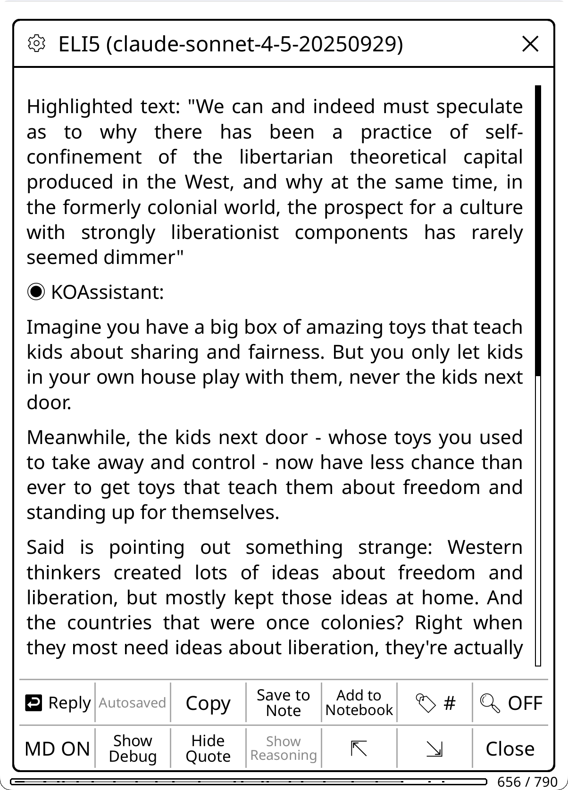</a>
  <a href="screenshots/Xraybrowser.png">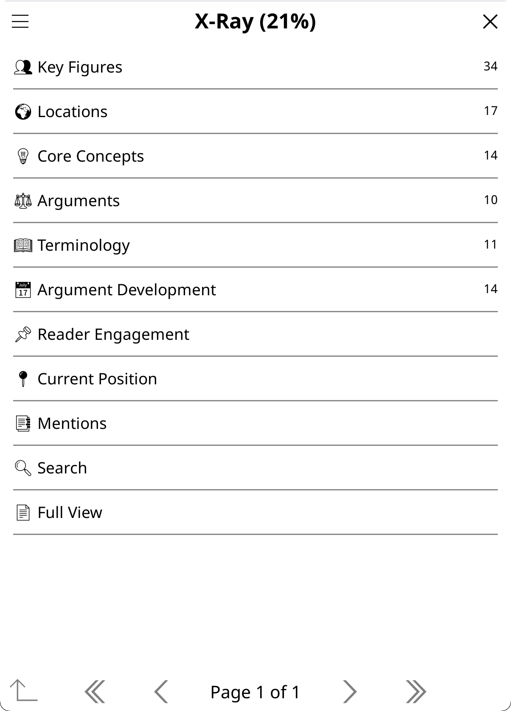</a>
  <a href="screenshots/compactdict.png">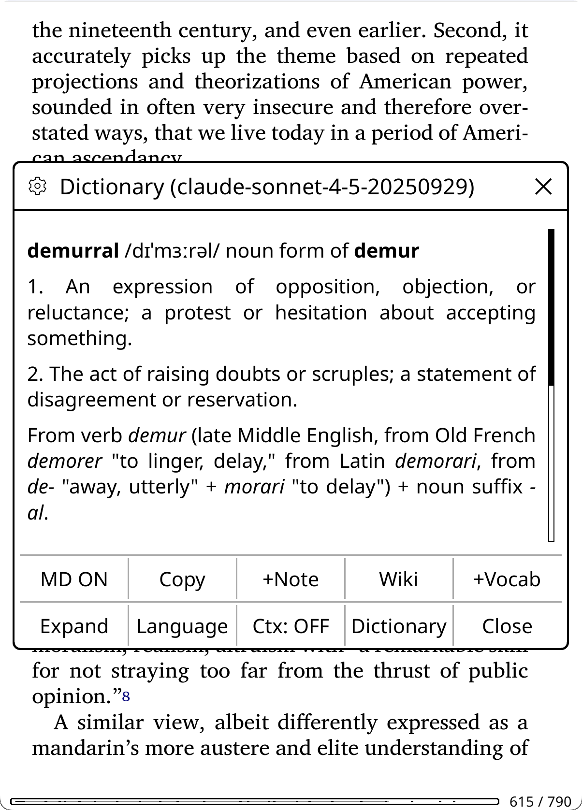</a>
  <a href="screenshots/settingsui.png">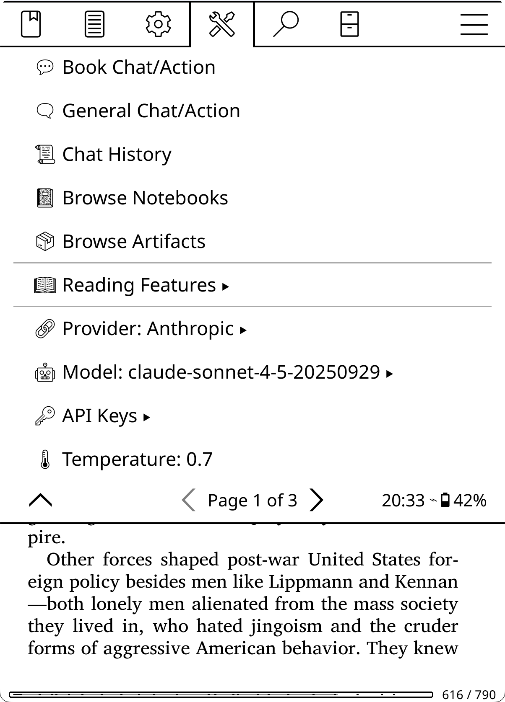</a>
</p>

- **Highlight text** → translate, explain, define words, analyze passages, connect ideas, save content directly to KOReader's highlight notes/annotations
- **While reading** → reference guides (summaries, browsable X-Ray with character tracking, cross-references, chapter distribution, local (offline) X-Ray lookup, X-Ray (Simple) prose overview from AI knowledge, recap, book info, notes analysis), analyze your highlights/annotations, explore the book/document (author, context, arguments, similar works), generate discussion questions
- **Research & analysis** → deep analysis of papers/articles, explore arguments, find connections across works
- **Multi-document** → compare texts, find common themes, analyze your collection
- **General chat** → AI without book/document context
- **Web search** → AI can search the web for current information (Anthropic, Gemini, OpenRouter)
- **Multilingual** → Use any language the AI understands, and use the KOAssistant UI in 20 languages

17 built-in providers (Anthropic, OpenAI, Gemini, Ollama, and more) plus custom OpenAI-compatible providers. Fully configurable: custom actions, behaviors, domains, per-action model overrides. **One-tap auto-update** keeps the plugin current. Personal reading data (highlights, annotations, notebooks) is opt-in — not sent to the AI unless you enable it.

**Status:** Active development — [issues](https://github.com/zeeyado/koassistant.koplugin/issues), [discussions](https://github.com/zeeyado/koassistant.koplugin/discussions), and [translations](https://hosted.weblate.org/engage/koassistant/) welcome. If you are somewhat technical and don't want to wait for tested releases, you can run off main branch to get the latest features. Breakage may happen. Also see [Assistant Plugin](https://github.com/omer-faruq/assistant.koplugin); both can run side by side.

> **Note:** This README is intentionally detailed to help users discover all features. Use the table of contents or search to navigate.

---

## Table of Contents

- [User Essentials](#user-essentials)
- [Quick Setup](#quick-setup)
- [Recommended Setup](#recommended-setup)
  - [Configure Quick Access Gestures](#configure-quick-access-gestures)
- [Testing Your Setup](#testing-your-setup)
- [Privacy & Data](#privacy--data) — ⚠️ (Read this) Some features require opt-in
  - [Privacy Controls](#privacy-controls)
  - [Text Extraction and Double-gating](#text-extraction-and-double-gating) — Enable document content analysis (off by default)
- [How to Use KOAssistant](#how-to-use-koassistant) — Contexts & Built-in Actions
  - [Highlight Mode](#highlight-mode)
  - [Book/Document Mode](#bookdocument-mode)
    - [Reading Analysis Actions](#reading-analysis-actions) — X-Ray, X-Ray (Simple), Recap, Document Summary, Document Analysis, Book Info, Analyze My Notes
  - [Multi-Document Mode](#multi-document-mode)
  - [General Chat](#general-chat)
  - [Input Dialog Actions](#managing-the-input-dialog) — Per-context action sorting, gear menu, web toggle
  - [Save to Note](#save-to-note)
- [How the AI Prompt Works](#how-the-ai-prompt-works) — Behavior + Domain + Language system
- [Actions](#actions)
  - [Managing Actions](#managing-actions)
  - [Tuning Built-in Actions](#tuning-built-in-actions)
  - [Creating Actions](#creating-actions) — Wizard + template variables
  - [Template Variables](#template-variables) — 30+ placeholders for dynamic content
    - [Utility Placeholders](#utility-placeholders) — Reusable prompt fragments (conciseness, hallucination nudges)
  - [Highlight Menu Actions](#highlight-menu-actions)
- [Dictionary Integration](#dictionary-integration) — Compact view, on demand context mode
- [Bypass Modes](#bypass-modes) — Skip menus, direct AI actions
  - [Dictionary Bypass](#dictionary-bypass)
  - [Highlight Bypass](#highlight-bypass)
  - [Translate View](#translate-view)
  - [Custom Action Gestures](#custom-action-gestures)
  - [Available Gesture Actions](#available-gesture-actions)
  - [Translate Page](#translate-page)
- [Behaviors](#behaviors) — Customize AI personality
  - [Built-in Behaviors](#built-in-behaviors)
  - [Sample Behaviors](#sample-behaviors)
  - [Custom Behaviors](#custom-behaviors)
- [Domains](#domains) — Add subject expertise to prompts
  - [Creating Domains](#creating-domains)
- [Managing Conversations](#managing-conversations) — History, export, notebooks
  - [Auto-Save](#auto-save)
  - [Chat History](#chat-history)
  - [Export & Save to File](#export--save-to-file) — Clipboard, file, multiple formats
  - [Notebooks (Per-Book Notes)](#notebooks-per-book-notes)
  - [Chat Storage & File Moves](#chat-storage--file-moves)
  - [Tags](#tags)
- [Settings Reference](#settings-reference) ↓ includes [KOReader Integration](#koreader-integration)
- [Updating the Plugin](#updating-the-plugin) — Auto-update and manual methods
  - [Automatic Update (One-Tap)](#automatic-update-one-tap)
  - [Manual Update](#manual-update)
- [Update Checking](#update-checking)
- [Advanced Configuration](#advanced-configuration)
- [Backup & Restore](#backup--restore)
- [Technical Features](#technical-features)
  - [Streaming Responses](#streaming-responses)
  - [Prompt Caching](#prompt-caching)
  - [Response Caching](#response-caching) — 7 cacheable artifacts, incremental X-Ray/Recap updates as you read
  - [Document Artifacts](#document-artifacts) — Summary, X-Ray, X-Ray (Simple), Recap, Analysis, Book Info, Analyze My Notes: viewable guides and reusable context for Smart actions
  - [Reasoning/Thinking](#reasoningthinking)
  - [Web Search](#web-search) — AI searches the web for current information (Anthropic, Gemini, OpenRouter)
- [Supported Providers + Settings](#supported-providers--settings) - Choose your model, etc
  - [Free Tier Providers](#free-tier-providers)
  - [Adding Custom Providers](#adding-custom-providers)
  - [Adding Custom Models](#adding-custom-models)
  - [Setting Default Models](#setting-default-models)
- [Tips & Advanced Usage](#tips--advanced-usage)
  - [View Modes: Markdown vs Plain Text](#view-modes-markdown-vs-plain-text)
  - [Reply Draft Saving](#reply-draft-saving)
  - [Adding Extra Instructions to Actions](#adding-extra-instructions-to-actions)
- [KOReader Tips](#koreader-tips)
- [Troubleshooting](#troubleshooting)
  - [Features Not Working / Empty Data](#features-not-working--empty-data) — Privacy settings for opt-in features
  - [Text Extraction Not Working](#text-extraction-not-working)
  - [Emoji Font Setup](#emoji-font-setup) — How to get emoji icons working
  - [Font Issues (Arabic/RTL Languages)](#font-issues-arabicrtl-languages)
  - [Settings Reset](#settings-reset)
  - [Debug Mode](#debug-mode)
- [Requirements](#requirements)
- [Contributing](#contributing)
  - [Community & Feedback](#community--feedback)
- [Credits](#credits)
- [AI Assistance](#ai-assistance)

---

## User Essentials

**New to KOAssistant?** Start here for the fastest path to productivity:

1. ✅ **[Quick Setup](#quick-setup)** — Install, add API key, restart (5 minutes)
2. 🔒 **[Privacy Settings](#privacy--data)** — Some features require opt-in; configure what data you share
3. 🎯 **[Recommended Setup](#recommended-setup)** — Configure gestures and explore key features (10 minutes)
4. 🧪 **[Testing Your Setup](#testing-your-setup)** — Web inspector for experimenting (optional but highly recommended)
5. 💰 **[Free Tiers](#free-tier-providers)** — Don't want to pay? See free provider options

**Want to go deeper?** The rest of this README covers all features in detail.

**Note:** The README is intentionally verbose and somewhat repetitive to ensure you see all features and their nuances. Use the table of contents to jump to specific topics. A more concise structured documentation system is planned (contributions welcome).

**Prefer a minimal footprint?** KOAssistant is designed to stay out of your way. The main menu is tucked under Tools (page 2), and all default integrations (file browser buttons, highlight menu items, dictionary popup, gesture actions) can be disabled via **[Settings → KOReader Integration](#koreader-integration)**. Use only what you need.

---

## Quick Setup

**Get started in 3 steps:**

### 1. Install the Plugin

Download `koassistant.koplugin.zip` from the latest [Release](https://github.com/zeeyado/koassistant.koplugin/releases) → Assets, or clone the repo:
```bash
git clone https://github.com/zeeyado/koassistant.koplugin
```

Extract or copy the `koassistant.koplugin` folder to your KOReader plugins directory:
```
Kobo/Kindle:  /mnt/onboard/.adds/koreader/plugins/koassistant.koplugin/
Android:      /sdcard/koreader/plugins/koassistant.koplugin/
macOS:        ~/Library/Application Support/koreader/plugins/koassistant.koplugin/
Linux:        ~/.config/koreader/plugins/koassistant.koplugin/
```

For the plugin to be installed correctly, the file structure should look like this (no nested folder, and foldername must be `koassistant.koplugin` exactly):
```
koreader
└── plugins
    └── koassistant.koplugin
        ├── _meta.lua
        ├── main.lua
        └── ...
```

> **This is the only time you need to install manually.** After this, KOAssistant updates itself — when a new version is available, you'll see release notes with an "Update Now" button. One tap and it handles everything (download, install, preserve your settings). See [Updating the Plugin](#updating-the-plugin) for details.

**Alternative:** You can also install KOAssistant directly from within KOReader using the [App Store plugin](https://github.com/omer-faruq/appstore.koplugin), which lets you browse, install, and update KOReader plugins without a computer. It can install from releases or from the latest main branch code.

### 2. Add Your API Key

**Option A: Via Settings**

1. Go to **Tools → KOAssistant → API Keys**
2. Tap any provider to enter your API key
3. Keys are shown semi-blurred in your settings

**Option B: Via Configuration File**

Make a copy of apikeys.lua.sample and name it apikeys.lua

```bash
cp apikeys.lua.sample apikeys.lua
```

Edit `apikeys.lua` and add your API key(s):
```lua
return {
    anthropic = "your-key-here",  -- console.anthropic.com
    openai = "",                  -- platform.openai.com
    -- See apikeys.lua.sample for all 17 providers
}
```

> **Note:** GUI-entered keys take priority over file-based keys. The API Keys menu shows `[set]` for GUI keys and `(file)` for keys from apikeys.lua.

See [Supported Providers](#supported-providers) for full list with links to get API keys.

> **Free Options Available:** Don't want to pay? Groq, Gemini, and Ollama offer free tiers. See [Free Tier Providers](#free-tier-providers).

### 3. Restart KOReader

Find KOAssistant Settings in: **Tools → Page 2 → KOAssistant**

### 4. Configure Privacy Settings (Optional)

Some features require opt-in to work:
- **Analyze My Notes, Connect with Notes** → Enable "Allow Annotation Notes"
- **X-Ray, Recap with your highlights** → Enable "Allow Highlights"
- **X-Ray, Recap with actual book content** → Enable "Allow Text Extraction" (X-Ray requires this; without it, use X-Ray (Simple) for a prose overview from AI knowledge)

Go to **Settings → Privacy & Data** to configure. See [Privacy & Data](#privacy--data) for details.

> **Quick option:** Use **Preset: Full** to enable all data sharing at once. Or leave defaults (personal content private, basic context shared).

---

## Recommended Setup

### Setup Wizard

On first launch, KOAssistant walks you through a 5-step setup wizard:

1. **Welcome** — Brief introduction
2. **Language Setup** — Detects your KOReader UI language and asks if you want to use it as your AI language. For non-English users, it confirms the detected language (e.g., "Use Français?"). For English users, it offers to keep English or choose a different language. You can also pick from the full list of 47 supported languages. This sets your primary interaction language for all AI responses, translations, and dictionary lookups.
3. **Emoji Display Test** — Shows emoji icons used throughout the plugin. If they render correctly on your device, tap "Yes, enable" to turn on all emoji features (menu icons, panel icons, data access indicators). If you see blank boxes or question marks, tap "No, skip". See the [Emoji Fonts](#emoji-fonts) section for instructions on enabling emoji support in KOReader.
4. **Gesture Setup** — Offers to assign Quick Settings and Quick Actions panels to tap bottom-right corner (or shows a tip if the gesture slot is already taken)
5. **Getting Started Tips** — Pointers to privacy settings and action management

The wizard runs once and won't appear again. If you re-run the wizard (by resetting the setup flag), it skips the language step if you've already configured a language. You can always change language, emoji, and gesture settings later in Settings.

### Getting Started Checklist

After the setup wizard, complete these steps for the best experience:

- [ ] **Configure privacy settings** — Enable data sharing for features you want (Settings → Privacy & Data). See [Privacy & Data](#privacy--data)
- [ ] **Set up gestures** (if you skipped the wizard) — See [Configure Quick Access Gestures](#configure-quick-access-gestures)
- [ ] **Explore the highlight menu** — 8 actions included by default (Translate, Look up in X-Ray, ELI5, Explain, Elaborate, Summarize, Connect, Fact Check); add more via Manage Actions → hold action → "Add to Highlight Menu"
- [ ] **Try Dictionary Bypass** — Single-word selections go straight to AI dictionary (Settings → Dictionary Settings → Bypass KOReader Dictionary)
- [ ] **Try Highlight Bypass** — Multi-word selections trigger instant translation (Settings → Highlight Settings → Enable Highlight Bypass)
- [ ] **Set your languages** (if you skipped the wizard) — KOAssistant auto-detects from your KOReader UI language, but you can configure additional languages or change your primary (Settings → AI Language Settings)
- [ ] **Add custom actions to gestures** — Any book/general action can become a gesture (Manage Actions → hold → "Add to Gesture Menu", requires restart)
- [ ] **Pin actions to file browser** — Add frequently-used book actions directly to the long-press menu (Manage Actions → hold → "Add to File Browser")

> **Tip**: Edit built-in actions to always use the provider/model of your choice (regardless of your main settings); e.g. Dictionary actions benefit from a lighter model for speed.

### Configure Quick Access Gestures

**Automatic setup:** The setup wizard offers to assign both panels to **tap bottom-right corner** — Quick Settings in the file browser and Quick Actions in the reader. Accept to set up both gestures automatically (requires KOReader restart). If the bottom-right corner is already assigned to another action, you'll get an informational tip instead.

**Manual setup** (same gesture, two contexts):

1. **In File Browser**: Go to Settings → Gesture Manager, pick a gesture (e.g., tap bottom-right corner), select **KOAssistant: Quick Settings**
2. **In Reader** (open any book or document): Go to Settings → Gesture Manager, pick the **same gesture**, select **KOAssistant: Quick Actions**

Now the same tap gives you Quick Settings in the file browser and Quick Actions while reading. Both panels include most functions you need, plus buttons to open Settings and other features. In reader mode, each panel has a button to switch to the other.

**Recommended: Two Quick Access Panels**

KOAssistant provides two distinct quick-access panels for different purposes:

**1. Quick Settings** (available everywhere)

<a href="screenshots/QSpanel.png">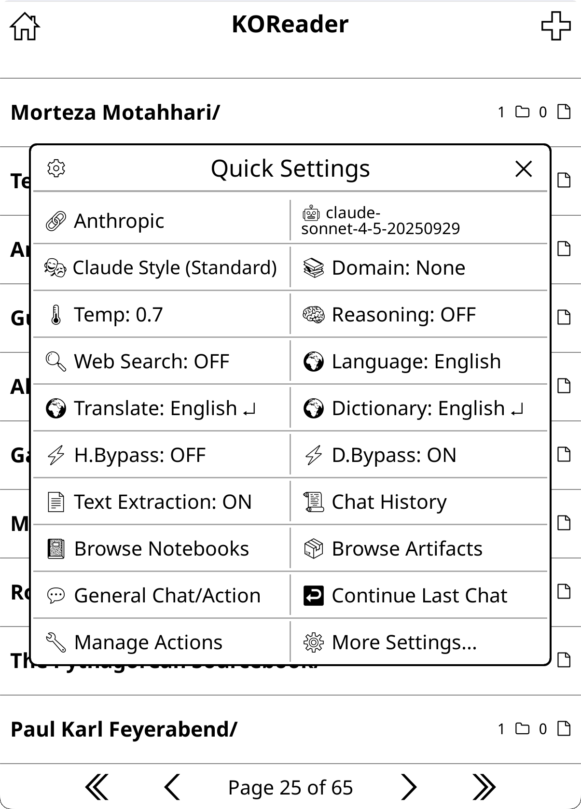</a>

Assign "KOAssistant: Quick Settings" to a gesture for one-tap access to a two-column settings panel with commonly used options:
- **Provider & Model** — Quick switching between AI providers and models
- **Behavior & Domain** — Change communication style and knowledge context
- **Temperature & Reasoning** — Adjust creativity level and toggle Anthropic/Gemini reasoning (has no effect on other providers)
- **Web Search & Language** — Enable AI web search and set primary response language
- **Translate & Dictionary** — Translation and dictionary language settings
- **Highlight Bypass & Dictionary Bypass** — Toggle bypass modes on/off
- **Text Extraction** — Toggle book text extraction on/off (must be enabled once via Settings → Privacy & Data first)
- **Chat History, Browse Notebooks & Browse Artifacts** — Quick access to saved chats, notebooks, and cached artifacts
- **General Chat/Action** — Start a context-free conversation or run a general action
- **Manage Actions** — Edit and configure your actions

In reader mode, additional buttons appear (items naturally shift to accommodate):
- **New Book Chat/Action** — Start a chat about the current book or access book actions
- **Quick Actions...** — Access the Quick Actions panel for reading features
- **More Settings...** — Open the full settings menu

The panel has a **gear icon** (top-left) that opens the QS Panel Utilities manager for reordering and toggling buttons. Also accessible via **Settings → Quick Settings Settings → QS Panel Utilities**.

**2. Quick Actions** (reader mode only)

<a href="screenshots/QApanelmore.png">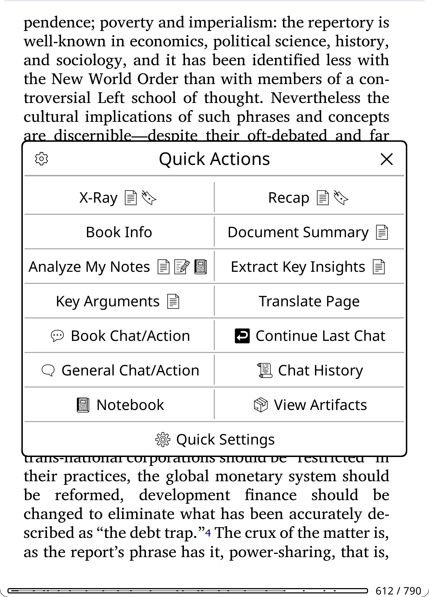</a>

Assign "KOAssistant: Quick Actions" to a gesture for fast access to reading-related actions:
- **Default actions** — X-Ray, Recap, Book Info, Document Summary, Analyze My Notes, Extract Key Insights, Key Arguments (Smart)
- **Artifact button** — "View Artifacts" appears when any artifacts exist (X-Ray, X-Ray (Simple), Summary, Analysis, Recap, Book Info, Analyze My Notes), opening a picker showing each artifact with progress % and age (e.g., "X-Ray (100%, 3d ago)")
- **Utilities** — Translate Page, New Book Chat/Action, Continue Last Chat, General Chat/Action, Chat History, Notebook, View Artifacts, Quick Settings

You can add any book action to Quick Actions via **Action Manager → hold action → "Add to Quick Actions"**. The panel has a **gear icon** (top-left) that lets you choose between managing **Panel Actions** (reorder/remove actions) or **Panel Utilities** (show/hide/reorder utility buttons). Also accessible via **Settings → Quick Actions Settings**. Defaults can also be removed.

> **Tip**: For quick access, assign Quick Settings and Quick Actions to their own gestures (e.g., two-finger tap, corner tap). This gives you one-tap access to these panels from anywhere. Alternatively, you can add them to a KOReader QuickMenu alongside other actions (see below).

**Alternative: Build a KOReader QuickMenu**
For full customization, assign multiple KOAssistant actions to one gesture and enable **"Show as QuickMenu"** to get a selection menu with any actions you want, in any order, mixed with non-KOAssistant actions:
- Chat History, Continue Last Chat, General Chat/Action, Book Chat/Action
- Toggle Dictionary Bypass, Toggle Highlight Bypass
- Translate Page, Settings, etc.

Unlike KOAssistant's built-in panels (Quick Settings, Quick Actions) which show two buttons per row, KOReader's QuickMenu shows one button per row but allows mixing KOAssistant actions with any other KOReader actions.

**Direct gesture assignments**
You can also assign individual actions directly to their own gestures for instant one-tap access:
- "Translate Page" on a multiswipe for instant page translation
- "Toggle Dictionary Bypass" on a tap corner if you frequently switch modes
- "Continue Last Chat" for quickly resuming conversations

**Add your own actions to gestures**
Any book or general action (built-in or custom) can be added to the gesture menu. See [Custom Action Gestures](#custom-action-gestures) for details.

> **Important: KOReader has two separate gesture configurations:**
> - **File Browser gestures**: Configure from the file browser (Settings → Gesture Manager)
> - **Reader gestures**: Configure while a book or document is open (Settings → Gesture Manager)
>
> You must set up gestures in **both places** if you want access from both contexts. Reader-only gestures (like Quick Actions, Translate Page, Book Chat/Action) will appear grayed out if you try to add them to File Browser gestures — this is expected. General gestures (like Quick Settings, Chat History) work in both contexts and can be added to either or both.


### Key Features to Explore

After basic setup, explore these features to get the most out of KOAssistant:

| Feature | What it does | Where to configure |
|---------|--------------|-------------------|
| **[Behaviors](#behaviors)** | Control response style (concise, detailed, custom) | Settings → Actions & Prompts → Manage Behaviors |
| **[Domains](#domains)** | Add project-like context to conversations | Settings → Actions & Prompts → Manage Domains |
| **[Actions](#actions)** | Create your own prompts and workflows | Settings → Actions & Prompts → Manage Actions |
| **Quick Actions** | Fast access to reading actions while in a book or document | Gesture → "KOAssistant: Quick Actions" |
| **[Highlight Menu](#highlight-menu-actions)** | Actions in highlight popup (8 defaults including Translate, ELI5, Explain) | Manage Actions → Add to Highlight Menu |
| **[Dictionary Integration](#dictionary-integration)** | AI-powered word lookups when selecting single words | Settings → Dictionary Settings |
| **[Bypass Modes](#bypass-modes)** | Instant AI actions without menus | Settings → Dictionary/Highlight Settings |
| **Reasoning/Thinking** | Enable deep analysis for complex questions | Settings → Advanced → Reasoning |
| **Backup & Reset** | Backup settings, restore, and reset options | Settings → Backup & Reset |
| **Languages** | Configure multilingual responses (native script pickers) | Settings → AI Language Settings |

See detailed sections below for each feature.

### Tips for Better Results

- **Good document metadata** improves AI responses. Use Calibre, Zotero, or similar tools to ensure titles, authors, and identifiers are correct.
- **Shorter tap duration** makes text selection in KOReader easier: Settings → Taps and Gestures → Long-press interval
- **Choose models wisely**: Fast models (like Haiku) for quick queries; powerful models (like Sonnet, Opus) for deeper analysis. You can set different models for different actions — see [Tuning Built-in Actions](#tuning-built-in-actions).
- **Try different behavior styles**: 23 built-in behaviors include provider-inspired styles (Claude, GPT, Gemini, Grok, DeepSeek, Perplexity) — all work with any provider. Change via Quick Settings or Settings → Actions & Prompts → Manage Behaviors.
- **Combine behaviors with domains**: Behavior controls *how* the AI communicates; Domain provides *what* context. Try Perplexity Style + a research domain for source-focused academic analysis.

---

## Testing Your Setup

The test suite includes an interactive web inspector that lets you test and experiment with KOAssistant without launching KOReader:

**What you can do:**
- **Test API keys** — Verify your credentials work before using on e-reader
- **Experiment with settings** — Try different behaviors, domains, temperature, reasoning
- **Preview request structure** — See exactly what's sent to each provider
- **Actually call APIs** — Send real requests and see responses in real-time
- **Simulate all contexts** — Highlight text, book metadata, multi-book selections
- **Try custom actions** — Test your action prompts before using them on your device
- **Load your actual domains** — The inspector reads from your `domains/` folder
- **Send multi-turn conversations** — **Full chat interface** with conversation history

**Requirements:**
- Lua 5.3+ with LuaSocket, LuaSec, and dkjson
- **Clone from GitHub** — Tests are excluded from release zips to keep downloads small
- See [tests/README.md](tests/README.md) for full setup instructions

**Quick Start:**
```bash
cd /path/to/koassistant.koplugin
lua tests/inspect.lua --web
# Then open http://localhost:8080 in a browser
```

**Pro tip:** The web inspector reads from your actual KOAssistant settings (`koassistant_settings.lua`), so run KOReader on the same device/computer first to load your full configuration (languages, behavior, temperature, etc.).

**Why use it:**
- Test actions and prompts comfortably on a computer before deploying to your e-reader
- Have actual chats with your desired setup to see how it performs
- Experiment with expensive reasoning models without UI overhead
- Debug why a prompt isn't working as expected
- Learn how different settings affect request structure
- Validate custom providers and models
- Compare model and provider performance

---

## Privacy & Data

> ⚠️ **Some features are opt-in.** To protect your privacy, personal reading data (highlights, annotations, notebook) is NOT sent to AI providers by default. You must enable sharing in **Settings → Privacy & Data** if you want features like Analyze My Notes or Connect with Notes to work fully. See [Privacy Controls](#privacy-controls) below.

KOAssistant sends data to AI providers to generate responses. This section explains what's shared and how to control it. This is not meant as security or privacy theater or false reassurances of privacy, as the "threat model" here is simply users including sensitive data (Annotations, notes, content, etc.) by accident; you are already being permissive about privacy by using online AIs (especially for personal interest areas) in the first place, and this plugin by its nature does encourage the use of AI to analyze your reading material. The available placeholders/template variables are substantial in this regard (amount and sensitivity of data), but none currently access KOReader's built in advanced local statistics. Best practice is to pick providers thoughtfully, and the very best practice is to use local or self-hosted solutions, e.g. Ollama.

### What Gets Sent

**Always sent (cannot be disabled):**
- Your question/prompt
- Selected text (for highlight actions)

**Sent by default: (for Actions using it)**
- Document metadata like title, author, identifiers (you can disable this in Action management by unchecking "Include book info")
- Enabled system content, like user languages, domain, behavior, etc
- Reading progress (percentage) 
- Chapter info (current chapter title, chapters read count, time since last opened)
- The data used to calculate this (exact date you opened the document last, etc.) is local only

**Opt-in (disabled by default):**
- Highlights — your highlighted text passages (separate from annotations)
- Annotations — your highlighted text with personal notes attached, and the dates they were made
- Notebook entries — your KOAssistant notebook for the book, with dates
- Book text content — actual text from the document (for X-Ray, Recap, etc.)

### Privacy Controls

**Settings → Privacy & Data** provides three quick presets:

| Preset | What it does |
|--------|--------------|
| **Default** | Progress and chapter info shared for context-aware features. Personal content (highlights, annotations, notebook) stays private. |
| **Minimal** | Maximum privacy. Only your question and book metadata are sent. Even progress and chapter info are disabled. |
| **Full** | All data sharing enabled for full functionality. Does not automatically enable text extraction (see below). |

**Individual toggles** (under Data Sharing Controls):
- **Allow Annotation Notes** — Your personal notes attached to highlights (default: OFF). Automatically enables Allow Highlights. Actions requesting annotations degrade gracefully: when this is off but Allow Highlights is on, they receive highlights-only data (labeled "My highlights so far:" instead of "My annotations:").
- **Allow Highlights** — Your highlighted text passages (default: OFF). Used by X-Ray, Recap, and actions with `{highlights}` placeholders. Does not include personal notes. Grayed out when annotations is enabled (annotations implies highlights).
- **Allow Notebook** — Notebook entries for the book (default: OFF)
- **Allow Reading Progress** — Current reading position percentage (default: ON)
- **Allow Chapter Info** — Chapter title, chapters read, time since last opened (default: ON)

**Trusted Providers:** Mark providers you fully trust (e.g., local Ollama) to bypass all data sharing controls AND text extraction. When the active provider is trusted, all data types — highlights, annotations, notebook, reading progress, and book text — are available without toggling individual settings.

**Graceful degradation:** When you disable a data type, actions adapt automatically. Section placeholders like `{highlights_section}` simply disappear from prompts, so you don't need to modify your actions. For text extraction specifically, actions go a step further: when document text is unavailable, the AI is explicitly guided to use its training knowledge of the work (and to say so honestly if it doesn't recognize the title). This means actions like Explain in Context, Discussion Questions, and others still produce useful results for well-known books even without text extraction enabled — see [Text Extraction and Double-gating](#text-extraction-and-double-gating) for details. **Exception:** X-Ray requires text extraction and blocks generation without it (use X-Ray (Simple) instead for a prose overview from AI knowledge — see [Reading Analysis Actions](#reading-analysis-actions)).

**Visibility tip:** If your device supports emoji fonts, enable **[Emoji Data Access Indicators](#display-settings)** (Settings → Display Settings → Emoji) to see at a glance what data each action accesses — 📄 document text, 🔖 highlights, 📝 annotations, 📓 notebook, 🌐 web search — directly on action names throughout the UI.

### Text Extraction and Double-gating

> ⚠️ **Text extraction is OFF by default.** To use features like X-Ray, Recap, and context-aware highlight actions with actual book content (rather than AI's training knowledge), you must enable it in **Settings → Privacy & Data → Text Extraction → Allow Text Extraction**.

Text extraction sends actual book/document content to the AI, enabling features like X-Ray, Recap, Document Summary/Analysis, and highlight actions like "Explain in Context" to analyze what you've read. Without it enabled, most actions gracefully fall back to the AI's training knowledge — the AI is explicitly told no document text was provided and asked to use what it knows about the work (or say so honestly if it doesn't recognize it). This works reasonably for well-known titles but will be inaccurate for obscure works, and basically unusable for research papers and articles the AI hasn't seen. **Exception:** X-Ray requires text extraction and blocks generation without it — use X-Ray (Simple) for a prose overview from AI knowledge.

**Why it's off by default:**

1. **Token costs and context window** (primary reasons, and also why it is not automatically enabled by Privacy presets, even Full) — Extracting book text uses significantly more context than you might expect. A full book can consume 60k+ tokens per request, which adds up quickly with paid APIs. Users should consciously opt into this cost. Large contexts also significantly degrade response quality, especially for follow up questions. That's why it is wise to use Document Summary caches in combination with Smart Actions, where you run your queries (e.g. Explain in Context) on a previously generated summary of the text, rather than the entire document text.

2. **Content awareness** (See double-gating below) — For most users reading mainstream books, the text itself isn't privacy-sensitive. However, if you're reading something non-standard, subversive, controversial, or otherwise sensitive, you should be aware that the actual content is being sent to cloud AI providers. This is a secondary consideration for most users but important for some.

**How to enable:**
1. Go to **Settings → Privacy & Data → Text Extraction**
2. Enable **"Allow Text Extraction"** (the master toggle)
3. Built-in actions (X-Ray, Recap, Explain in Context, Analyze in Context) already have the per-action flag enabled

**Double-gating for custom actions:** When you create a custom action from scratch, sensitive data requires both a global privacy setting AND a per-action permission flag. This prevents accidental data leakage if you use sensitive placeholders/template variables—enabling a global setting doesn't automatically expose that data in all your custom actions.

> **For built-in actions:** You only need to enable the global setting. Built-in actions already have the appropriate per-action flags set. When you copy a built-in action, it inherits those flags.

The table below documents which flags are required for each data type (relevant when creating custom actions from scratch):

| Data Type | Global Setting | Per-Action Flag |
|-----------|----------------|-----------------|
| Book text | Allow Text Extraction | "Allow text extraction" checked |
| X-Ray analysis cache | Allow Text Extraction if cache was built with text (+ Allow Highlights if cache was built with highlights) | "Allow text extraction" (if cache used text) and "Allow highlight use" (if cache used highlights) checked |
| Analyze/Summary caches | Allow Text Extraction if cache was built with text | "Allow text extraction" (if cache used text) checked |
| Highlights | Allow Highlights (or Allow Annotation Notes) | "Allow highlight use" checked |
| Annotations | Allow Annotation Notes (degrades to highlights when off but Allow Highlights is on) | "Allow annotation use (notes)" checked |
| Notebook | Allow Notebook | "Allow notebook use" checked |
| Surrounding context* | None (hard-capped 2000 chars) | Auto-inferred from placeholder |

\* Surrounding context is a text selection type for highlight context (same as highlighting text), included here for clarity because it extracts more than you highlighted.

> **Tip:** Enable **[Emoji Data Access Indicators](#display-settings)** to see which flags each action has directly on its name — no need to inspect action settings manually.

**Privacy compromise for X-Ray:** X-Ray, X-Ray (Simple), and Recap use highlights (not annotations). If you want them to see your highlighted passages but not personal notes, enable **Allow Highlights** only (leave **Allow Annotation Notes** off). If you prefer no personal data at all, leave both off — X-Ray and Recap analyze the book text alone, and X-Ray (Simple) uses AI knowledge alone.

**Cache permission inheritance:** When caches are built, they record what data was used. Actions that later reference cache placeholders inherit requirements based on what the cache actually contains:
- Cache built **without text extraction** → No "Allow Text Extraction" needed (AI used training knowledge only)
- Cache built **with text extraction** → "Allow Text Extraction" needed
- X-Ray/Recap cache built **without highlights** → No "Allow Highlights" needed
- X-Ray/Recap cache built **with highlights** → "Allow Highlights" (or "Allow Annotation Notes") also required

The artifact viewer shows "Based on AI training data knowledge" or "Based on extracted document text" so you always know what a cache contains. If you change privacy settings after building a cache (e.g., disable text extraction), actions may render the cache placeholder empty. To fix: either re-enable the required permissions, or regenerate the cache with your current settings.

**Two text extraction types** (determined by placeholder in your action prompt):
- `{book_text_section}` — Extracts from start to your current reading position (used by X-Ray, Recap)
- `{full_document_section}` — Extracts the entire document regardless of position (used by most text extraction actions including Explain in Context, Analyze in Context, Summarize, Document Analysis, and more)

See [Troubleshooting → Text Extraction Not Working](#text-extraction-not-working) if you're having issues.

### Local Processing

For maximum privacy, **Ollama** can run AI models entirely on your device(s):
- Data never leaves your hardware
- Works offline after model download
- See [Ollama's official docs](https://github.com/ollama/ollama) for installation and [FAQ](https://github.com/ollama/ollama/blob/main/docs/faq.md) for network setup (hosting on another machine)
- Quick start: Install Ollama → `ollama pull qwen2.5:0.5b` → Select "Ollama" as provider in KOAssistant settings
- For network hosting, change the endpoint in Settings → Provider → Base URL (e.g., `http://192.168.1.100:11434/api/chat`)

**Other local options:** LM Studio, vLLM, llama.cpp server, and Text Generation WebUI all work via [Adding Custom Providers](#adding-custom-providers) since they support OpenAI-compatible APIs. Just input the Provider name and Model name and you are set -- they will be saved for future use.

Anyone using local LLMs is encouraged to open Issues/Feature Requests/Discussions to help enhance support for local, privacy-focused usage.

### Provider Policies

Cloud providers have their own data handling practices. Check their policies on data retention and model training. Remember that API policies are often different from web interface ones.

### Design Choices

KOAssistant does not include library-wide scanning or reading habit profiling.

**KOReader's deeper statistics:** KOReader's Statistics plugin collects extensive local data (reading time, pages per session, reading speed, session history, daily patterns). KOAssistant does **not** access any of this. If KOAssistant ever adds features that expose this behavioral data, they will require explicit opt-in with clear warnings about how revealing such information can be. Reading patterns over time create a surprisingly detailed personal profile.

---

## How to Use KOAssistant

KOAssistant works in **4 contexts**, each with its own set of built-in actions:

| Context | Built-in Actions |
|---------|------------------|
| **Highlight** | Explain, ELI5, Summarize, Elaborate, Connect, Connect (With Notes), Explain in Context, Explain in Context (Smart), Analyze in Context, Analyze in Context (Smart), Thematic Connection (Smart), Fact Check*, Current Context*, Translate, Dictionary, Quick Define, Deep Analysis, Look up in X-Ray† |
| **Book** | Book Info, Find Similar, About Author, Historical Context, Related Thinkers, Book Reviews*, X-Ray, X-Ray (Simple), Recap, Analyze My Notes, Key Arguments, Key Arguments (Smart), Discussion Questions, Discussion Questions (Smart), Generate Quiz, Generate Quiz (Smart), Document Analysis, Document Summary, Extract Key Insights |
| **Multi-book** | Compare Books, Find Common Themes, Analyze Collection, Quick Summaries, Reading Order |
| **General** | News Update* |

*Requires web search (Anthropic, Gemini, OpenRouter). News Update is available in gesture menu by default but not in the general input dialog. See [Web Search](#web-search) and [General Chat](#general-chat) for details.

†Local action — searches cached X-Ray data instantly, no AI call or network required. Only appears when the book has an X-Ray cache.

You can customize these, create your own, or disable ones you don't use. See [Actions](#actions) for details.

### Highlight Mode

<a href="screenshots/highlightmenu.png">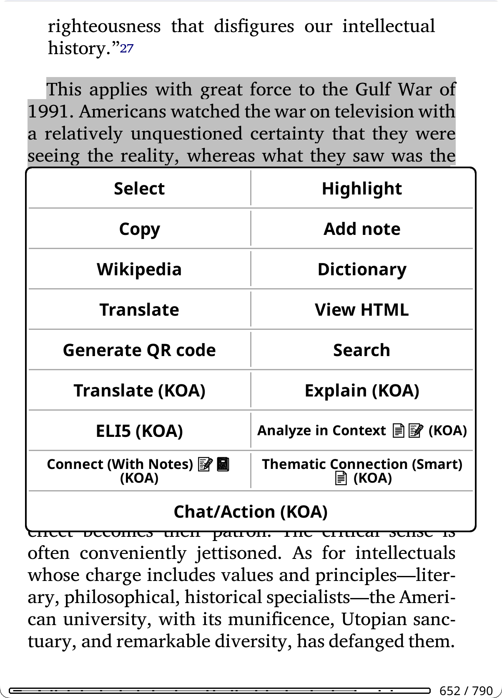</a>

**Access**: Highlight text in a document → tap "KOAssistant"

**Quick Actions**: You can add frequently-used actions directly to KOReader's highlight popup menu for faster access. Instead of going through the KOAssistant dialog, actions like "KOA: Explain" or "KOA: Translate" appear as separate buttons. See [Highlight Menu Actions](#highlight-menu-actions) below.

**Bypass Mode**: Skip the highlight menu entirely and trigger your chosen action immediately when selecting text. See [Highlight Bypass](#highlight-bypass) below.

**Built-in Actions**:
| Action | Description |
|--------|-------------|
| **Explain** | Detailed explanation of the passage |
| **ELI5** | Explain Like I'm 5 - simplified explanation |
| **Summarize** | Concise summary of the text |
| **Elaborate** | Expand on concepts, provide additional context and details |
| **Connect** | Draw connections to other works, thinkers, and broader context |
| **Connect (With Notes)** | Connect passage to your personal reading journey ⚠️ *Requires: Allow Annotation Notes, Allow Notebook* |
| **Explain in Context** | Explain passage using full document text as context ⚠️ *Requires: Allow Text Extraction* |
| **Explain in Context (Smart)** | Like above, but uses cached document summary for efficiency ⚠️ *Requires: Allow Text Extraction* |
| **Analyze in Context** | Deep analysis using full document text and your annotations ⚠️ *Requires: Allow Text Extraction, Allow Annotation Notes* |
| **Analyze in Context (Smart)** | Like above, but uses cached document summary ⚠️ *Requires: Allow Text Extraction, Allow Annotation Notes* |
| **Thematic Connection (Smart)** | Analyze how a passage connects to the book's larger themes ⚠️ *Requires: Allow Text Extraction* |
| **Fact Check** | Verify claims using web search ⚠️ *Requires: Web Search* |
| **Current Context** | Get latest information about a topic using web search ⚠️ *Requires: Web Search* |
| **Translate** | Translate to your configured language |
| **Dictionary** | Full dictionary entry: definition, etymology, synonyms, usage (also accessible via dictionary popup) |
| **Quick Define** | Minimal lookup: brief definition only, no etymology or synonyms |
| **Deep Analysis** | Linguistic deep-dive: morphology, word family, cognates, etymology path |
| **Look up in X-Ray** | `[Local]` Instant search of cached X-Ray data for selected text — no AI call, works offline. Shows matching characters, locations, themes, or concepts with full detail. Available in highlight menu and dictionary popup. Only appears when the book has an X-Ray cache. |

**Regular vs Smart actions:**

Several actions come in two variants: a **regular** version that sends full document text, and a **Smart** version that uses a cached document summary instead. Both analyze the actual content — the difference is cost and freshness, as well as the AIs performance degradation with large contexts:

- **Regular** (e.g., Discussion Questions) — Sends the full document text to the AI. Most accurate, but uses more tokens. Best for one-off queries or short documents.
- **Smart** (e.g., Discussion Questions (Smart)) — Uses a pre-generated summary (~2-8K tokens) instead of raw text (~100K tokens). Much cheaper and performant for repeated use or follow-up questions, since each follow-up resends the full conversation history to the AI. A smaller initial context means more room for extended discussions. Best for longer documents or repeated actions and follow-up queries.

| Regular (full text) | Smart (cached summary) | Context |
|---------------------|------------------------|---------|
| Explain in Context | Explain in Context (Smart) | Highlight |
| Analyze in Context | Analyze in Context (Smart) | Highlight |
| — | Thematic Connection (Smart) | Highlight |
| Key Arguments | Key Arguments (Smart) | Book |
| Discussion Questions | Discussion Questions (Smart) | Book |
| Generate Quiz | Generate Quiz (Smart) | Book |

**When to use Smart variants:**
- Longer documents (longer research papers, textbooks, novels)
- Repeated queries on the same book
- Books the AI isn't trained on (need context for every query)
- When token cost is a concern

**When to use regular variants:**
- Short to medium length documents where full text is cheap to send and doesn't choke the context window, thus degrading performance
- One-off queries where generating a summary first isn't worth it
- When you need the AI to work from the actual text, not a summary, for detail and accuracy

**How Smart actions work:**
- First use: Prompts to generate a reusable summary via the **Document Summary** action
- Subsequent uses: Uses cached summary (much faster and cheaper)
- The summary is available to other Smart actions and as a placeholder for use as you like
- Token savings: ~100K raw text → ~2-8K cached summary per query

**Document Summary and Smart actions:**

The **Document Summary** action is the same action that Smart actions trigger automatically when no summary exists — it generates the summary artifact. You can run it yourself proactively (from Reading Features, Quick Actions, gestures, or the book actions menu) or let Smart actions trigger it on demand. When triggered by a Smart action, the summary is generated silently in the background and the Smart action continues automatically. When triggered directly, it opens in the summary viewer.

You can customize the Document Summary action independently (provider, model, temperature, etc.) via Action Manager if you find a setup that works well for summary generation. Smart actions use their own settings (global or per-action overrides) — separate from the Document Summary action's settings.

Even if you remove Document Summary from Quick Actions or Reading Features, or disable it entirely, it still works as the Smart action summary generator — the pre-flight mechanism calls it directly, not through the panel.

**Accessing summaries:**
- **Reading Features** → Document Summary (shows View/Redo popup if summary exists, generates if not)
- **Quick Actions** → Document Summary (same behavior)
- **File browser** → Long-press a book → "View Artifacts (KOA)" → pick Summary, X-Ray, X-Ray (Simple), Recap, or Analysis. X-Ray opens in a browsable category menu; X-Ray (Simple) opens in the text viewer.
- **Gesture** → Add artifact actions to gesture menu via Action Manager (hold action → "Add to Gesture Menu")
- **Coverage**: The viewer title shows coverage percentage if document was truncated (e.g., "Summary (78%)")

> **Tip**: For documents you'll query multiple times, generate the summary proactively to save tokens on future queries. The artifacts (Summary, X-Ray, X-Ray (Simple), Analysis, Recap) are also useful on their own as viewable reference guides — see [Document Artifacts](#document-artifacts).

See [Document Artifacts → "Generate Once, Use Many Times"](#document-artifacts) for full details on the summary artifact and Smart actions system.

**What the AI sees**: Your highlighted text, plus document metadata (title, author). Actions like "Explain in Context" and "Analyze in Context" also use extracted document text to understand the surrounding content. Custom actions can access reading progress, chapter info, your highlights/annotations, notebook, and extracted book text—depending on action settings and [privacy preferences](#privacy--data). See [Template Variables](#template-variables) for details.

**Save to Note**: After getting an AI response, tap the **Save to Note** button to save it directly as a KOReader highlight note attached to your selected text. See [Save to Note](#save-to-note) for details.

> **Tip**: Add frequently-used actions to the highlight menu (Action Manager → hold action → "Add to Highlight Menu") for quick access. Other enabled highlight actions remain available from the main "KOAssistant" entry in the highlight popup. From that input window, you can also add extra instructions to any action (e.g., "esp. the economic implications" or "in simple terms").

### Book/Document Mode

<a href="screenshots/bookinfowmetadata.png"></a>

**Access**: Long-press a book in File Browser → "Chat/Action (KOA)" or while reading, use gesture or menu

Some actions work from the file browser (using only document metadata like title/author), while others require reading mode (using document state like progress, highlights, or extracted text). Reading-only actions are automatically hidden in file browser. You can pin frequently-used file browser actions directly to the long-press menu via **Action Manager → hold action → "Add to File Browser"**, so they appear as one-tap buttons without opening the action selector. All file browser buttons (utilities + pinned actions + Chat/Action) are distributed across rows of up to 4 buttons each.

**Built-in Actions**:
| Action | Description |
|--------|-------------|
| **Book Info** | Overview, significance, and why to read it |
| **Find Similar** | Recommendations for similar books |
| **About Author** | Author biography and writing style |
| **Historical Context** | When written and historical significance |
| **Related Thinkers** | Intellectual landscape: influences, contemporaries, and connected thinkers |
| **Book Reviews** | Find critical and reader reviews, awards, and reception ⚠️ *Requires: Web Search* |
| **X-Ray** | Browsable reference guide: characters (with aliases and connections), locations, themes, lexicon, timeline — opens in a structured menu with search, chapter/book mention tracking, per-item chapter distribution, linkable cross-references, local lookup, and highlight integration ⚠️ *Requires: Allow Text Extraction* |
| **X-Ray (Simple)** | Prose companion guide from AI knowledge — characters, themes, settings, key terms. No text extraction needed. Uses reading progress to avoid spoilers. |
| **Recap** | "Previously on..." style summary to help you resume reading ⚠️ *Best with: Allow Text Extraction* |
| **Analyze My Notes** | Discover patterns and connections in your notes and highlights ⚠️ *Requires: Allow Annotation Notes* |
| **Key Arguments** | Thesis, evidence, assumptions, and counterarguments using full book text ⚠️ *Requires: Allow Text Extraction* |
| **Key Arguments (Smart)** | Like Key Arguments, but uses cached summary ⚠️ *Requires: Allow Text Extraction* |
| **Discussion Questions** | Comprehension, analytical, and interpretive prompts using full book text ⚠️ *Requires: Allow Text Extraction* |
| **Discussion Questions (Smart)** | Like Discussion Questions, but uses cached summary ⚠️ *Requires: Allow Text Extraction* |
| **Generate Quiz** | Comprehension quiz with answers (multiple choice, short answer, essay) ⚠️ *Requires: Allow Text Extraction* |
| **Generate Quiz (Smart)** | Like Generate Quiz, but uses cached summary ⚠️ *Requires: Allow Text Extraction* |
| **Document Analysis** | Deep analysis: thesis, structure, key insights, audience. Saved as an Analysis artifact. ⚠️ *Requires: Allow Text Extraction* |
| **Document Summary** | Comprehensive summary of entire document. Saved as a Summary artifact — the foundation that all Smart actions rely on. ⚠️ *Requires: Allow Text Extraction* |
| **Extract Key Insights** | Actionable takeaways and ideas worth remembering ⚠️ *Requires: Allow Text Extraction* |

**What the AI sees**: Document metadata (title, author). For Analyze My Notes: your annotations. For full document actions: entire document text.

#### Reading Analysis Actions

These actions analyze your actual reading content. They require specific privacy settings to be enabled:

| Action | What it analyzes | Privacy setting required |
|--------|------------------|--------------------------|
| **X-Ray** | Book text + highlights up to current position | Allow Text Extraction (required), Allow Highlights (optional) |
| **X-Ray (Simple)** | AI training knowledge + reading progress + highlights | Allow Highlights (optional) |
| **Recap** | Book text + highlights up to current position | Allow Text Extraction, Allow Highlights |
| **Analyze My Notes** | Your highlights and annotations | Allow Annotation Notes |
| **Key Arguments** | Entire document | Allow Text Extraction |
| **Key Arguments (Smart)** | Cached summary | Allow Text Extraction |
| **Discussion Questions** | Entire document | Allow Text Extraction |
| **Discussion Questions (Smart)** | Cached summary | Allow Text Extraction |
| **Generate Quiz** | Entire document | Allow Text Extraction |
| **Generate Quiz (Smart)** | Cached summary | Allow Text Extraction |
| **Document Analysis** | Entire document | Allow Text Extraction |
| **Document Summary** | Entire document | Allow Text Extraction |
| **Extract Key Insights** | Entire document | Allow Text Extraction |
| **Book Info** | AI training knowledge (+ optional web search) | None (web search optional) |
| **Analyze My Notes** | Your highlights and annotations | Allow Annotation Notes |

> ⚠️ **Privacy settings required:** These actions won't have access to your reading data unless you enable the corresponding setting in **Settings → Privacy & Data**. Without text extraction enabled, most actions gracefully fall back: the AI is explicitly guided to use its training knowledge of the work and to say so if it doesn't recognize the title. This produces reasonable results for well-known books but will be less accurate for obscure works and unusable for research papers. A "*Response generated without: ...*" notice will appear in the chat to indicate what data was requested but not provided. **Exception:** X-Ray requires text extraction and blocks generation without it — use X-Ray (Simple) for a prose overview from AI knowledge.
>
> **Smart actions don't fall back this way** — they require a pre-generated summary cache to function, so they prompt you to generate one first. If you decline, the action doesn't run. This is by design: Smart actions are specialized for repeated queries on a condensed summary, and running them without any document context would defeat their purpose.

> **Tip:** Highlight actions can also use text extraction. "Explain in Context" and "Analyze in Context" send the full document text (`{full_document_section}`) to understand your highlighted passage within the complete work. See [Highlight Mode](#highlight-mode) for details.

**X-Ray**, **Document Summary**, and **Document Analysis** require text extraction enabled (Settings → Privacy & Data → Text Extraction). Without it, generation is blocked with a message directing you to enable text extraction (or use X-Ray (Simple) as an alternative for X-Ray). If you've already generated a cached result and later disable text extraction, you can still view it but cannot regenerate or redo it.

<p align="center">
  <a href="screenshots/Xraybrowser.png"></a>
  <a href="screenshots/xrayarg.png"></a>
  <a href="screenshots/xrayappearance.png">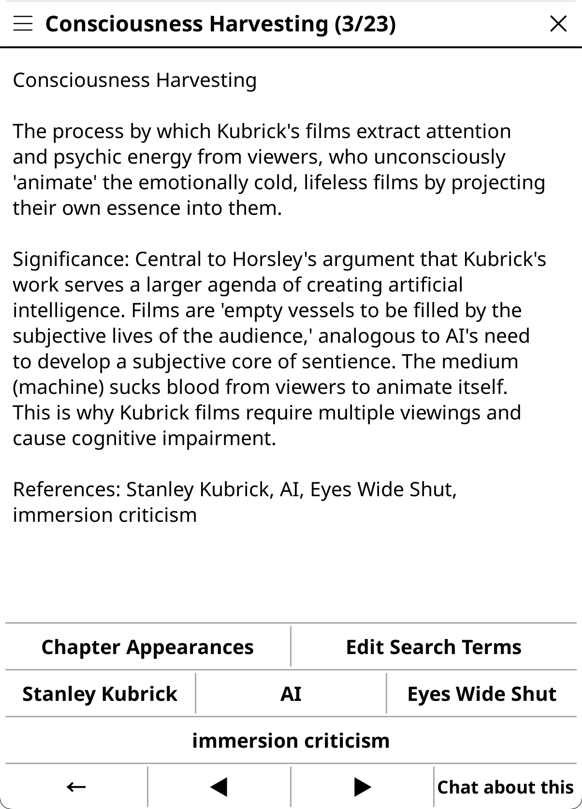</a>
  <a href="screenshots/xrayapps.png">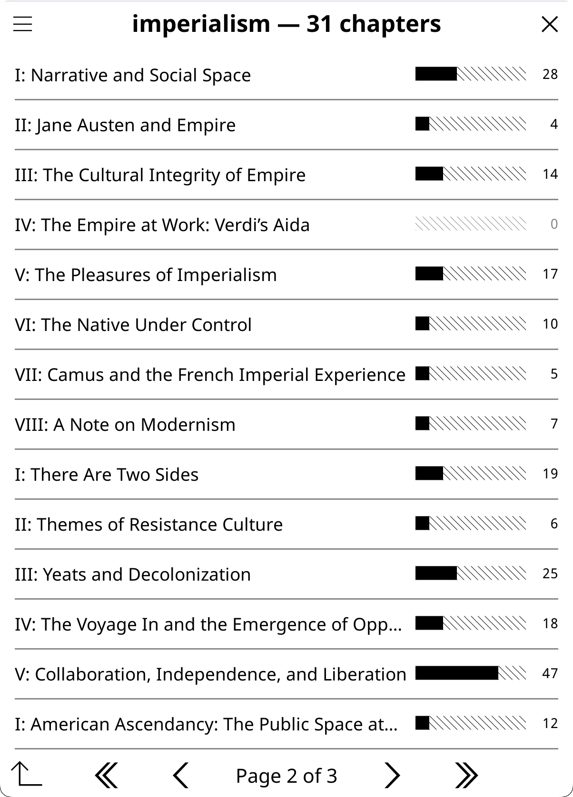</a>
</p>

The X-Ray action produces a structured JSON analysis that opens in a **browsable category menu** rather than a plain text document. The initial browsable menu concept was inspired by [X-Ray Plugin for KOReader by 0zd3m1r](https://github.com/0zd3m1r/koreader-xray-plugin). Chapter distribution, linkable connections, and local lookup features were informed by [Dynamic X-Ray by smartscripts-nl](https://github.com/smartscripts-nl/dynamic-xray) — a comprehensive manual X-Ray system with curated character databases, live page markers, and a custom histogram widget. Our approach differs: KOAssistant uses AI generation instead of manual curation, and menu-based navigation instead of custom widgets, but DX demonstrated the value of per-item chapter tracking and cross-reference linking. The browser provides:

- **Category navigation** — Cast, World, Ideas, Lexicon, Story Arc, Reader Engagement, Current State/Conclusion (fiction) or Key Figures, Core Concepts, Arguments, Terminology, Argument Development, Reader Engagement, Current Position/Conclusion (non-fiction) — with item counts. Reader Engagement appears only when highlights were provided during generation. Current State/Current Position appears for incremental (spoiler-free) X-Rays; Conclusion appears for complete (entire document) X-Rays — see [two-track design](#x-ray-modes) below.
- **Item detail** — descriptions, AI-provided aliases (e.g., "Lizzy", "Miss Bennet" — shown for all categories), connections/relationships, your highlights mentioning each item, and custom search term editing
- **Linkable references** — character connections and cross-category references (locations → characters, themes → characters, etc.) are tappable buttons that navigate directly to the referenced item's detail view. References are resolved across all categories using name, alias, and substring matching.
- **Mentions** — unified chapter-navigable text matching. Opens to your current chapter by default, showing which X-Ray items (characters, locations, themes, lexicon, etc.) appear there with mention counts and category tags. A chapter picker at the top opens a KOReader-style hierarchical TOC with expand/collapse for nested chapters — auto-expands to the current chapter and bolds it; subsequent opens remember your last selection. Tap any entry at any depth (Part, Chapter, Section) to analyze that scope. Includes an "All Chapters (to X%)" aggregate option that scans from page 1 to the coverage boundary, plus an "All Chapters" option that reveals the entire book (bypassing per-chapter spoiler confirmations). Chapters beyond the greater of X-Ray coverage and reading position are dimmed with tap-to-reveal spoiler protection. For complete X-Rays, all chapters are available with no spoiler gating. Books without a TOC fall back to page-range chunks. Excludes event-based categories (timeline, argument development) whose descriptive names produce misleading matches. Uses word-boundary matching against names and aliases.
- **Chapter Appearances** — from any item's detail view, see where it appears across all chapters with inline bar visualization (████░░░░) and mention counts. Counts use union semantics: all match spans from the item's name and aliases are collected, overlapping spans merged, and unique matches counted — matching KOReader's text search behavior. Current chapter marked with ▶. Chapters beyond the greater of your X-Ray coverage and reading position are dimmed with tap-to-reveal spoiler protection (individual or "Scan all"). For complete X-Rays, all chapters are visible with no spoiler gating. Tap a chapter with mentions to navigate there and launch a text search for the item's name and aliases (uses regex OR for multi-term matching, e.g., `Constantine|Mithrandir`). A floating "← X-Ray" button appears during the search — tap it to return directly to the distribution view; hold to dismiss. Auto-dismisses when the search dialog is closed. Uses TOC-aware chapter boundaries with configurable depth and page-range fallback for books without TOC. Per-session caching avoids re-scanning.
- **Edit Search Terms** — from any item's detail view, add custom search terms (alternate spellings, transliterations, nicknames) or ignore AI-generated aliases that produce false matches. Custom terms are stored per-book in a sidecar file that survives X-Ray regeneration. Added terms contribute to Chapter Appearances counts and KOReader text search patterns. Ignored terms are hidden from the item's alias list and excluded from counting. All operations (add, remove, ignore, restore) are accessible from a single "Edit Search Terms" button.
- **Search** — find any entry across all categories by name, alias, or description
- **Local X-Ray Lookup** — select text while reading → instantly look it up in cached X-Ray data. No AI call, no network, instant results. Single match shows full detail; multiple matches show a tappable list. Available in highlight menu and dictionary popup when an X-Ray cache exists. See "Look up in X-Ray" in [Highlight Mode](#highlight-mode).
- **Full View** — rendered markdown view in the chat viewer (with export)
- **Chat about this** — from any detail view, launch a chat with the entry as context to ask follow-up questions. Opens with a curated set of actions (Explain, Elaborate, ELI5, Fact Check, Explain in Context (Smart), Thematic Connection (Smart), Connect by default) since the context is AI-generated analysis. The entry text is prefixed with a note clarifying it's from an analysis, not the work itself. Customize which actions appear via the gear icon → "Choose and Sort Actions"
- **Text selection** — hold to select text in detail views: 1-3 words opens dictionary, 4+ copies to clipboard
- **Options menu** — info (model, progress, date, fiction/non-fiction type), delete, close

> **Model selection for X-Ray:** X-Ray generates detailed structured JSON (for the X-Ray browser to work) that can be large (10K-30K+ tokens of output), and it is a complex task for the AI. The action requests up to 32K output tokens to avoid truncation. Weaker models can struggle to follow these instructions, and even if they manage it, will produce low quality content for the actual analysis, and models with low output caps (e.g., some Groq models at 8K, DeepSeek Chat at 8K) will produce shorter, potentially truncated results — use larger models with higher output limits for best results. If you find a model that produces great X-Rays, you can lock it in for this action while keeping your global model for everything else — see the tip below.

> **Tip: Per-action model overrides.** You don't have to use the same model for every action. If you discover that a particular model excels at X-Ray (or any other action), you can assign it permanently to just that action:
> 1. Go to **Settings → Actions → Manage Actions**
> 2. Long-press the action (e.g., X-Ray) → **"Edit Settings"**
> 3. Scroll to **Advanced** → set **Provider** and **Model**
>
> Your global model continues to be used for all other actions. This is useful for mixing cost and quality — for example, use a fast model (Gemini 2.5 Flash, Haiku, small Mistral models, etc.) as your global default for quick lookups and chat, while assigning a more capable model (Gemini 2.5 Pro, Sonnet, large Mistral models, etc.) specifically to X-Ray or Deep Analysis where quality matters most. See [Tuning Built-in Actions](#tuning-built-in-actions) for more examples. You can of course also momentarily change you global model to run an action and then change back if you don't want to tie an action to a model. 

> **Tip:** If your device supports emoji fonts, enable **Emoji Menu Icons** in Settings → Display Settings → Emoji for visual category icons in the X-Ray browser (e.g., characters, locations, themes). See [Emoji Menu Icons](#display-settings).

> **Custom TOC support:** Chapter-based features (Mentions, Chapter Appearances) automatically use KOReader's active TOC — including custom/handmade TOCs. If your book has no chapters or a single chapter, the fallback is page-range chunks (~20 pages each). For better results, create a custom TOC in KOReader (long-press the TOC icon → "Set custom TOC from pages") and the X-Ray browser will use it.

> **Hidden flows support:** When KOReader's hidden flows feature is active (hiding endnotes, translator introductions, or separate books in collected works), KOAssistant automatically adapts:
> - **Text extraction** skips hidden content — only visible pages are sent to the AI
> - **Reading progress** reports your position within visible content only (e.g., page 42 of 70 visible pages = 60%, not 42%)
> - **TOC-based features** (Mentions, Chapter Appearances) filter out chapters from hidden flows
> - **Cache staleness** detects when your hidden flow configuration changes and notifies you
>
> This works for both EPUB and PDF. Useful for collected works where you want to analyze just one book, or for editions with long endnotes/apparatus you want excluded from AI analysis. The hidden content is simply invisible to KOAssistant — extraction, progress tracking, and chapter features all operate on visible pages only.
>
> **Tip:** Hidden Flows is one of the best ways to save tokens and improve AI results. By hiding front matter, appendices, indices, and other non-narrative content, you send only the parts that matter. For collected works or anthologies, use Hidden Flows to isolate individual volumes or sections — a "Complete X-Ray" treats the visible content as the entire document, giving you a focused, high-quality analysis of just the part you're reading. See KOReader's documentation for how to set up Hidden Flows. *(Planned: **Scoped X-Rays & Sub-Books** — save named scopes as reactivatable "sub-documents" with their own complete set of artifacts and caches, then bridge across related documents in a series or research collection for shared cross-document analysis.)*

> **Highlights in X-Ray:** When [Allow Highlights](#privacy-controls) is enabled, X-Ray incorporates your highlighted passages into its analysis — adding a **Reader Engagement** category that tracks which themes and ideas you've engaged with, and weaving your highlights into character and location entries. This gives the X-Ray a personal dimension tied to your reading. To control this:
> - **Disable for all actions:** Turn off "Allow Highlights" in Settings → Privacy & Data. No action will see your highlights.
> - **Disable for X-Ray only:** Go to Settings → Actions → Manage Actions, long-press the X-Ray action → "Edit Settings", and untick "Allow highlight use". Other actions keep highlight access.
>
> Without highlights, X-Ray still works fully — you just won't see the Reader Engagement category or highlight mentions in entries.

> **Tip: Reasoning for complex tasks.** For short, dense works (research papers, academic chapters, technical documents under ~100 pages), enabling **Reasoning** can significantly improve X-Ray quality and depth. The additional processing time is worthwhile when the text is concentrated — the AI produces more thorough entries and fewer omissions. For Claude 4.6 models, use **Adaptive Thinking** (effort: high or max for Opus) — the model decides how much thinking each part of the analysis needs. For other models, **Extended Thinking** with a higher budget helps. This also applies to Document Analysis and other complex one-off tasks. See [Reasoning/Thinking](#reasoningthinking).

<a id="x-ray-modes"></a>

**X-Ray** requires text extraction to generate — it blocks with a message directing you to enable text extraction or use X-Ray (Simple) instead. If you've already cached an X-Ray and later disable text extraction, you can still view the cached result but cannot update or redo it.

**X-Ray (Simple)** is a separate action that produces a prose overview (Characters, Themes, Setting, Key Terms, Where Things Stand) from the AI's training knowledge — no text extraction needed. Uses your reading progress for spoiler gating and optionally includes your highlights. Available in the Reading Features menu and as a separate artifact. Every generation is fresh (no incremental updates). Best for well-known books when you don't want to enable text extraction. For obscure works or research papers, results will be limited since the AI may not recognize the title.

**Recap** works in two modes:
- **With text extraction** (recommended): AI analyzes actual book content. Produces accurate, book-specific results. Results are cached and labeled "Based on extracted document text."
- **Without text extraction** (default): AI uses only the title/author and its training knowledge. Works reasonably for well-known titles but produces generic results. Results are labeled "Based on AI training data knowledge."

**Two-track X-Ray:** When generating a new X-Ray, you choose between two tracks:

- **Incremental** (default) — Spoiler-free: extracts text only up to your current reading position. Produces a **Current State** (fiction) or **Current Position** (non-fiction) section capturing active conflicts, open questions, and narrative momentum. Supports incremental updates as you read further — only new content is sent, and the AI's additions are diff-merged into the existing analysis. Updates are fast and cheap (~200-500 output tokens vs 2000-4000 for full regeneration). You can also **Update to 100%** to extend the incremental X-Ray to the end of the book using the same spoiler-free prompt. The scope popup offers: "Generate X-Ray (to 42%)" for a new incremental X-Ray, or "Update X-Ray (to 100%)" for an existing one.
- **Complete** (entire document) — Holistic: extracts and analyzes the entire document in one pass. Produces a **Conclusion** section with resolutions, themes resolved (fiction) or key findings, implications (non-fiction). Always generates fresh — no incremental updates, no diff-merging. Best for articles, research papers, short works, or finished books where spoiler-free scoping isn't needed. The scope popup offers: "Generate X-Ray (entire document)".

The track is chosen at initial generation and cannot be converted. To switch tracks, delete the cache and regenerate. Both tracks use the same browsable category menu, the same JSON structure for all shared categories (characters, locations, themes, etc.), and the same privacy gates. The only structural difference is the final status section (Current State/Current Position vs Conclusion).

When an X-Ray cache covers 100% — whether from a complete generation, an incremental "Update to 100%", or simply reading to the end and updating — tapping X-Ray goes directly to the browser viewer with no popup (Redo is available in the browser's options menu).

> **Spoiler safety:** By default, X-Ray and Recap use the **incremental** track, which limits extraction to your current reading position (`{book_text_section}`). Choosing "Generate X-Ray (entire document)" uses the **complete** track, which sends the full document (`{full_document_section}`). All other text extraction actions — including "Explain in Context" and "Analyze in Context" — always send the full document. If you need a spoiler-free variant of any action, create a custom action using `{book_text_section}` instead of `{full_document_section}`.

> **Note:** Marking a book as "finished" in KOReader does not affect text extraction. Incremental X-Ray and Recap still extract up to your actual page position, not 100%. This means you can navigate to a specific point in a finished book and get a spoiler-free analysis up to that point. For a full analysis of a finished book, use "Generate X-Ray (entire document)" to get the complete track with Conclusion.

> ⚠️ **To enable text extraction:** Go to Settings → Privacy & Data → Text Extraction → Allow Text Extraction. This is OFF by default to avoid unexpected token costs.

**Full Document Actions** (Document Analysis, Document Summary, Extract Insights, Key Arguments, Discussion Questions, Generate Quiz, Explain in Context, Analyze in Context): These actions send the entire document text to the AI regardless of reading position. **Document Analysis** and **Document Summary** require text extraction — they block generation when it's disabled, like X-Ray. Other full document actions gracefully degrade when text extraction is disabled — the AI is guided to use its training knowledge and to be honest about unrecognized works (see [Privacy Controls](#privacy-controls)). They adapt to your content type and work especially well with [Domains](#domains). For example, with a "Linguistics" domain active, analyzing a linguistics paper will naturally focus on relevant aspects. Key Arguments, Discussion Questions, and Generate Quiz also have **Smart variants** that use a cached summary instead of full text — cheaper for repeated use on longer books.

> **Tip:** Create specialized versions for your workflow. Copy a built-in action, customize the prompt for your field (e.g., "Focus on methodology and statistical claims" for scientific papers), and pair it with a matching domain. Disable built-ins you don't use via Action Manager (tap to toggle). See [Custom Actions](#custom-actions) for details.

> **📦 Response Caching**: X-Ray and Recap responses are automatically cached per book. For incremental X-Rays with a partial cache, a popup lets you **View** the cached result (with coverage and age), **Update** it to your current position, or **Update to 100%**. Complete X-Rays and incremental caches at 100% go directly to the browser viewer — Redo is available in the options menu. See [Response Caching](#response-caching) for details.

**Reading Mode vs File Browser:**

Book actions work in two contexts: **reading mode** (book is open) and **file browser** (long-press a book in your library).

- **File browser** has access to book **metadata** only: title, author, identifiers
- **Reading mode** additionally has access to **document state**: reading progress, highlights, annotations, notebook, extracted text

**Reading-only actions** (hidden in file browser): X-Ray, X-Ray (Simple), Recap, Analyze My Notes, Key Arguments, Key Arguments (Smart), Discussion Questions, Discussion Questions (Smart), Generate Quiz, Generate Quiz (Smart), Document Analysis, Document Summary, Extract Key Insights. These require document state that isn't available until you open the book.

Custom actions using placeholders like `{reading_progress}`, `{book_text}`, `{full_document}`, `{highlights}`, `{annotations}`, or `{notebook}` are filtered the same way. The Action Manager shows a `[reading]` indicator for such actions.

### Multi-Document Mode

**Access**: Select multiple documents in File Browser → tap any → "Compare with KOAssistant"

**Built-in Actions**:
| Action | Description |
|--------|-------------|
| **Compare Books** | What makes each book distinct — contrasts, not just similarities |
| **Find Common Themes** | Shared DNA — recurring themes, influences, connections |
| **Analyze Collection** | What this selection reveals about the reader's interests |
| **Quick Summaries** | Brief summary of each book |
| **Reading Order** | Suggest optimal order based on dependencies, difficulty, themes |

**What the AI sees**: List of titles, authors, and identifiers 

### General Chat

**Access**: Tools → KOAssistant → General Chat/Action, or via gesture (easier)

A free-form conversation without specific document context. If started while a book is open, that "launch context" is saved with the chat (so you know where you launched it from) but doesn't affect the conversation, i.e. the AI doesn't see that you launched it from a specific document, and the chat is saved in General chats

**Built-in Actions**:
| Action | Description |
|--------|-------------|
| **News Update** | Get today's top news stories from Al Jazeera with links ⚠️ *Requires: Web Search* |

#### Managing the Input Dialog

All input dialogs (highlight, book, general) show a configurable set of actions that you can customize per context. The top row has **[Web ON/OFF] [Domain] [Send]**, followed by action buttons in rows of 2. The title bar has a close X on the right and a gear icon on the left.

**Default actions per context:**

| Context | Default Actions |
|---------|----------------|
| **Highlight** | Translate, ELI5, Explain, Elaborate, Summarize, Connect, Fact Check, Explain in Context (Smart) |
| **Book** | Book Info, X-Ray (Simple), Find Similar, Key Arguments, Extract Key Insights, Discussion Questions, About Author, Book Reviews |
| **Book (file browser)** | Book Info, Find Similar, Related Thinkers, About Author, Historical Context, Book Reviews |
| **X-Ray Chat** | Explain, Elaborate, ELI5, Fact Check, Explain in Context (Smart), Thematic Connection (Smart), Connect |
| **General** | *(none — use Send button for freeform chat)* |

All defaults are customizable — add, remove, or reorder actions for each context independently. Remaining enabled actions are always accessible via "Show More Actions" in the grid or the gear icon → "More Actions".

**Customizing which actions appear:**
- **From the input dialog**: Tap the gear icon → **"Choose and Sort Actions"** to reorder, show, or hide actions for the current context
- **From the input dialog**: Tap the gear icon → **"More Actions"** to run any enabled action not currently shown in the grid
- **From Action Manager**: Long-press any action → **"+ Input Dialog"** to add it to the relevant input context

The general input dialog shows only actions you've explicitly added. By default, it starts empty (use the Send button for freeform chat). To add actions:

1. Go to **Settings → Actions → Action Manager**
2. Switch to **General** context (at the top)
3. Long-press any action
4. Tap **"Add to General Input"**

Actions like News Update that require [web search](#web-search) are available in the gesture menu by default but not in the input dialog—this avoids showing web-dependent actions to users who haven't configured a web-search-capable provider. Add them to the input dialog (Manage Actions -> long press a general context action -> Add to General Input) if you use Anthropic, Gemini, or OpenRouter, the latter of which support web search for models from other providers that KOAssistant currently doesn't have dedicated web support for, e.g. OpenAI, XAI, Perplexity models.

> **Tip:** News Update demonstrates per-action web search override (`enable_web_search = true`). Even if web search is globally disabled, this action will use it. See [Web Search](#web-search) for more on per-action overrides.

### Quick UI Features

- **Settings Icon (Input)**: Tap the gear icon in the input dialog title bar for a menu with **Quick Settings** (streamlined settings panel), **Choose and Sort Actions** (reorder, show/hide actions for this context), and **More Actions** (access enabled actions not shown in the grid). See [Recommended Setup](#recommended-setup) for details on the Quick Settings panel.
- **Web Search Toggle (Input)**: The input dialog has a **Web ON/OFF** button (top row) to toggle web search before running an action. This is a persistent toggle — the setting sticks across sessions. Action button labels update to reflect web search status.
- **Settings Icon (Viewer)**: Tap the gear icon in the chat viewer title bar to adjust font size and text alignment (cycles left/justified/right on each click)
- **Settings Icon (Panels)**: Both the Quick Settings and Quick Actions panels have a gear icon in the title bar for managing panel layout — reorder, show/hide buttons without leaving the panel
- **Show/Hide Quote**: In the chat viewer, toggle button to show or hide the highlighted text quote (useful for long selections)
- **Save to Note**: For highlight context chats, tap the **Save to Note** button to save the AI response directly as a note attached to your highlighted text (see [Save to Note](#save-to-note) below)
- **Link Handling**: Tapping a link in the chat viewer opens KOReader's external link dialog — Copy, Show QR code, Open in browser, and any registered plugin actions (e.g., Add to Wallabag). When no book is open, a basic version of the dialog is shown.
- **Text Selection Lookup**: Selecting 1–3 words in the chat viewer triggers a dictionary lookup (KOReader's built-in dictionary when [bypass](#dictionary-bypass) is off, or your configured AI action when on). Selecting 4+ words copies to clipboard. Your chat stays open underneath. See [Text Selection in Chat Viewer](#text-selection-in-chat-viewer).
- **Other**: Turn on off Text/Markdown view, Debug view mode, add Tags, Change Domain, etc

### Save to Note

**Save AI responses directly to your KOReader highlights.**

When working with highlighted text, the **Save to Note** button lets you save the AI response as a native KOReader note attached to that highlight. This integrates AI explanations, translations, and analysis directly into your reading annotations.

**How it works:**
1. Highlight text and use any KOAssistant action (Explain, Translate, etc.)
2. Review the AI response in the chat viewer
3. Tap the **Save to Note** button (appears between Copy and Add to Notebook)
4. KOReader's Edit Note dialog opens with the response pre-filled
5. Edit if desired, then save — the highlight is created with your note attached

**Key features:**
- **Native integration**: Uses KOReader's standard highlight/note system
- **Configurable content**: Choose what to save — response only (default), question + response, or full chat with metadata. Configure in Settings → Chat & Export Settings → Content Format → Note Content
- **Editable before saving**: Review and modify the AI response before committing
- **Creates permanent highlight**: The selected text becomes a saved highlight with the note attached
- **Works with translations**: Great for saving translations alongside the original text
- **Available in all views**: Appears in both full chat view and Translate View

**Use cases:**
- Save explanations of difficult passages for later reference
- Keep translations alongside original foreign text
- Build a glossary of term definitions within your book
- Annotate with AI-generated insights that become part of your reading notes

**Note:** The Save to Note button only appears for highlight context chats (where you've selected text). It's not available for book, multi-book, or general chat contexts.

---

## How the AI Prompt Works

When you trigger an action, KOAssistant builds a complete request from several components:

**System message** (sets AI context):
1. **Behavior** — Communication style: tone, formatting, verbosity (see [Behaviors](#behaviors))
2. **Domain** — Knowledge context: subject expertise, terminology (see [Domains](#domains))
3. **Language instruction** — Which language to respond in (see [AI Language Settings](#ai-language-settings))

**User message** (your specific request):
1. **Context data** — Highlighted text, book metadata, surrounding sentences (automatic)
2. **Action prompt** — The instruction template with placeholders filled in
3. **User input** — Your optional free-form addition (the text you type)

### Context Data vs Placeholders

There are two ways book metadata (title, author) can be included in a request:

1. **`[Context]` section** — Automatically added as a labeled section at the start of the user message. Controlled by `include_book_context` flag on actions.
2. **Direct placeholders** — `{title}`, `{author}`, `{author_clause}` substituted directly into the prompt template.

**For highlight actions:** Use `include_book_context = true` to add a `[Context]` section. The highlighted text is the main subject, so book info is supplementary context.

**For book actions:** Use `{title}` and `{author_clause}` directly in the prompt (e.g., "Tell me about {title}"). The book IS the subject, so it belongs in the prompt itself.

### Skipping System Components

Some actions skip parts of the system message because they'd interfere:

- **Translate** and **Dictionary** actions skip both **Domain** and **Language instruction** by default. Domain context can significantly alter translation/definition results since the AI follows domain instructions. The target language is already specified directly in the prompt template.
- Custom actions can toggle these via the **"Skip domain"** and **"Skip language instruction"** checkboxes in the action wizard.

> **Tip:** When creating custom actions, experiment with domain on and off to see what produces better results for your use case. For precise linguistic tasks (translation, grammar checking), skipping domain usually helps. For analytical tasks (explaining concepts in a field), domain context improves results.

### Behavior vs Domain vs Action Prompt

All three can contain instructions to the AI, and deciding what to put where can be confusing:

| Component | Scope | Best for |
|-----------|-------|----------|
| **Behavior** | Global (one selection for all chats) | Communication style, formatting rules, verbosity level |
| **Domain** | Sticky (persists until you change it) | Subject expertise, terminology, analytical frameworks |
| **Action prompt** | Per-action (specific task) | Task-specific instructions, output format, what to analyze |

> **Tip:** For most custom actions, using a standard behavior (like "Standard" or "Full") and putting detailed instructions in the action prompt works best. Reserve custom behaviors for broad style preferences you want across all interactions. Reserve domains for deep subject expertise you want across multiple actions.

> **Tip:** There is natural overlap between behavior and domain — both are sent in the system message and both can influence the AI's approach. The key difference: behavior controls *manner* (how it speaks), domain controls *substance* (what it knows). A "scholarly" behavior makes the AI formal and rigorous; a "philosophy" domain makes it reference philosophers and logical frameworks.

---

## Actions

Actions define what you're asking the AI to do. Each action has a prompt template, and can optionally override behavior, domain, language, temperature, reasoning, and provider/model settings. See [How the AI Prompt Works](#how-the-ai-prompt-works) for how actions fit into the full request.

When you select an action and start a chat, you can optionally add your own input (a question, additional context, or specific request) which gets combined with the action's prompt template.

### Managing Actions

<a href="screenshots/actionmanager.png">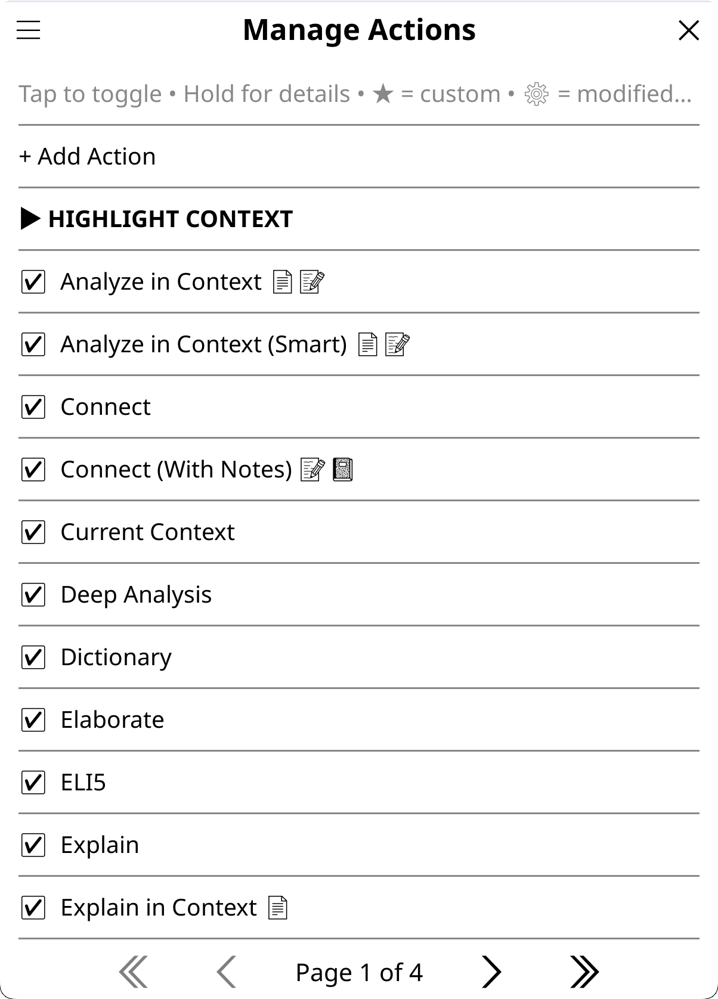</a>

**Settings → Actions & Prompts → Manage Actions**

- Toggle built-in and custom actions on/off
- Create new actions with the wizard
- Edit or delete your custom actions (marked with ★)
- Edit settings for built-in actions (temperature, thinking, provider/model, AI behavior)
- Duplicate/Copy existing Actions to use them as template (e.g. to make a slightly different variant)

**Action indicators:**
- **★** = Custom action (editable)
- **⚙** = Built-in action with modified settings
- **📄🔖📝📓🌐** = Data access indicators (when [Emoji Data Access Indicators](#display-settings) enabled): 📄 document text, 🔖 highlights only, 📝 annotations (includes highlights), 📓 notebook, 🌐 web search. These suffixes appear on action names in menus, showing at a glance what sensitive data each action accesses. Visible in action manager, reading features menu, highlight/dictionary menus, and file browser buttons.

**Editing built-in actions:** Long-press any built-in action → "Edit Settings" to customize its advanced settings without creating a new action. Use "Reset to Default" to restore original settings.

### Tuning Built-in Actions

Don't like how a built-in action behaves? Clone and customize it:

**Common tweaks:**

1. **Action too verbose?**
   - **Example:** Elaborate gives you walls of text
   - **Fix:** Duplicate the action, edit the prompt to add "Keep response under 150 words"
   - **Why clone?** Preserves the original if you want to compare

2. **Want different model for specific action?**
   - **Example:** Quick Define lookups are slow with your main model
   - **Fix:** Edit the Quick Define action → Advanced → Set provider to "anthropic" and model to "claude-haiku-4-5"
   - **Why:** Different actions benefit from different models:
     - **Fast/cheap models** for Dictionary, Quick Define, Translate (speed matters, task is simple)
     - **Standard models** for Explain, Summarize, ELI5 (balanced quality and cost)
     - **Reasoning models** for Deep Analysis, Key Arguments, academic tasks (complex thinking)
   - **Examples:** Haiku/GPT-4.1-nano/qwen2.5:0.5b for lookups; Sonnet/GPT-5/llama3.3 for general use; Opus/o3/deepseek-r1 for analysis

3. **Want action without domain/language?**
   - **Example:** Translate action giving unexpected results due to your domain
   - **Fix:** Edit action → Name & Context → Check "Skip domain"
   - **Why:** Domain context can alter translation style/register

4. **Compare different approaches?**
   - Duplicate an action multiple times with different prompts
   - Name them "Explain (brief)", "Explain (detailed)", "Explain (ELI5)"
   - Test which works best for your reading style

**Quick workflow:**
1. Long-press any action in Manage Actions
2. Select "Duplicate" or "Edit Settings"
3. Modify prompt/settings/model
4. Test in [web inspector](#testing-your-setup)
5. Use on e-reader when satisfied

**Tip:** Disable built-in actions you don't use (tap to toggle) — cleaner action menus.

### Creating Actions

The action wizard walks through 4 steps:

1. **Name & Context**: Set button text and where it appears (highlight, book, multi-book, general, or both). Options:
   - *View Mode* — Choose how results display: Standard (full chat), Dictionary Compact (minimal popup), or Translate (translation-focused UI)
   - *Include book info* — Send title/author with highlight actions
   - *Skip language instruction* — Don't send your language preferences (useful when prompt already specifies target language)
   - *Skip domain* — Don't include domain context (useful for linguistic tasks like translation)
   - *Add to Highlight Menu* / *Add to Dictionary Popup* — Quick-access placement
2. **AI Behavior**: Optional behavior override (use global, select a built-in, none, or write custom text)
3. **Action Prompt**: The instruction template with placeholder insertion (see [Template Variables](#template-variables))
4. **Advanced**: Provider, Model, Temperature, and Reasoning/Thinking overrides

### Template Variables

Insert these in your action prompt to reference dynamic values:

| Variable | Context | Description | Privacy Setting |
|----------|---------|-------------|-----------------|
| `{highlighted_text}` | Highlight | The selected text | — |
| `{title}` | Book, Highlight | Book title | — |
| `{author}` | Book, Highlight | Book author | — |
| `{author_clause}` | Book, Highlight | " by Author" or empty | — |
| `{count}` | Multi-book | Number of books | — |
| `{books_list}` | Multi-book | Formatted list of books | — |
| `{translation_language}` | Any | Target language from settings | — |
| `{dictionary_language}` | Any | Dictionary response language from settings | — |
| `{context}` | Highlight | Surrounding text context (sentence/paragraph/characters) | — |
| `{context_section}` | Highlight | Context with "Word appears in this context:" label | — |
| `{reading_progress}` | Book (reading) | Current reading position (e.g., "42%") | Allow Reading Progress |
| `{progress_decimal}` | Book (reading) | Reading position as decimal (e.g., "0.42") | Allow Reading Progress |
| `{chapter_title}` | Book (reading) | Current chapter name | Allow Chapter Info |
| `{chapters_read}` | Book (reading) | Number of chapters read (e.g., "5 of 12") | Allow Chapter Info |
| `{time_since_last_read}` | Book (reading) | Time since last reading session (e.g., "3 days ago") | Allow Chapter Info |
| `{highlights}` | Book, Highlight (reading) | All highlights from the document | Allow Highlights (or Allow Annotation Notes) |
| `{annotations}` | Book, Highlight (reading) | All highlights with user notes | Allow Annotation Notes |
| `{highlights_section}` | Book, Highlight (reading) | Highlights with "My highlights so far:" label | Allow Highlights (or Allow Annotation Notes) |
| `{annotations_section}` | Book, Highlight (reading) | Annotations with adaptive label: "My annotations:" when full data available, "My highlights so far:" when degraded to highlights-only | Allow Annotation Notes (degrades to Allow Highlights) |
| `{notebook}` | Book, Highlight (reading) | Content from the book's KOAssistant notebook | Allow Notebook |
| `{notebook_section}` | Book, Highlight (reading) | Notebook with "My notebook entries:" label | Allow Notebook |
| `{book_text}` | Book, Highlight (reading) | Extracted book text from start to current position | Allow Text Extraction |
| `{book_text_section}` | Book, Highlight (reading) | Same as above with "Book content so far:" label | Allow Text Extraction |
| `{full_document}` | Book, Highlight (reading) | Entire document text (start to end, regardless of position) | Allow Text Extraction |
| `{full_document_section}` | Book, Highlight (reading) | Same as above with "Full document:" label | Allow Text Extraction |
| `{surrounding_context}` | Highlight (reading) | Text surrounding the highlighted passage | — |
| `{surrounding_context_section}` | Highlight (reading) | Same as above with "Surrounding text:" label | — |
| `{xray_cache}` | Book (reading) | Cached X-Ray (if available) | Allow Text Extraction (+ Allow Highlights if cache used them) |
| `{xray_cache_section}` | Book (reading) | Same as above with progress label | Allow Text Extraction (+ Allow Highlights if cache used them) |
| `{analyze_cache}` | Book (reading) | Cached document analysis (if available) | Allow Text Extraction |
| `{analyze_cache_section}` | Book (reading) | Same as above with label | Allow Text Extraction |
| `{summary_cache}` | Book (reading) | Cached document summary (if available) | Allow Text Extraction |
| `{summary_cache_section}` | Book (reading) | Same as above with label | Allow Text Extraction |

**Context notes:**
- **Book** = Available in both reading mode and file browser
- **Highlight** = Always reading mode (you can't highlight without an open book)
- **(reading)** = Reading mode only — requires an open book. Book actions using these placeholders are automatically hidden in file browser
- **Privacy Setting** = The setting that must be enabled in Settings → Privacy & Data for this variable to have content. If disabled, the variable returns empty (section placeholders disappear gracefully)

#### Section vs Raw Placeholders

"Section" placeholders automatically include a label and gracefully disappear when empty:
- `{book_text_section}` → "Book content so far:\n[content]" or "" if empty
- `{full_document_section}` → "Full document:\n[content]" or "" if empty
- `{context_section}` → "Word appears in this context: [text]" or "" if empty
- `{highlights_section}` → "My highlights so far:\n[content]" or "" if empty
- `{annotations_section}` → "My annotations:\n[content]" or "My highlights so far:\n[content]" if degraded (annotations off, highlights on), or "" if both off
- `{notebook_section}` → "My notebook entries:\n[content]" or "" if empty
- `{surrounding_context_section}` → "Surrounding text:\n[content]" or "" if empty
- `{xray_cache_section}` → "Previous X-Ray (as of X%):\n[content]" or "" if empty
- `{analyze_cache_section}` → "Document analysis:\n[content]" or "" if empty
- `{summary_cache_section}` → "Document summary:\n[content]" or "" if empty

"Raw" placeholders (`{book_text}`, `{full_document}`, `{highlights}`, `{annotations}`, `{notebook}`, `{surrounding_context}`, `{xray_cache}`, `{analyze_cache}`, `{summary_cache}`) give you just the content with no label, useful when you want custom labeling in your prompt.

**Tip:** Use section placeholders in most cases. They prevent dangling references—if you write "Look at my highlights: {highlights}" in your prompt but highlights is empty, the AI sees confusing instructions about nonexistent content. Section placeholders include the label only when content exists.

> **Privacy note:** Section placeholders adapt to [privacy settings](#privacy--data). If a data type is disabled (or not yet enabled), the corresponding placeholder returns empty and section variants disappear gracefully. For example, `{highlights_section}` is empty unless you enable **Allow Highlights** (or **Allow Annotation Notes**, which implies highlights). You don't need to modify actions to match your privacy preferences—they adapt automatically.

> **Double-gating (for custom actions):** When creating custom actions from scratch, sensitive data requires BOTH a global privacy setting AND a per-action permission flag. This prevents accidental data leakage—if you enable "Allow Text Extraction" globally, your new custom actions still need "Allow text extraction" checked to actually use it. Built-in actions already have appropriate flags set, and copied actions inherit them. Document cache placeholders require the same permissions as their source: `{xray_cache}` needs text extraction, plus highlights only if the cache was built with highlights included; `{analyze_cache}` and `{summary_cache}` only need text extraction. See [Text Extraction and Double-gating](#text-extraction-and-double-gating) for the full reference table.

#### Utility Placeholders

Utility placeholders provide reusable prompt fragments that can be inserted into any action. Currently available:

| Placeholder | Expands To | Behavior |
|-------------|------------|----------|
| `{conciseness_nudge}` | "Be direct and concise. Don't restate or over-elaborate." | Always present |
| `{hallucination_nudge}` | "If you don't recognize this or the content seems unclear, say so rather than guessing." (web-aware variant adds "search the web to verify" when web search is active) | Always present |
| `{text_fallback_nudge}` | "Note: No document text was provided. Use your knowledge of \"{title}\" to provide the best response you can. If you don't recognize this work, say so honestly rather than fabricating details." | **Conditional** — only appears when document text is empty; invisible when text is present |

**Why use these?**
- **`{conciseness_nudge}`**: Some AI models (notably Claude Sonnet 4.5) tend to produce verbose responses. This provides a standard instruction to reduce verbosity without sacrificing quality. Used in 17 built-in actions including Explain, Summarize, ELI5, and the context-aware analysis actions.
- **`{hallucination_nudge}`**: Prevents AI from fabricating information when it doesn't recognize a book or author. When web search is active, the nudge encourages the AI to search the web to verify before falling back. Used in many built-in actions including Book Info, Find Similar, Connect, Historical Context, and all multi-book actions.
- **`{text_fallback_nudge}`**: Enables graceful degradation for actions that use document text extraction. When text extraction is disabled or yields no content, this nudge appears to guide the AI to use its training knowledge — and to say so honestly if it doesn't recognize the work. When document text IS present, the placeholder expands to nothing (zero overhead). Used in 7 built-in actions: Explain in Context, Analyze in Context, Recap, Key Arguments, Discussion Questions, Generate Quiz, Extract Insights. X-Ray, Document Analysis, and Document Summary block generation without text extraction rather than degrading gracefully. Smart actions are excluded because they require a pre-generated summary cache.

**For custom actions:** Add these placeholders at the end of your prompts where appropriate. The placeholders are replaced with the actual text at runtime, so you can also use the raw text directly if you prefer. `{text_fallback_nudge}` is especially useful in custom actions that use `{full_document_section}` or `{book_text_section}` — it ensures your action produces useful results even when text extraction is disabled.

### Tips for Custom Actions

- **Skip domain** for linguistic tasks: Translation, grammar checking, dictionary lookups work better without domain context influencing the output. Enable "Skip domain" in the action wizard for these, unless you are translating something that would benefit from the context added by a domain.
- **Skip language instruction** when the prompt already specifies a target language (using `{translation_language}` or `{dictionary_language}` placeholders), to avoid conflicting instructions.
- **Put task-specific instructions in the action prompt**, not in behavior. Behavior applies globally; action prompts are specific. Use a standard behavior and detailed action prompts for most custom actions.
- **Temperature matters**: Lower (0.3-0.5) for deterministic tasks (translation, definitions). Higher (0.7-0.9) for creative tasks (elaboration, recommendations).
- **Experiment with domains**: Try running the same action with and without a domain to see what works for your use case. Some actions benefit from domain context (analysis, explanation), others don't (translation, grammar).
- **Test before deploying**: Use the [web inspector](#testing-your-setup) to test your custom actions before using them on your e-reader. You can try different settings combinations and see exactly what's sent to the AI.
- **Reading-mode placeholders**: Book actions using `{reading_progress}`, `{book_text}`, `{full_document}`, `{highlights}`, `{annotations}`, `{notebook}`, or `{chapter_title}` are **automatically hidden** in File Browser mode because these require an open book. This filtering is automatic—if your custom book action uses these placeholders, it will only appear when reading. Highlight actions are always reading-mode (you can't highlight without an open book). The action wizard shows a `[reading]` indicator for such actions.
- **Document caches**: Three cache types are available as placeholders: `{summary_cache_section}`, `{xray_cache_section}`, and `{analyze_cache_section}`. All require `use_book_text = true` since the cached content derives from book text. The **summary cache** is the primary one for custom actions — it's a neutral, comprehensive representation of the document designed to be reused. The **X-Ray cache** can also be useful as supplementary context (structured character/concept reference). The **analyze cache** is more specialized — it's an opinionated analysis, so avoid using it as input for another analysis (you'd be analyzing an analysis, a decaying game of telephone where each layer loses nuance). Cache placeholders disappear when empty, so including them is always safe. Two usage patterns:
  - **Replace**: Use `{summary_cache_section}` INSTEAD of raw book text for token savings on long books. Built-in **Smart actions** implement this pattern. Add `requires_summary_cache = true` to your custom actions to trigger automatic summary generation when needed. See [Document Artifacts](#document-artifacts) for details.
  - **Supplement**: Add a cache reference as bonus context alongside other data. For example, append `{xray_cache_section}` to a custom action so the AI has the character/concept reference available if it exists. The placeholder vanishes if no cache exists, so there's no downside.

  > *Planned feature: the ability to append files, caches, and other resources to chats and actions — including referencing one book's cache in an action on another book (e.g., comparing an X-Ray across volumes in a series).*
- **Surrounding context**: Use `{surrounding_context_section}` in highlight actions to include text around the highlighted passage. This is live extraction (not cached), hard-capped at 2000 characters. Particularly useful for **custom dictionary-like actions** that need sentence context for single-word lookups—look at the built-in `quick_define`, `dictionary`, and `deep` actions for inspiration. Uses your Dictionary Settings for context mode (sentence, paragraph, or character count).

### File-Based Actions

For more control, create `custom_actions.lua`:

```lua
return {
    {
        text = "Grammar Check",
        context = "highlight",
        behavior_override = "You are a grammar expert. Be precise and analytical.",
        prompt = "Check grammar: {highlighted_text}"
    },
    {
        text = "Discussion Questions",
        context = "book",
        prompt = "Generate 5 discussion questions for '{title}'{author_clause}."
    },
    {
        text = "Series Order",
        context = "multi_book",
        prompt = "What's the reading order for these books?\n\n{books_list}"
    },
}
```

**Optional fields**:
- `behavior_variant`: Use a preset behavior by ID (e.g., "standard", "mini", "full", "gpt_style_standard", "perplexity_style_full", "reader_assistant", "none")
- `behavior_override`: Custom behavior text (overrides variant)
- `provider`: Force specific provider ("anthropic", "openai", etc.)
- `model`: Force specific model for the provider
- `temperature`: Override global temperature (0.0-2.0)
- `reasoning_config`: Per-provider reasoning settings (see below)
- `extended_thinking`: Legacy: "off" to disable, "on" to enable (Anthropic only)
- `thinking_budget`: Legacy: Token budget when extended_thinking="on" (1024-32000)
- `enabled`: Set to `false` to hide
- `requires`: Array of requirement types that block execution if unmet: `{"book_text"}`, `{"highlights"}`. Shows user-facing error identifying which gate (per-action or global) is the problem, with optional `blocked_hint` suggestion.
- `blocked_hint`: Suggestion text shown when action is blocked (e.g., `_("Or use X-Ray (Simple) for an overview based on AI knowledge.")`)
- `use_book_text`: Allow text extraction for this action (acts as permission gate; also requires global "Allow Text Extraction" setting enabled). The actual extraction is triggered by placeholders in the prompt: `{book_text_section}` extracts to current position, `{full_document_section}` extracts entire document. Also gates access to analysis cache placeholders.
- `use_highlights`: Include document highlights (text only, no notes). Requires Allow Highlights or Allow Annotation Notes.
- `use_annotations`: Include document annotations (highlights with user notes). Requires Allow Annotation Notes.
- `use_reading_progress`: Include reading position and chapter info
- `use_reading_stats`: Include time since last read and chapter count
- `use_notebook`: Include content from the book's KOAssistant notebook
- `use_surrounding_context`: Include surrounding text for highlight actions (auto-inferred from `{surrounding_context}` placeholder)
- `include_book_context`: Add book info to highlight actions
- `cache_as_xray`: Save this action's result to the X-Ray cache (for other actions to reference)
- `cache_as_analyze`: Save this action's result to the document analysis cache
- `cache_as_summary`: Save this action's result to the document summary cache
- `skip_language_instruction`: Don't include language instruction in system message (default: off; Translate/Dictionary use true since target language is in the prompt)
- `skip_domain`: Don't include domain context in system message (default: off; Translate/Dictionary use true)
- `domain`: Force a specific domain by ID (overrides the user's current domain selection; file-only, no UI for this yet)
- `enable_web_search`: Override global web search setting (true=force on, false=force off, nil=follow global)

**Per-provider reasoning config** (new in v0.6):
```lua
reasoning_config = {
    anthropic = { budget = 4096 },      -- Extended thinking budget
    openai = { effort = "medium" },     -- low/medium/high
    gemini = { level = "high" },        -- low/medium/high
}
-- Or: reasoning_config = "off" to disable for all providers
```

See `custom_actions.lua.sample` for more examples.

### Highlight Menu Actions

Add frequently-used highlight actions directly to KOReader's highlight popup for faster access.

**Default actions** (included automatically):
1. **Translate** — Instant translation of selected text
2. **Look up in X-Ray** — Local search of cached X-Ray data (only appears when cache exists)
3. **ELI5** — Explain Like I'm 5, simplified explanation
4. **Explain** — Get an explanation of the passage
5. **Elaborate** — Expand on concepts, provide additional context
6. **Summarize** — Condense the passage to its essential points
7. **Connect** — Draw connections to other works, thinkers, and broader context
8. **Fact Check** — Verify claims using web search

**Other built-in actions you can add**: Connect (With Notes), Explain in Context, Explain in Context (Smart), Analyze in Context, Analyze in Context (Smart), Thematic Connection (Smart), Current Context, Dictionary, Quick Define, Deep Analysis

**Adding more actions**:
1. Go to **Manage Actions**
2. Hold any highlight-context action
3. Tap **"Add to Highlight Menu"**
4. A notification reminds you to restart KOReader

Actions appear as "KOA: Explain", "KOA: Translate", etc. in the highlight popup.

**Managing actions**:
- Use **Settings → Highlight Settings → Highlight Menu Actions** to view all enabled actions
- Tap an action to move it up/down or remove it
- Default actions can be removed (they won't auto-reappear)
- Freeform chat is always available via the Send button in the input dialog

**Note**: Changes require an app restart since the highlight menu is built at startup.

> **Prefer a cleaner menu?** You can disable KOAssistant's highlight menu integration entirely via **Settings → KOReader Integration**. "Show in Highlight Menu" (the main button) and "Show Highlight Quick Actions" (shortcuts like Translate, Explain) have separate toggles.

---

## Dictionary Integration

With help from contributions to [assistant.koplugin](https://github.com/omer-faruq/assistant.koplugin) by [plateaukao](https://github.com/plateaukao) and others

KOAssistant integrates with KOReader's dictionary system, providing AI-powered word lookups when you select words in a document.

> **Tip:** For best results, duplicate a built-in dictionary action and customize it for your language pair. Set a light model (e.g. Haiku) for speed, and make it your bypass action for one-tap lookups.

> **Don't need dictionary integration?** Disable it entirely via **Settings → KOReader Integration → Show in Dictionary Popup**.

### How It Works

When you select a word in a document, KOReader normally shows its dictionary popup. With KOAssistant's dictionary integration, you can:

1. **Add AI actions to the dictionary popup** — Tap "Dictionary (KOA)" or another Action button from KOReader's Dictionary popup
2. **Bypass the dictionary entirely** — Skip KOReader's dictionary and go directly to your selected KOAssistant Dictionary Action for word lookups

**Default dictionary popup actions** (3 included):
1. **Dictionary** — Full entry: definition, etymology, synonyms, usage
2. **Quick Define** — Minimal: brief definition only
3. **Deep Analysis** — Linguistic deep-dive: morphology, word family, cognates

You can add or substitute other highlight actions to this menu via **Manage Actions → hold action → "Add to Dictionary Popup"** or manage the actions centrally from Dictionary Settings.

### Dictionary Settings

**Settings → Dictionary Settings**

| Setting | Description | Default |
|---------|-------------|---------|
| **AI Buttons in Dictionary Popup** | Show selected Action buttons in KOReader's dictionary popup | On |
| **Response Language** | Language for definitions. Can follow Translation Language (`↵T`) or be set independently | `↵T` |
| **Context Mode** | Surrounding text sent with lookup: None, Sentence, Paragraph, or Characters | None (Context is available on the demand in the popup)|
| **Context Characters** | Character count when using "Characters" mode | 100 |
| **Disable Auto-save** | Don't auto-save dictionary lookups to chat history | On |
| **Enable Streaming** | Stream responses in real-time (shows text as it generates) | On |
| **Dictionary Popup Actions** | Configure which actions appear in the AI menu (reorder, add custom) | 3 built-in |
| **Bypass KOReader Dictionary** | Skip native dictionary, go directly to your selected bypass Action | Off |
| **Bypass Action** | Which action triggers on bypass (try Quick Define for speed) | Dictionary |
| **Bypass: Follow Vocab Builder** | Respect KOReader's Vocabulary Builder auto-add setting during bypass | On |

> **Tip:** Test different dictionary actions and context modes in the [web inspector](#testing-your-setup) to find what works best for your reading. Consider creating custom dictionary actions for your specific language pair.

### Dictionary Popup Actions (3 included by default)

When "AI Buttons in Dictionary Popup" is enabled, KOAssistant Dictionary Actions are added to KOReader's dictionary popup. Three built-in dictionary actions are included by default:

| Action | Purpose | Includes |
|--------|---------|----------|
| **Dictionary** | Standard dictionary entry | Definition, pronunciation, etymology, synonyms, usage examples |
| **Quick Define** | Fast, minimal lookup | Brief definition only—no etymology, no synonyms |
| **Deep Analysis** | Linguistic deep-dive | Morphology (roots, affixes), word family, etymology path, cognates |

Dictionary (KOA) is the default if you turn on Bypass mode. You can set any action as the **Bypass Action** for instant one-tap lookups.

**Configure this menu:**
1. **Settings → Dictionary Settings → Dictionary Popup Actions**
2. Enable/disable actions, reorder them, or add custom actions
3. Consider setting "Quick Define" as bypass action for faster responses

### Context Mode: When to Use It

Context mode sends surrounding text (sentence/paragraph/characters) with your lookup. The compact view has a **Ctx** button to toggle context on-demand (it re-runs the request with/without the surrounding sentence as context).

**Context OFF (default)**
- ✅ Natural, complete dictionary response
- ✅ Multiple definitions and homographs included (e.g., "round" as noun, verb, adjective)
- ✅ Faster response (less text to process)
- ❌ Doesn't know which meaning is intended in your reading

**Context ON**
- ✅ Precise, disambiguated definition for THIS usage
- ✅ Explains word's role in THIS specific sentence
- ❌ May miss other meanings/senses of the word (context disambiguates, so homographs aren't shown)
- ❌ Slightly slower (more text to process)

**Best practice:** Use context OFF for general lookups; turn context ON (via Ctx button) when you need disambiguation.

### Dictionary Language Indicators

The dictionary language setting shows return symbols when following other settings:
- `↵` = Following Primary Language
- `↵T` = Following Translation Language

See [How Language Settings Work Together](#how-language-settings-work-together) for details.

### RTL Language Support

Dictionary, translate, general chat, and artifact viewers have special handling for right-to-left (RTL) languages:

- **Automatic RTL mode**: When your dictionary or translation language is set to an RTL language, results automatically use Plain Text mode for proper font rendering. For general chat and artifact viewers (X-Ray, X-Ray (Simple), Analyze, Summary), the content is checked—if RTL characters outnumber Latin, it switches to RTL mode (right-aligned text + Plain Text). This can be configured via **Settings → Display Settings → Rendering → Text Mode for RTL Dictionary**, **Text Mode for RTL Translate**, and **Auto RTL mode for Chat**.
- **BiDi text alignment**: Entries with RTL content display with correct bidirectional text alignment. Mixed RTL/LTR content (e.g., Arabic headwords with English pronunciation guides) renders in the correct reading order.
- **IPA transcription handling**: Phonetic transcriptions are anchored to display correctly alongside RTL headwords.

> **Note:** For best RTL rendering, Plain Text mode is recommended. The automatic RTL settings handle this for dictionary, translate, general chat, and artifact viewers, while preserving your global Markdown/Plain Text preference when content is not predominantly RTL.

### Custom Dictionary Actions

The built-in dictionary actions use unified prompts that work across many scenarios:
- **Monolingual lookups** (e.g., English word → English definitions)
- **Bilingual lookups** (e.g., French word → English definitions and translations)
- **Context-aware disambiguation** (toggle Ctx ON in compact view)

For the best results, **create custom dictionary actions tailored to your specific use case**:

1. **Settings → Actions & Prompts → Manage Actions**
2. Find "Dictionary" or "Quick Define" and tap to **duplicate**
3. Edit the duplicate with prompts specific to your language pair or learning style
4. **Settings → Dictionary Settings → Dictionary Popup Actions** — add your custom action
5. Set it as the **Bypass Action** for one-tap access
6. Consider changing the bypass action to "Quick Define" for faster responses, or to your custom action

**Examples:**
- **"EN→AR Dictionary"** — Explicit Arabic translation with English metalanguage
- **"Monolingual French"** — Definitions only in French, no translations
- **"Etymology Focus"** — Start from Deep Analysis, remove morphology sections
- **"Quick Vocab"** — Minimal definition + example sentence for flashcard creation

**Tips:**
- Use a **lighter model** (e.g., Haiku) for dictionary actions via per-action model override
- **Context OFF** (default) gives complete entries with all senses; **Context ON** disambiguates for the specific usage
- For RTL languages, the compact view automatically uses Plain Text mode

### Dictionary Bypass

When bypass is enabled, selecting a word skips KOReader's dictionary popup entirely and immediately triggers your chosen AI action.

**To enable:**
1. Settings → Dictionary Settings → Bypass KOReader Dictionary → ON
2. Settings → Dictionary Settings → Bypass Action → choose action (default: Dictionary)

**Recommended setup:** Set "Quick Define" or a custom lightweight action as your bypass action for faster responses. Use the full "Dictionary" action when you need etymology and synonyms.

**Toggle via gesture:** Assign "KOAssistant: Toggle Dictionary Bypass" to a gesture for quick on/off switching. These settings are also available in the recommended Quick Settings panel.

**Note:** Dictionary bypass (and the dictionary popup AI button) uses compact view by default for quick, focused responses.

### Compact View Features

The compact dictionary view provides two rows of buttons:
- **Row 1:** MD ON/TXT ON, Copy, +Note, Wiki, +Vocab
- **Row 2:** Expand, Language, Ctx, [Action], Close

**MD ON / TXT ON** — Toggle between Markdown and Plain Text view modes. Shows "MD ON" when Markdown is active, "TXT ON" when Plain Text is active. For RTL languages, this may default to TXT ON automatically based on your settings.

**Copy** — Copies the AI response only (plain text). Unlike the full chat view, compact view always copies just the response without metadata or asking for format.

**+Note** — Save the AI response as a note attached to your highlighted word in KOReader's annotation system. The button is greyed out if word position data isn't available (e.g., when launched from certain contexts).

**Wiki** — Look up the word in Wikipedia using KOReader's built-in Wikipedia integration.

**+Vocab** — Add the looked-up word to KOReader's Vocabulary Builder. After adding, the button changes to "Added" (greyed out). See [Vocabulary Builder Integration](#vocabulary-builder-integration).

**Expand** — Open the response in the full-size chat viewer with all options (continue conversation, save, export, etc.).

**Language** — Re-run the lookup in a different language (picks from your configured languages). Closes the current view and opens a new one with the updated result.

**Ctx: ON/OFF** — Toggle surrounding text context. If your lookup was done without context (mode set to "None"), you can turn it on to get a context-aware definition (Sentence by default). If context was included, you can turn it off for a plain definition. Re-runs the lookup with the toggled setting. This setting is not sticky, so context will revert to your main setting on closing the window.

**[Action]** — Shows the name of the current dictionary action. Tap to switch to a different dictionary popup action. If only one other action is available, switches directly; otherwise shows a picker with all available dictionary actions.

**Close** — Close the compact view.

**RTL-aware rendering**: When viewing dictionary results for RTL languages, the compact view automatically uses Plain Text mode (if enabled in settings) and applies correct bidirectional text alignment for proper display of RTL content.

### Vocabulary Builder Integration

When using dictionary lookups in compact view, KOAssistant integrates with KOReader's Vocabulary Builder:

- **Auto-add enabled** (Vocabulary Builder ON in KOReader settings): Words are automatically added to vocab builder when looked up via dictionary bypass. A greyed "Added" button confirms the word was added.
- **Auto-add disabled** (Vocabulary Builder OFF): A "+Vocab" button appears to manually add the looked-up word to the vocabulary builder.

The vocab button appears in compact/minimal buttons view (dictionary bypass and popup actions).

**Bypass: Follow Vocab Builder Auto-add** (Settings → Dictionary Settings): Controls whether dictionary bypass respects KOReader's Vocabulary Builder auto-add setting. Disable this if you use bypass for analyzing words you already know and don't want them added to the vocabulary builder.

### Chat Saving

Dictionary lookups are **not auto-saved** by default (`Disable Auto-save` is on). This prevents cluttering your chat history with individual word lookups.

- **Auto-save disabled** (default): Lookups are not saved automatically. If you expand a compact view chat, the Save button becomes active so you can save manually to the current document.
- **Auto-save enabled** (toggle off): Dictionary chats follow your general chat saving settings (auto-save all or auto-save continued).

---

## Bypass Modes

Bypass modes let you skip menus and immediately trigger AI actions.

### Dictionary Bypass

Skip KOReader's dictionary popup when selecting words. Useful for language learners who want instant AI definitions.

**How it works:**
1. Select a word in the document
2. Instead of dictionary popup → AI action triggers immediately
3. Response appears in **compact view** (minimal UI optimized for quick lookups — see [Compact View Features](#compact-view-features))

**Configure:** Settings → Dictionary Settings → Bypass KOReader Dictionary

### Highlight Bypass

Skip the highlight menu when selecting text. Useful when you always want the same action (e.g., translate).

**How it works:**
1. Select text by long-pressing and dragging
2. Instead of highlight menu → AI action triggers immediately
3. Response appears in **full view** (standard chat viewer)

**Configure:** Settings → Highlight Settings → Enable Highlight Bypass

### Bypass Action Selection

Both bypass modes let you choose which action triggers:

| Bypass Mode | Default Action | Where to Configure |
|-------------|----------------|-------------------|
| Dictionary | Dictionary | Settings → Dictionary Settings → Bypass Action |
| Highlight | Translate | Settings → Highlight Settings → Bypass Action |

You can select any highlight-context action (built-in or custom) as your bypass action. **Recommended:** Set dictionary bypass to "Quick Define" or a custom lightweight action for faster responses.

### Gesture Toggles

Quick toggle bypass modes without entering settings:

- **KOAssistant: Toggle Dictionary Bypass** - Assign to gesture
- **KOAssistant: Toggle Highlight Bypass** - Assign to gesture

Toggling shows a brief notification confirming the new state.

### Custom Action Gestures

You can add any **book** or **general** action to KOReader's gesture menu:

1. Go to **Settings → Actions & Prompts → Manage Actions**
2. Hold any book or general action to see details
3. Tap **"Add to Gesture Menu"**
4. **Restart KOReader** for changes to take effect
5. Configure the gesture in **Settings → Gesture Manager**

Actions with gestures show a `[gesture]` indicator in the Action Manager list.

**Where gestures appear:**
- **Book actions** → Reader gestures only (requires open book; grayed out in File Browser)
- **General actions** → Available in both contexts (can add to Reader and/or File Browser gestures)

**Why only book and general?** Highlight actions require selected text, and multi-book actions require file browser multi-select — neither can be triggered via gestures.

**Note:** Changes require restart because KOReader's gesture system loads available actions at startup. To disable all custom action gestures at once, use **Settings → KOReader Integration → Show in Gesture Menu**. Built-in utility gestures (Quick Settings, Chat History, etc.) are not affected by this toggle.

### Available Gesture Actions

**Reader Only** (require open book; grayed out in File Browser gesture settings):
- KOAssistant: Quick Actions — Reading actions panel
- KOAssistant: Book Chat/Action — Start a chat about current book or access book actions
- KOAssistant: Translate Page — Translate visible page text

**General** (available in both File Browser and Reader gesture settings):
- KOAssistant: Chat History — Browse all saved chats
- KOAssistant: Continue Last Saved Chat — Resume most recently saved chat
- KOAssistant: Continue Last Chat — Resume most recently viewed chat
- KOAssistant: Settings — Open main settings menu
- KOAssistant: General Chat/Action — Start a new general conversation or run a general action
- KOAssistant: Quick Settings — Two-column settings panel
- KOAssistant: Toggle Dictionary Bypass — Toggle dictionary bypass on/off
- KOAssistant: Toggle Highlight Bypass — Toggle highlight bypass on/off

**Custom Actions:**
- Any book or general action can be added via "Add to Gesture Menu" in Action Manager
- Book actions → Reader Only; General actions → Available in both contexts
- Includes artifact actions (X-Ray, Recap, Document Summary, etc.), utility actions, and your own custom actions

### Translate Page

A special gesture action to translate all visible text on the current page:

**Gesture:** KOAssistant: Translate Page

This extracts all text from the visible page/screen and sends it to the Translate action. Uses Translate View (see below) for a focused translation experience.

**Works with:** PDF, EPUB, DjVu, and other supported document formats.

### Translate View

All translation actions (Highlight Bypass with Translate, Translate Page, highlight menu Translate) use a specialized **Translate View** — a minimal UI focused on translations.

**Button layout:**
- **Row 1:** MD ON/TXT ON (toggle markdown), Copy, Save to Note (when highlighting)
- **Row 2:** → Chat (expand to full chat), Show/Hide Original, Lang, Close

**Key features:**
- **Lang button** — re-run translation with a different target language (picks from your configured languages)
- **Save to Note button** — save translation directly to a highlight note (closes translate view after save)
- **Auto-save disabled** by default (translations are ephemeral like dictionary lookups)
- **Copy/Note Content** options — choose what to include: full, question + response, or translation only
- **Configurable original text visibility** — follow global setting, always hide, hide long text, or never hide
- **→ Chat button** — expands to full chat view with all options (continue conversation, save, etc.)

**Configure:** Settings → Translate Settings

> 📖 **Quick Reference: Bypass Mode Use Cases**
>
> - **Dictionary Bypass** → Language learners wanting instant definitions
> - **Highlight Bypass** → Quick translations or instant explanations
> - **Translate Page** → Academic reading, foreign language texts
>
> All bypass modes can be toggled via gestures for quick on/off switching.

---

## Behaviors

Behavior defines the AI's personality, communication style, and response guidelines. It is sent **first** in the system message, before domain context and language instruction. See [How the AI Prompt Works](#how-the-ai-prompt-works) for the full picture.

### What Behavior Controls

- Response tone (conversational, academic, concise)
- Formatting preferences (when to use lists, headers, etc.)
- Communication style (brief vs detailed explanations)

### Built-in Behaviors

23 built-in behaviors are available, organized by provider style. Each style comes in three sizes (Mini ~160-220 tokens, Standard ~400-500 tokens, Full ~1150-1325 tokens):

**Provider-inspired styles (all provider-agnostic — use any style with any provider):**
- **Claude Style** (Mini, Standard, Full) — Based on [Anthropic Claude guidelines](https://docs.anthropic.com/en/release-notes/system-prompts). **Claude Style (Standard) is the default.**
- **DeepSeek Style** (Mini, Standard, Full) — Analytical and methodical
- **Gemini Style** (Mini, Standard, Full) — Clear and adaptable
- **GPT Style** (Mini, Standard, Full) — Conversational and helpful
- **Grok Style** (Mini, Standard, Full) — Witty with dry humor
- **Perplexity Style** (Mini, Standard, Full) — Research-focused with source transparency

**Reading-focused:**
- **Reader Assistant** (~350 tokens) — Reading companion persona (used by X-Ray, Recap, Analyze My Notes, Connect with Notes)

**General utility:**
- **Concise** (~55 tokens) — Brevity-focused, minimal guidance for direct responses

**Specialized (used by specific actions, hidden from quick pickers):**
- **Direct Dictionary** (~30 tokens) — Minimal guidance for dictionary lookups (used by Dictionary action)
- **Detailed Dictionary** (~30 tokens) — Guidance for detailed linguistic analysis (used by Deep Analysis action)
- **Direct Translator** (~80 tokens) — Direct translation without commentary (used by Translate action)

**Changing the default:** Settings → Actions & Prompts → Manage Behaviors, tap to select. Or use Quick Settings (gear icon or gesture) → Behavior.

### Sample Behaviors

The [behaviors.sample/](behaviors.sample/) folder contains additional behaviors beyond the built-ins:

- **Reading-specialized**: Scholarly, Religious/Classical, Creative writing
- **More provider styles**: Additional variations and experimental styles

To use: copy desired files from [behaviors.sample/](behaviors.sample/) to `behaviors/` folder. They'll appear in the behavior selector under "FROM BEHAVIORS/ FOLDER".

### Custom Behaviors

Create your own behaviors via:

1. **Files**: Add `.md` or `.txt` files to `behaviors/` folder
2. **UI**: Settings → Actions & Prompts → Manage Behaviors → Create New

**File format** (same as domains):
- Filename becomes the behavior ID: `concise.md` → ID `concise`
- First `# Heading` becomes the display name
- Rest of file is the behavior text sent to AI

See [behaviors.sample/README.md](behaviors.sample/README.md) for full documentation.

### Per-Action Overrides

Individual actions can override the global behavior:
- Use a different variant (minimal/full/none)
- Provide completely custom behavior text
- Example: The built-in Translate action uses a dedicated "translator_direct" behavior for direct translations

### Relationship to Other Components

- Behavior is the **first** component in the system message, followed by domain and language instruction
- Individual actions can override or disable behavior (see [Actions](#actions) → Creating Actions)
- Behavior controls *how* the AI communicates; for *what* context it applies, see [Domains](#domains)
- There is natural overlap: a "scholarly" behavior and a "critical reader" domain both influence analytical depth, but from different angles (style vs expertise)

> 🎭 **Remember:** Behavior = HOW the AI speaks | Domain = WHAT it knows
>
> Combine them strategically: Perplexity Style + research domain = source-focused academic analysis. Test combinations in the [web inspector](#testing-your-setup).

---

## Domains

Domains provide **project-like context** for AI conversations. When selected, the domain context is sent **after** behavior in the system message. See [How the AI Prompt Works](#how-the-ai-prompt-works) for the full picture.

### How It Works

The domain text is included in the system message after behavior and before language instruction. The AI uses it as background knowledge for the conversation. You can have very small, focused domains, or large, detailed, interdisciplinary ones. Both behavior and domain benefit from prompt caching (50-90% cost reduction on repeated queries, depending on provider).

### Built-in Domain

One domain is built-in: **Synthesis**

This serves as an example of what domains can do. For more options/inspiration, see [domains.sample/](domains.sample/) which includes specialized sample domains.

### Creating Domains

Create domains via:

1. **Files**: Add `.md` or `.txt` files to `domains/` folder
2. **UI**: Settings → Actions & Prompts → Manage Domains → Create New

**File format**:

**Example**: Truncated part of `domains/synthesis.md` (from [domains.sample/](domains.sample/))
```markdown
# Synthesis
<!--
Tokens: ~450
Notes: Interdisciplinary reading across mystical, philosophical, psychological traditions
-->

This conversation engages ideas across traditions—mystical, philosophical,
psychological, scientific—seeking resonances without forcing false equivalences.

...

## Orientation
Approach texts and questions through multiple lenses simultaneously:
- Depth Psychology: Jungian concepts as maps of inner territory
- Contemplative Traditions: Sufism, Taoism, Buddhism, Christian mysticism
- Philosophy: Western and non-Western traditions
- Scientific Cosmology: Modern physics, complexity theory, emergence

...

```

- Filename becomes the domain ID: `my_domain.md` → ID `my_domain`
- First `# Heading` becomes the display name (or derived from filename)
- Metadata in `<!-- -->` comments is optional (for tracking token costs)
- Rest of file is the context sent to AI
- Supported: `.md` and `.txt` files

See [domains.sample/](domains.sample/) for examples including classical language support and interpretive frameworks.

### Selecting Domains

Select a domain via the **Domain** button in the chat input dialog, or through Quick Settings. Once selected, the domain **stays active** for all subsequent chats until you change it or select "None".

**Note**: Keep this sticky behavior in mind — if you set a domain for one task, it will apply to all following actions (including quick actions that don't open the input dialog, unless they have been set to Skip Domain) until you clear it. You can change the domain through the input dialog, Quick Settings, or gesture actions.

### Browsing by Domain

Chat History → hamburger menu → **View by Domain**

**Note**: Domains are for context, not storage. Chats still save to their book or "General AI Chats", but you can filter by domain in Chat History.

### Tips

- **Domain can be skipped per-action**: Actions like Translate and Dictionary skip domain by default because domain instructions alter their output. You can toggle "Skip domain" for any custom action in the action wizard (see [Actions](#actions)).
- **Domain vs Behavior overlap**: Both are sent in the system message. Behavior = communication style, Domain = knowledge context. Sometimes content could fit in either. Rule of thumb: if it's about *how to respond*, put it in behavior. If it's about *what to know*, put it in a domain.
- **Domains affect all actions in a chat**: Once selected, the domain applies to every message in that conversation. If an action doesn't benefit from domain context, use "Skip domain" in that action's settings.
- **Cost considerations**: Large domains increase token usage on every request. Keep domains focused. Most major providers (Anthropic, OpenAI, Gemini, DeepSeek) cache system prompts automatically (50-90% cost reduction on repeated domain context).
- **Preview domain effects**: Use the [web inspector](#testing-your-setup) to see how domains affect request structure and AI responses before using them on your e-reader.

---

## Managing Conversations

### Auto-Save

By default, all chats are automatically saved. You can disable this in Settings → Chat & Export Settings.

- **Auto-save All Chats**: Save every new conversation
- **Auto-save Continued Chats**: Only save when continuing from history (i.e. from an already saved chat)

### Chat History

**Access**: Tools → KOAssistant → Chat History

**Hamburger menu** (tap ☰ icon):
- Browse by Document, by Domain, by Tag
- **Browse Notebooks** / **Browse Artifacts** — navigate to other browsers
- Delete all chats

**Chat organization**: In the document view, chats are sorted as:
1. General AI Chats
2. Multi-Book Chats (comparisons and analyses across multiple books)
3. Individual books (alphabetically)

With [Emoji Menu Icons](#display-settings) enabled, each entry gets a type prefix: 💬 general, 📚 multi-book, 📖 book chats.

**Document list actions:**
- **Tap** → Opens the chat list for that document
- **Hold** → Options popup: "Open Book" (book documents only), "Delete All Chats", "Cancel"

### Chat Actions

Select any chat to see the options popup:
- **Continue Chat**: Resume the conversation
- **Rename**: Change the chat title
- **Tags**: Add or remove tags
- **Export**: Copy to clipboard or save to file
- **Open Book**: Open the book in the reader (book documents only)
- **Delete Chat**: Remove the chat

With [Emoji Menu Icons](#display-settings) enabled, individual chats get a 💬 prefix. Tag browser entries get a 🏷️ prefix.

### Export & Save to File

When you tap Export on a chat, you can choose:
- **Copy to Clipboard**: Copy the formatted chat text
- **Save to File**: Save as a markdown (.md) or text (.txt) file

**Content options** (Settings → Chat & Export Settings → Content Format → Chat History Export):
- **Ask every time** (default): Shows a picker dialog to choose what to include
- **Follow Copy Content**: Uses the global Copy Content setting
- Fixed formats (5 types):
  - **Response only**: Just the AI response
  - **Q+A**: Highlighted text + question + AI response (minimal context)
  - **Full Q+A**: All context messages + Q+A (no book metadata header)
  - **Full**: Book metadata header + Q+A (no context messages)
  - **Everything**: Book metadata + all context messages + all messages (debug)

**Directory options** for Save to File (Settings → Chat & Export Settings → Save Location):
- **KOAssistant exports folder** (default): Central `koassistant_exports/` in KOReader data directory
- **Custom folder**: User-specified fixed directory
- **Ask every time**: PathChooser dialog on each save

**Subfolder organization**: Files are automatically sorted into subfolders:
- `book_chats/` — Chats from book context
- `general_chats/` — Standalone AI chats
- `multi_book_chats/` — Chats comparing multiple books

**Save book chats alongside books** (checkbox, default OFF):
When enabled, book chats go to `[book_folder]/chats/` instead of the central folder. General and multi-book chats always use the central location.

**Filename format**: `[book_title]_[chat_title]_[YYYYMMDD_HHMMSS].md`
- Book title truncated to 30 characters (omitted when saving alongside book)
- Chat title (user-editable name or action name) truncated to 25 characters
- Uses chat's original timestamp for saved chats, export time for unsaved chats

The export uses your global Export Style setting (Markdown or Plain Text).

### Notebooks (Per-Book Notes)

Notebooks function like book logs that you can append chat content to and edit (with TextEdit directly in KOReader or dedicated markdown editor). They are persistent markdown files stored alongside each book in its sidecar folder (`.sdr/koassistant_notebook.md`). Unlike chat history which stores full conversations, notebooks let you curate AI insights for long-term reference, along with your own notes.

You can include notebook content in your custom actions using the `{notebook}` placeholder (see [Template Variables](#template-variables)). This lets actions reference your accumulated notes and insights.

**Saving to a notebook:**
1. Have a conversation with the AI about your book
2. Tap the **Add to Notebook** button in the chat viewer toolbar
3. The response (with context) is appended to the book's notebook

**What gets saved** (Settings → Notebooks → Content Format):
- **Response only**: Just the AI response
- **Q&A**: Highlighted text + your question + AI response
- **Full Q&A** (recommended, default): Same as Q&A for notebooks (notebooks are book-specific, so additional book context is redundant)

Each entry includes timestamp, page number, progress percentage, and chapter title.

**Accessing notebooks:**
- **Browse all notebooks**: Settings → Notebooks → Browse Notebooks (shows all books with notebooks, sorted by last modified; 📓 prefix with [Emoji Menu Icons](#display-settings))
- **From file browser**: Long-press a book → "Notebook (KOA)" button (if notebook exists)
- **Via gestures**: Assign "View Notebook" or "Browse Notebooks" to a gesture for quick access (Settings → Gesture Manager → General → KOAssistant)

The notebook browser has a **hamburger menu** (☰) for navigating to Chat History or Browse Artifacts.

**Viewing vs Editing:**
- **Tap** a notebook → Options popup: View, Edit, Open Book, Delete Notebook
  - **View** → Opens in Chat Viewer (default) with Copy, Export, MD/TXT toggle, Open in Reader, and Edit buttons
  - **Edit** → Opens in text editor for direct editing
  - **Open Book** → Opens the book in the reader
- **Open in Reader** button (in Chat Viewer) → Opens the notebook in KOReader's full reader (markdown rendering, page navigation)
- **External editor**: Edit `.sdr/koassistant_notebook.md` directly with any markdown editor

The default viewer can be changed in Settings → Notebooks → Viewer Mode (Chat Viewer or KOReader).

**Key features:**
- ✅ **Travels with books**: Notebooks automatically move when you reorganize files
- ✅ **Cumulative**: New entries append to existing content
- ✅ **Portable markdown**: Edit or view `.sdr/koassistant_notebook.md` with any text editor
- ✅ **Separate from chats**: Notebooks are curated excerpts; full chats remain in Chat History

**Notebook vs Chat History:**
| Feature | Notebooks | Chat History |
|---------|-----------|--------------|
| Purpose | Curated insights | Full conversation logs |
| Storage | One file per book | Multiple chats per book |
| Content | Selected responses and notes | Complete back-and-forth |
| Editing | Manual editing allowed | Immutable after save |
| Format | Markdown | Structured Lua data |

### Chat Storage & File Moves

**Storage System (v2)**: Chats are organized into three storage locations:

1. **Book chats** — Stored alongside your books in `.sdr/metadata.lua` (per-book via DocSettings)
2. **General chats** — Stored in `koassistant_general_chats.lua` (global file)
3. **Multi-book chats** — Stored in `koassistant_multi_book_chats.lua` (global file)

This means:
- ✅ **Book chats travel with books** when you move or copy files (in "doc" storage mode)
- ✅ **No data loss** when reorganizing your library
- ✅ **Automatic index sync**: When you move or rename books via KOReader's file manager, the chat index automatically updates to track the new path — chats remain accessible immediately without needing to reopen books
- ✅ **Multi-book context preserved**: Chats comparing multiple books (Compare Books, Common Themes) preserve the full list of compared books in metadata and appear in a separate section in Chat History

**Storage Modes**: KOAssistant is designed for and tested with KOReader's default **"Book folder"** storage mode (metadata stored alongside book files in `.sdr` folders).

> **Important**: Other storage modes ("KOReader settings folder", "Hash-based") are **not currently supported** and have known issues:
> - **Notebook collision**: All books may share the same notebook file, causing overwrites
> - **Cache collision**: Same issue with X-Ray/Recap cache files
> - **Mode switching**: Changing storage modes does not migrate existing chat data
> - **Index rebuild**: Only works with "Book folder" mode folder structure
>
> **Recommendation**: Use Settings → Document → Book metadata location → **"Book folder"** for full KOAssistant functionality. Full mode support is planned for a future release.

**Migration**: If you're upgrading from an older version, your existing chats will be automatically migrated to the new storage system on first launch. The old chat files are backed up to `koassistant_chats.backup/`.

### Tags

Tags are simple labels for organizing chats. Unlike domains:
- No context attached (just labels)
- Can be added/removed anytime
- Multiple tags per chat allowed

**Adding Tags**:
- In chat viewer: Tap the **#** button in the chat viewer
- In chat history: Long-press a chat → Tags

**Browsing by Tag**: Chat History → hamburger menu → View by Tag

---

## Settings Reference

<a href="screenshots/settingsref.png">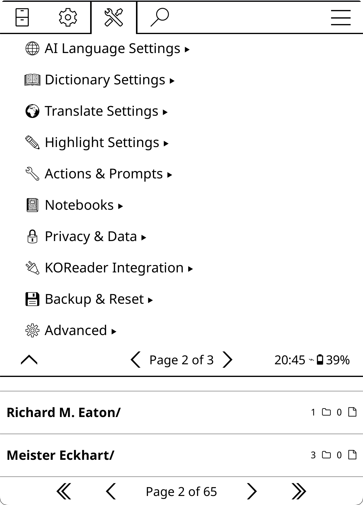</a>

**Tools → KOAssistant → Settings**

### Quick Actions
- **New Book Chat/Action**: Start a conversation about the current book or access book actions
- **General Chat/Action**: Start a context-free conversation or run a general action
- **Quick Settings**: Quick access to provider, model, behavior, and other settings
- **Chat History**: Browse saved conversations
- **Browse Notebooks**: Open the Notebook Manager to view all notebooks
- **Browse Artifacts**: Open the Artifact Browser to view all cached artifacts

### Reading Features (visible when document is open)
- **X-Ray**: Generate a browsable reference guide for the book up to your current reading position — opens in a structured category menu with characters, locations, themes, lexicon, timeline, and per-item chapter distribution. Requires text extraction enabled
- **Recap**: Get a "Previously on..." style summary to help you resume reading
- **Analyze My Notes**: Discover patterns and connections in your highlights and annotations
- **X-Ray (Simple)**: Prose companion guide from AI knowledge — characters, themes, settings, key terms. No text extraction needed
- **Book Info**: Overview, significance, and why to read it — from AI knowledge with optional web search
- **Document Summary**: Generate a comprehensive document summary — foundation for Smart actions. Requires text extraction
- **Document Analysis**: Deep analysis of thesis, structure, key insights, and audience. Requires text extraction

### Provider & Model
- **Provider**: Select AI provider (17 built-in + custom providers)
  - Tap to select from built-in providers
  - Custom providers appear with ★ prefix (see [Adding Custom Providers](#adding-custom-providers))
  - Long-press "Add custom provider..." to create your own
- **Model**: Select model for the chosen provider
  - Tap to select from available models
  - Custom models appear with ★ prefix (see [Adding Custom Models](#adding-custom-models))
  - Long-press any model to set it as your default for that provider (see [Setting Default Models](#setting-default-models))

### API Keys
- Enter API keys directly via the GUI (no file editing needed)
- Shows status indicators: `[set]` for GUI-entered keys, `(file)` for keys from apikeys.lua
- GUI keys take priority over file-based keys
- Tap a provider to enter, view (masked), or clear its key

### Display Settings

#### Rendering (sub-menu)
- **View Mode**: Choose between Markdown (formatted) or Plain Text display
  - **Markdown**: Full formatting with bold, lists, headers, etc. (default)
  - **Plain Text**: Better font support for Arabic and some other non-Latin scripts
- **Plain Text Options**: Settings for Plain Text mode
  - **Apply Markdown Stripping**: Convert markdown syntax to readable plain text. Headers use hierarchical symbols with bold text (`▉ **H1**`, `◤ **H2**`, `◆ **H3**`, etc.), `**bold**` renders as actual bold, `*italics*` are preserved as-is, `_italics_` (underscores) become bold, lists become `•`, code becomes `'quoted'`. Includes BiDi support for mixed RTL/LTR content. Disable to show raw markdown. (default: on)
- **Text Mode for Dictionary**: Always use Plain Text mode for dictionary popup, regardless of global view mode setting. Better font support for non-Latin scripts. (default: off)
- **Text Mode for RTL Dictionary**: Automatically use Plain Text mode for dictionary popup when dictionary language is RTL. Grayed out when Text Mode for Dictionary is enabled. (default: on)
- **Text Mode for RTL Translate**: Automatically use Plain Text mode for translate popup when translation language is RTL. (default: on)
- **Auto RTL mode for Chat**: Automatically detect RTL content and switch to RTL mode (right-aligned text + Plain Text) for general chat and artifact viewers. Activates when the latest response has more RTL than Latin characters. English text referencing Arabic stays in Markdown. Disabling removes all automatic RTL adjustments. Grayed out when markdown is disabled. (default: on)

#### Emoji (sub-menu)
- **Emoji Menu Icons**: Show emoji icons in plugin UI menus and buttons. Off by default. When enabled:
  - **Settings menu**: Descriptive emojis on menu items and section headers (💬 Chat, 🔗 Provider, 🤖 Model, 📖 Reading Features, 🔒 Privacy, etc.)
  - **Chat history**: Type prefixes on documents (💬 general, 📚 multi-book, 📖 book chats), 💬 on individual chats, 🏷️ on tag browser entries
  - **Notebook browser**: 📓 prefix on entries
  - **Artifact browser**: 📖 prefix on entries
  - **X-Ray browser**: Category icons (👥 Characters, 🌍 Locations, 💭 Themes, 📖 Lexicon, 📅 Timeline, 📌 Reader Engagement, 📍 Current State/Current Position, 🏁 Conclusion). Highly recommended for the X-Ray browser — the visual icons make browsing categories much more intuitive.
  - **Chat viewer**: ↩️ Reply, 🏷️ Tag, 🔍 Web search toggle
  - **Streaming**: 🔍 web search indicator
  - Requires **emoji font support** — see [Emoji Font Setup](#emoji-font-setup) for installation instructions. If icons appear as question marks or blank squares, your device doesn't have a compatible emoji font installed.
- **Emoji Data Access Indicators**: Show emoji suffixes on action names indicating what sensitive data they access. Off by default. Independent from Emoji Menu Icons — you can enable either or both. When enabled:
  - 📄 = document text (book text, X-Ray/Recap/Summary caches)
  - 🔖 = highlights only (no personal notes)
  - 📝 = annotations (highlights with personal notes)
  - 📓 = notebook
  - 🌐 = web search forced on
  - Visible in: action manager, reading features menu, quick actions, highlight/dictionary menus, file browser buttons
  - Helps you see at a glance which actions send personal data to AI providers. See [Privacy & Data](#privacy--data) for details on what gets shared.
  - Requires **emoji font support** — see [Emoji Font Setup](#emoji-font-setup).

#### Highlights (sub-menu)
- **Hide Highlighted Text**: Don't show selection in responses
- **Hide Long Highlights**: Collapse highlights over character threshold
- **Long Highlight Threshold**: Character limit before collapsing (default: 280)

#### Other
- **Plugin UI Language**: Language for plugin menus and dialogs. Does not affect AI responses. Options: Match KOReader (default), English, or 20+ other translations. Use this to switch the plugin UI to a language you're learning without changing KOReader's language, or to force English if you find the translations inaccurate. Requires restart.

### Chat & Export Settings
- **Auto-save All Chats**: Automatically save every new conversation
- **Auto-save Continued Chats**: Only save when continuing from history
- **Scroll to Last Message (Experimental)**: When resuming or replying to a chat, scroll to show your last question. Off by default (old behavior: top for new chats, bottom for replies)

#### Streaming (sub-menu)
- **Enable Streaming**: Show responses as they generate in real-time
- **Auto-scroll Streaming**: Follow new text during streaming (on by default)
- **Page-based Scroll (e-ink)**: Stream text into empty page space instead of scrolling from the bottom. Reduces full-screen refreshes on e-ink devices. When disabled, falls back to continuous bottom-scrolling. Default: on. Requires Auto-scroll.
- **Large Stream Dialog**: Use full-screen streaming window
- **Stream Poll Interval (ms)**: How often to check for new stream data (default: 125ms, range: 25-1000ms). Lower values are snappier but use more battery.
- **Display Refresh Interval (ms)**: How often to refresh the display during streaming (default: 250ms, range: 100-500ms). Higher values improve performance on slower devices.

### Content Format (within Chat & Export Settings)
- **Export Style**: Format for Copy, Note, and Save to File — Markdown (default) or Plain Text
- **Copy Content**: What to include when copying — Ask every time, Full (metadata + chat), Question + Response, Response only, or Everything (debug)
- **Note Content**: What to include when saving to note — Ask every time, Full, Question + Response, Response only (default), or Everything (debug)
- **History Export**: What to include when exporting from Chat History — Ask every time (default), Follow Copy Content, Full, Q+A, Response only, or Everything (debug)

When "Ask every time" is selected, a picker dialog appears letting you choose what to include before proceeding.

### Save Location (within Chat & Export Settings)
- **Save Location**: Where to save exported files
  - **KOAssistant exports folder** (default): Central `koassistant_exports/` folder with subfolders for book/general/multi-book chats
  - **Custom folder**: User-specified fixed directory
  - **Ask every time**: PathChooser dialog on each save
- **Save book chats alongside books**: When enabled, book chats go to `[book_folder]/chats/` subfolder (default: OFF)
- **Set Custom Folder**: Set the custom directory path (appears when Custom folder is selected)
- **Show Export in Chat Viewer**: Add Export button to the chat viewer toolbar (default: off)

### AI Language Settings
These settings control what language the AI responds in.

**Auto-detection:** KOAssistant automatically detects your language from KOReader's UI language setting. If you haven't configured any languages, the AI will respond in your KOReader language (e.g., if KOReader is set to Français, the AI responds in French). This also applies to translation and dictionary actions. The auto-detected language is shown as "(auto)" in Quick Settings. Once you explicitly set a language, auto-detection is no longer used.

**Existing users:** If you completed the setup wizard before this feature was added and haven't configured languages, KOAssistant will show a one-time prompt offering to use your detected KOReader language (non-English users only).

- **Your Languages**: Languages you speak/understand. Opens a picker with 47 pre-loaded languages displayed in their native scripts (日本語, Français, Español, etc.). Select multiple languages. These are sent to the AI in the system prompt ("The user understands: ...").
- **Primary Language**: Pick which of your languages the AI should respond in by default. Defaults to first in your list.
- **Additional Languages**: Extra languages for translation/dictionary targets without affecting AI response language. These are NOT sent to the AI in the system prompt but appear in translation/dictionary language pickers and the Language button in compact/translate views. Use cases: scholarly work (Latin, Sanskrit, Ancient Greek), language learning (translate TO a language you're studying), or occasional use of languages you understand but don't want the AI defaulting to.

**Native script display:** Languages appear in their native scripts in menus and settings (日本語, Français, etc.). System prompts sent to the AI use English names for better language model comprehension. Classical/scholarly languages (Ancient Greek, Biblical Hebrew, Classical Arabic, Latin, Sanskrit) are displayed in English only.

**Custom languages:** Use "Add Custom Language..." at the top of each picker to enter languages not in the pre-loaded list. Custom languages are remembered and appear in future pickers.

**Note:** Translation target language settings are in **Settings → Translate Settings**.

**How language responses work:**
- AI responds in your primary language by default (auto-detected or explicitly set)
- If you type in another language from your list, AI switches to that language
- The AI only auto-switches between Your Languages—it will never spontaneously respond in an Additional Language, even when working with content in that language. This is because Additional Languages are not included in the system-level language instruction sent to the AI; they exist solely for translation/dictionary targeting.

**Examples:**
- Your Languages: `English` - AI always responds in English
- Your Languages: `Deutsch, English, Français` with Primary: `English` - English by default, switches if you type in German or French
- Additional Languages: `Latin, Sanskrit` - Available in translation/dictionary pickers only; AI won't auto-switch to these languages even when you're reading Latin text

**How it works technically:** Your interaction languages are sent as part of the system message (after behavior and domain). The instruction tells the AI to respond in your primary language and switch if you type in another configured language. Language names in system prompts use English (e.g., "Japanese" not "日本語") for more reliable AI comprehension. See [How the AI Prompt Works](#how-the-ai-prompt-works).

**Built-in actions that skip this:** Translate and Dictionary actions set `skip_language_instruction` because they specify the target language directly in their prompt templates (via `{translation_language}` and `{dictionary_language}` placeholders). This avoids conflicting instructions.

**For custom actions:** If your action prompt already specifies a response language, enable "Skip language instruction" to prevent conflicts. If you want the AI to follow your global language preference, leave it disabled (the default).

#### How Language Settings Work Together

KOAssistant has four language-related settings that work together:

1. **Your Languages** — Languages you speak (sent to AI in system prompt)
2. **Primary Language** — Default response language for all AI interactions (selected from Your Languages)
3. **Translation Language** — Target language for Translate action
   - Can be set to follow Primary (`↵` symbol) or set independently
   - Picker shows both Your Languages and Additional Languages
4. **Dictionary Language** — Response language for dictionary lookups
   - Can follow Primary (`↵`) or Translation (`↵T`) or be set independently
   - Picker shows both Your Languages and Additional Languages

**Return symbols:**
- `↵` = Following another setting
- `↵T` = Following Translation setting specifically

**Example setup:**
- Your Languages: English, Spanish
- Primary: English
- Additional Languages: Latin
- Translation: `↵` (follows Primary → English)
- Dictionary: `↵T` (follows Translation → English)

This setup means: AI knows you understand English and Spanish, responds in English, translates to English, defines words in English. Latin is available in translation/dictionary pickers for scholarly texts.

**Another example:**
- Your Languages: English
- Primary: English
- Additional Languages: Spanish, Latin
- Translation: Spanish
- Dictionary: `↵T` (follows Translation → Spanish)

This setup means: AI responds in English by default, translates to Spanish, defines words in Spanish (useful when reading Spanish texts). Latin available for translation if needed.

### Dictionary Settings
See [Dictionary Integration](#dictionary-integration) and [Bypass Modes](#bypass-modes) for details.
- **AI Button in Dictionary Popup**: Show AI Dictionary button (opens menu with 3 built-in actions)
- **Response Language**: Language for definitions (`↵T` follows Translation Language by default)
- **Context Mode**: Surrounding text to include: None (default), Sentence, Paragraph, or Characters
- **Context Characters**: Character count for Characters mode (default: 100)
- **Disable Auto-save for Dictionary**: Don't auto-save dictionary lookups (default: on)
- **Copy Content**: What to include when copying in compact dictionary view — Follow global setting, Ask every time, Full, Question + Response, or Definition only (default)
- **Note Content**: What to include when saving dictionary results to a note via the +Note button — same options as Copy Content, defaults to Definition only
- **Enable Streaming**: Stream dictionary responses in real-time
- **Dictionary Popup Actions**: Configure which actions appear in the AI menu (reorder, add custom)
- **Bypass KOReader Dictionary**: Skip dictionary popup, go directly to AI
- **Bypass Action**: Which action to trigger when bypass is enabled (default: Dictionary). Consider "Quick Define" or a custom action for faster responses
- **Bypass: Follow Vocab Builder Auto-add**: Follow KOReader's Vocabulary Builder auto-add in bypass mode

> **Tip:** Create custom dictionary actions tailored to your language pair for best results. See [Custom Dictionary Actions](#custom-dictionary-actions).

### Translate Settings
See [Translate View](#translate-view) for details on the specialized translation UI.
- **Translate to Primary Language**: Use your primary language as the translation target (default: on)
- **Translation Target**: Pick from your languages or enter a custom target (when above is disabled)
- **Disable Auto-Save for Translate**: Don't auto-save translations (default: on). Save manually via → Chat button
- **Enable Streaming**: Stream translation responses in real-time (default: on)
- **Copy Content**: What to include when copying in translate view — Follow global setting, Ask every time, Full, Question + Response, or Translation only (default). Replaces the old "Copy Translation Only" toggle.
- **Note Content**: What to include when saving to note in translate view — same options as Copy Content, defaults to Translation only

When "Ask every time" is selected (or inherited from global), a picker dialog appears letting you choose what to include.
- **Original Text**: How to handle original text visibility (Follow Global, Always Hide, Hide Long, Never Hide)
- **Long Text Threshold**: Character count for "Hide Long" mode (default: 280)
- **Hide for Full Page Translate**: Always hide original when translating full page (default: on)

### Highlight Settings
See [Bypass Modes](#bypass-modes) and [Highlight Menu Actions](#highlight-menu-actions).
- **Enable Highlight Bypass**: Immediately trigger action when selecting text (skip menu)
- **Bypass Action**: Which action to trigger when bypass is enabled (default: Translate)
- **Highlight Menu Actions**: View and reorder actions in the highlight popup menu (8 defaults: Translate, Look up in X-Ray, ELI5, Explain, Elaborate, Summarize, Connect, Fact Check)

### Quick Settings Settings
Configure the Quick Settings panel (available via gesture or gear icon in input dialog).
- **QS Panel Utilities**: Show/hide and reorder buttons in the Quick Settings panel. Tap to toggle visibility, hold to move up/down. Also accessible via the gear icon in the Quick Settings panel title bar.
  - Provider, Model, Behavior, Domain, Temperature, Anthropic/Gemini Reasoning
  - Web Search, Language, Translation Language, Dictionary Language
  - H.Bypass, D.Bypass, Text Extraction
  - Chat History, Browse Notebooks, Browse Artifacts
  - General Chat/Action, Continue Last Chat, New Book Chat/Action, Manage Actions, Quick Actions, More Settings
  - All buttons are enabled by default. Disable any you don't use to streamline the panel.

### Quick Actions Settings

Configure the Quick Actions panel (available via gesture in reader mode).
- **Panel Actions**: Reorder or remove actions from the Quick Actions panel. Add new actions via Action Manager → hold action → "Add to Quick Actions". Also accessible via the gear icon in the Quick Actions panel title bar → Panel Actions.
- **QA Panel Utilities**: Show/hide and reorder utility buttons that appear below actions in the panel. Tap to toggle visibility, hold to move up/down. Also accessible via the gear icon → Panel Utilities.
  - Translate Page, New Book Chat/Action, Continue Last Chat, General Chat/Action
  - Chat History, Notebook (View/Edit popup), View Artifacts (opens picker when any artifacts exist), Quick Settings
  - All utilities are enabled by default. Disable any you don't use to streamline the panel.

### Actions & Prompts
- **Manage Actions**: See [Actions](#actions) section for full details
- **Manage Behaviors**: Select or create AI behavior styles (see [Behaviors](#behaviors))
- **Manage Domains**: Create and manage knowledge domains (see [Domains](#domains))

### Notebooks
- **Browse Notebooks...**: Open the Notebook Manager to view all notebooks
- **Content Format**: What to include when saving to notebook
  - **Response only**: Just the AI response
  - **Q&A**: Highlighted text + question + response
  - **Full Q&A** (recommended, default): All context messages + highlighted text + question + response
- **Viewer Mode**: Choose how notebooks open (default: Chat Viewer)
  - **Chat Viewer**: Opens in the plugin's viewer with Copy, Export, MD/TXT toggle, Open in Reader, and Edit buttons
  - **KOReader**: Opens as a full document in KOReader's reader with page navigation
- **Show in file browser menu**: Show "Notebook (KOA)" button when long-pressing books (default: on)
- **Only for books with notebooks**: Only show button if notebook already exists (default: on). Disable to allow creating notebooks from file browser.

**Filename format**: Files are named `[book_title]_[chat_title]_[timestamp].md` (or `.txt`). Book title is truncated to 30 characters, chat title to 25 characters. Timestamp uses the chat's creation time for saved chats, or export time for unsaved chats from the viewer.

### Privacy & Data
See [Privacy & Data](#privacy--data) for background on what gets sent to AI providers and the reasoning behind these defaults.
- **Trusted Providers**: Mark providers (e.g., local Ollama) that bypass all data sharing controls AND text extraction — all data types are available without toggling individual settings
- **Preset: Default**: Recommended balance — progress and chapter info shared, personal content private
- **Preset: Minimal**: Maximum privacy — only question and book metadata sent
- **Preset: Full**: Enable all data sharing for full functionality (does not enable text extraction)
- **Data Sharing Controls** (for non-trusted providers):
  - **Allow Annotation Notes**: Send your personal notes attached to highlights (default: OFF). Auto-enables Allow Highlights.
  - **Allow Highlights**: Send your highlighted text passages without notes (default: OFF). Grayed out when annotations enabled.
  - **Allow Notebook**: Send notebook entries (default: OFF)
  - **Allow Reading Progress**: Send current reading position percentage (default: ON)
  - **Allow Chapter Info**: Send chapter title, chapters read, time since last opened (default: ON)
- **Text Extraction** (submenu): Settings for extracting book content for AI analysis
  - **Allow Text Extraction**: Master toggle for text extraction (off by default). When enabled, actions can extract and send book text to the AI. Used by X-Ray, Recap, Explain in Context, Analyze in Context, and actions with text placeholders (`{book_text}`, `{full_document}`, etc.). Enabling shows an informational notice about token costs and a tip about using Hidden Flows to save tokens.
  - **Max Text Characters**: Maximum characters to extract (100,000-10,000,000, default 4,000,000 ~1M tokens). The default covers most books with Gemini's 1M-token context; lower it for smaller models
  - **Max Pages (PDF, DJVU, CBZ…)**: Maximum pages to extract from page-based formats (100-5,000, default 2,000)
  - **Don't warn about truncated extractions**: When unchecked (default), a blocking warning dialog appears before sending requests where extracted text was truncated to fit the character limit — shows the coverage percentage so you know how much of the document was included. The warning offers Cancel, Continue Anyway, or Don't warn again
  - **Don't warn about large extractions**: When unchecked (default), a warning dialog appears before sending requests with over 500K characters (~125K tokens) of extracted text — most models except Gemini will struggle at this size. The warning offers Cancel, Continue, or Don't warn again
  - **Clear Action Cache**: Clear cached artifact responses (X-Ray, X-Ray (Simple), Recap, Summary, Analysis, Book Info, Analyze My Notes) for the current book (requires book to be open). To clear just one action, use the delete button in the artifact viewer instead.

### KOReader Integration
Control where KOAssistant appears in KOReader's menus. All toggles default to ON; disable any to reduce UI presence.
- **Show in File Browser**: Add KOAssistant buttons to file browser context menus (requires restart)
- **Show in Highlight Menu**: Add the main "Chat/Action" button to the highlight popup (requires restart)
- **Show Highlight Quick Actions**: Add Explain, Translate, and other action shortcuts to the highlight popup (requires restart)
- **Show in Dictionary Popup**: Add AI buttons to KOReader's dictionary popup
- **Show in Gesture Menu**: Register custom action gestures in KOReader's gesture dispatcher (requires restart). Only affects actions added via "Add to Gesture Menu" in Action Manager — built-in gestures (Chat History, Quick Settings, toggles, etc.) are always available.

**Note:** File browser, highlight menu, and gesture menu changes require a KOReader restart since they are registered at plugin startup. Dictionary popup changes take effect immediately. To customize which actions appear in each menu, use **Action Manager → hold action** to add/remove from specific menus.

### Temperature
- **Temperature**: Response creativity (0.0-2.0, Anthropic max 1.0). Top-level setting for quick access.

### Backup & Reset
Backup and restore functionality, plus reset options. See [Backup & Restore](#backup--restore) for full details.
- **Create Backup**: Save settings, API keys, custom content, and chat history
- **Restore from Backup**: Restore from a previous backup
- **View Backups**: Manage existing backups and restore points
- **Reset Settings**: Quick resets (Settings only, Actions only, Fresh start), Custom reset checklist, Clear chat history

### Advanced
- **Reasoning/Thinking**: Per-provider reasoning settings:
  - **Enable Reasoning**: Master toggle for optional reasoning (default: off). Controls Anthropic (adaptive/extended thinking), Gemini 3 (thinking depth), and OpenAI GPT-5.1+ (reasoning effort). Other providers either always reason at factory defaults (o3, GPT-5, DeepSeek Reasoner) or don't support configurable reasoning. Gemini 2.5 models think automatically regardless of this toggle.
  - **Anthropic Adaptive Thinking (4.6+)**: Effort level (low/medium/high, max for Opus 4.6). Claude decides when and how much to think based on the task. Recommended for 4.6 models. Takes priority over Extended Thinking when model supports both. (requires master toggle)
  - **Anthropic Extended Thinking**: Budget 1024-32000 tokens. Manual thinking budget mode for all thinking-capable Claude models (4.6, 4.5, 4.1, 4, 3.7). On 4.6 models, Adaptive Thinking takes priority if both are enabled. (requires master toggle)
  - **Gemini Thinking**: Level (minimal/low/medium/high) for Gemini 3 models (requires master toggle). Gemini 2.5 thinking content is captured automatically.
  - **OpenAI Reasoning (5.1+)**: Enables reasoning for GPT-5.1 and GPT-5.2 models where it is off by default (requires master toggle). Effort level: low/medium/high/xhigh. Other OpenAI reasoning models (o3, o3-mini, o3-pro, o4-mini, GPT-5, GPT-5-mini, GPT-5-nano) always reason at their factory defaults and are not affected by this toggle.
  - **Show Reasoning Indicator**: Display "*[Reasoning was used]*" in chat when reasoning is active (default: on)
- **Web Search**: Allow AI to search the web for current information:
  - **Enable Web Search**: Global toggle (default: off). Supported by Anthropic, Gemini, and OpenRouter.
  - **Max Searches per Query**: 1-10 searches per query (Anthropic only, default: 5)
  - **Show Indicator in Chat**: Display "*[Web search was used]*" in chat when search is used (default: on)
- **Provider Settings**:
  - **Qwen Region**: Select your Alibaba Cloud region (International/China/US). API keys are region-specific and not interchangeable.
- **Console Debug**: Enable terminal/console debug logging. When enabled, also shows token usage (input, output, cache hits) in the terminal after each API response.
- **Show Debug in Chat**: Display debug info in chat viewer
- **Debug Detail Level**: Verbosity (Minimal/Names/Full)
- **Test Connection**: Verify API credentials work

### About
- **About KOAssistant**: Plugin info and gesture tips
- **Auto-check for updates on startup**: Toggle automatic update checking (default: on)
- **Check for Updates**: Manual update check (see [Update Checking](#update-checking) below)

---

## Updating the Plugin

KOAssistant can update itself with one tap. [Implementation](https://github.com/oleasteo/koreader-screenlockpin/blob/main/screenlockpin.koplugin/plugin/updatemanager.lua) in [oleasteo's ScreenLockPin](https://github.com/oleasteo/koreader-screenlockpin) used as template. When a new version is available, the update dialog includes an **"Update Now"** button that downloads, installs, and preserves your configuration automatically. Your API keys, custom actions, behaviors, domains, settings, chat history, notebooks, and caches are all safe.

### Automatic Update (One-Tap)

When KOAssistant detects a new version (automatically on startup, or via a manual check), the release notes dialog includes an **"Update Now"** button. Tap it and the plugin handles everything:

1. Downloads the release zip from GitHub
2. Extracts and verifies the new version
3. Preserves your configuration files (`apikeys.lua`, `configuration.lua`, `custom_actions.lua`, and custom `behaviors/`/`domains/` folders)
4. Swaps in the new version
5. Restores your configuration files
6. Prompts you to restart KOReader

The "Update Now" button appears in both the original and translated release notes viewers, so you can read the notes in your language and update from the same dialog.

> **Note:** If you installed KOAssistant by cloning the git repository (developers), the "Update Now" button will not appear. Use `git pull` instead — see [Git Pull](#git-pull-for-developers) below.

### What's Safe During Updates

Your settings and data are **not affected** by updates (automatic or manual):
- **All settings** (provider, model, features, privacy, etc.) are stored outside the plugin folder
- **API keys entered via Settings menu** are stored outside the plugin folder
- **Chat history, notebooks, caches** are all stored in KOReader's settings/sidecar files
- **Backups** (created via Settings → Backup & Restore) are stored outside the plugin folder

The auto-updater also preserves the optional configuration files that live inside the plugin folder: `apikeys.lua`, `configuration.lua`, `custom_actions.lua`, and custom `behaviors/`/`domains/` folders.

### Manual Update

If you prefer to update manually (or are updating from a version that doesn't have auto-update):

#### Extract Over Existing (Recommended)

New and changed files are overwritten; your configuration files are untouched.

1. Download `koassistant.koplugin.zip` from the [latest release](https://github.com/zeeyado/koassistant.koplugin/releases) → Assets
2. Connect your device via USB (or use a file manager on Android)
3. Extract the zip **directly over** the existing `koassistant.koplugin` folder in your plugins directory:
   ```
   Kobo/Kindle:  /mnt/onboard/.adds/koreader/plugins/
   Android:      /sdcard/koreader/plugins/
   macOS:        ~/Library/Application Support/koreader/plugins/
   Linux:        ~/.config/koreader/plugins/
   ```
   When your OS/file manager asks about existing files, choose **Replace** / **Overwrite** / **Merge**.
4. Safely eject your device (if USB) and restart KOReader

> **Tip (Kobo/Kindle):** On some file managers, "extract here" into the plugins directory will automatically merge into the existing folder. On others, you may need to drag the extracted `koassistant.koplugin` folder over the existing one and confirm the overwrite.

#### Clean Install (If You Have Issues)

If you're having problems after an update, a clean install can help. This deletes the old plugin folder entirely, so back up your configuration files first.

1. **Back up** any files you've created inside the plugin folder:
   - `apikeys.lua` (if you use file-based API keys instead of the Settings menu)
   - `configuration.lua` (if you created one)
   - `custom_actions.lua` (if you created one)
   - `behaviors/` and `domains/` folders (if you added custom files)
2. Delete the existing `koassistant.koplugin` folder
3. Extract the new zip to the plugins directory
4. Copy your backed-up files back into the new `koassistant.koplugin` folder
5. Restart KOReader

> **Note:** If you entered your API keys via the Settings menu (not a file), you don't need to back up `apikeys.lua` — GUI keys are stored separately and will persist.

#### Git Pull (For Developers)

If you cloned the repository:
```bash
cd /path/to/koreader/plugins/koassistant.koplugin
git pull
```

This gives you the latest development version (may include unreleased changes). The auto-updater detects git-based installs and disables itself to avoid overwriting your repository.

---

## Update Checking

KOAssistant includes both automatic and manual update checking to keep you informed about new releases.

### Automatic Update Check

By default, KOAssistant automatically checks for updates **once per session** when you first use a plugin feature (starting a chat, highlighting text, etc.).

**How it works:**
1. First time you use KOAssistant after launching KOReader, a brief "Checking for updates..." notification appears
2. The check runs in the background without blocking your workflow (4 second timeout)
3. If a new version is available, a dialog appears with:
   - Current version and latest version
   - Full release notes in formatted markdown with clickable links
   - **"Update Now"** button to install the update directly (see [Automatic Update](#automatic-update-one-tap))
   - "Visit Release Page" button to view on GitHub (opens in browser if device supports it)
   - "Translate" button to translate release notes to your language (only shown if non-English)
   - "Later" button to dismiss

**What's checked:**
- Compares your installed version against GitHub releases
- Includes both stable releases and pre-releases (alpha/beta)
- Uses semantic versioning (handles version strings like "0.6.0-beta")
- Only checks once per session to avoid repeated notifications

**To disable automatic checking:**
- Go to **Settings → About → Auto-check for updates on startup** and toggle it off
- Or add to your `configuration.lua`:
  ```lua
  features = {
      auto_check_updates = false,
  }
  ```

### Manual Update Check

You can manually check for updates any time via:

**Tools → KOAssistant → Settings → About → Check for Updates**

Manual checks always show a result (whether update is available or you're already on the latest version).

### Version Comparison

The update checker intelligently compares versions:
- **Newer version available** → Shows release notes dialog
- **Already on latest** → "You are running the latest version" message
- **Development version** (newer than latest release) → "You are running a development version" message

**Why the notification on first run?** The brief notification explains the slight delay you might experience when first using the plugin after launching KOReader. This ensures you're aware that the plugin is checking for updates in the background, not experiencing a bug or freeze.

---

## Advanced Configuration

### configuration.lua

For advanced overrides, copy `configuration.lua.sample` to `configuration.lua`:

```lua
return {
    -- Force a specific provider/model
    provider = "anthropic",
    model = "claude-sonnet-4-20250514",

    -- Provider-specific settings
    provider_settings = {
        anthropic = {
            base_url = "https://api.anthropic.com/v1/messages",
            additional_parameters = {
                max_tokens = 4096
            }
        },
        ollama = {
            model = "llama3",
            base_url = "http://192.168.1.100:11434/api/chat",
        }
    },

    -- Feature overrides
    features = {
        enable_streaming = true,
        ai_behavior_variant = "full",
        enable_extended_thinking = true,
        thinking_budget_tokens = 10000,
    },
}
```

---

## Backup & Restore

KOAssistant includes comprehensive backup and restore functionality to protect your settings, custom content, and optionally API keys and chat history.

**Access:** Tools → KOAssistant → Settings → Backup & Reset

### What Can Be Backed Up

Backups are selective — choose what to include:

| Category | What's Included | Default |
|----------|----------------|---------|
| **Core Settings** | Provider/model, behaviors, domains, temperature, languages, all toggles, custom providers, custom models, action menu customizations | Always included |
| **API Keys** | Your API keys (encrypted storage planned for future) | ⚠️ Excluded by default |
| **Configuration Files** | configuration.lua, custom_actions.lua (if they exist) | Included if files exist |
| **Domains & Behaviors** | Custom domains and behaviors from your folders | Included |
| **Chat History** | All saved conversations | Excluded (can be large) |

**Security note:** API keys are stored in plain text in backups. Only enable "Include API Keys" if you control access to your backup files.

### Creating Backups

**Steps:**
1. Settings → Backup & Reset → Create Backup
2. Choose what to include (checkboxes for each category)
3. Tap "Create Backup"
4. Backup saved to `koassistant_backups/` folder with timestamp

**Backup format:** `.koa` files (KOAssistant Archive) are tar.gz archives containing your settings and content.

**When to create backups:**
- Before major plugin updates
- Before experimenting with major settings changes
- To transfer settings between devices (e.g., e-reader ↔ test environment)
- As periodic safety snapshots

### Restoring Backups

**Steps:**
1. Settings → Backup & Reset → Restore from Backup
2. Select a backup from the list (sorted newest first)
3. Preview what the backup contains
4. Choose what to restore (can exclude categories)
5. Choose restore mode:
   - **Replace** (default, safest): Completely replaces current settings
   - **Merge** (advanced): Intelligently merges backup with current settings
6. Tap "Restore Now"

**Automatic restore point:** A restore point is automatically created before every restore operation, so you can undo if needed.

**After restore:** Restart KOReader for all settings to take full effect.

### Restore Modes

**Replace Mode (recommended):**
- Safest option for most users
- Completely replaces current settings with backup
- Creates automatic restore point first
- What you backed up is exactly what you get

**Merge Mode (advanced):**
- Intelligently combines backup with current settings
- Feature toggles use backup values
- Custom content (providers, models, actions) merged by ID
- API keys merged by provider (backup takes precedence)
- Domains/behaviors merged by filename

### Managing Backups

**View all backups:** Settings → Backup & Reset → View Backups

**For each backup:**
- **Info** — View manifest details (what's included, version, timestamp)
- **Restore** — Start restore flow
- **Delete** — Remove the backup

**Restore points:** Automatic restore points (created before each restore) are shown separately and auto-delete after 7 days.

**Total size:** Displayed at bottom of backup list.

### Transferring Settings Between Devices

You can export settings from your main device (e.g., e-reader) and import them into another KOReader installation (e.g., desktop for testing):

**Example workflow:**
```bash
# 1. On main device: Create backup via Settings UI
#    (Include: Settings, API Keys, Domains & Behaviors)
#    (Exclude: Chat History to keep backup small)

# 2. Copy backup from device to test machine
scp /mnt/onboard/.adds/koreader/koassistant_backups/koassistant_backup_*.koa \
    ~/test-env/koassistant_backups/

# 3. On test device: Restore via Settings UI

# 4. Restart KOReader
```

This is especially useful for:
- Testing new plugin versions with your actual configuration
- Using the [web inspector](#testing-your-setup) with your real settings
- Sharing configurations across multiple e-readers
- Synchronizing settings between work and personal devices

### Graceful Restore Handling

The restore system validates settings and handles edge cases:

**What's validated:**
- **Custom actions** — Skips actions with missing required fields
- **Action overrides** — Skips overrides for actions that no longer exist or have changed
- **Version compatibility** — Warns if backup was created with different plugin version

**If issues found:** Warnings are shown after restore completes. Invalid items are skipped but valid items are restored successfully.

### Reset Settings

KOAssistant provides clear reset options for different use cases.

**Access:** Settings → Backup & Reset → Reset Settings

#### Quick Resets

Three preset options that cover most needs:

**Quick: Settings only**
- Resets ALL settings in the Settings menu to defaults (provider, model, temperature, streaming, display, export, dictionary, translation, reasoning, debug, language preferences)
- Keeps: API keys, all actions, custom behaviors/domains, custom providers/models, gesture registrations, chat history

**Quick: Actions only**
- Resets all action-related settings (custom actions, edits to built-in actions, disabled actions, all action menus: highlight, dictionary, quick actions, general, file browser)
- Keeps: All settings, API keys, custom behaviors/domains, custom providers/models, gesture registrations, chat history

**Quick: Fresh start**
- Resets everything except API keys, language preferences, and chat history (all settings, all actions, custom behaviors/domains, custom providers/models, gesture registrations)
- Keeps: API keys, language preferences, chat history only

#### Custom Reset

Opens a checklist dialog to choose exactly what to reset:
- Settings (all toggles and preferences)
- Custom actions
- Action edits
- Action menus
- Custom providers & models
- Behaviors & domains
- API keys (shows ⚠️ warning)

Tap each item to toggle between "✗ Keep" and "✓ Reset", then tap "Reset Selected".

#### Clear Chat History

Separate option to delete all saved conversations across all books. This cannot be undone.

#### Action Manager Menu

The Action Manager (Settings → Actions & Prompts → Manage Actions) has a hamburger menu (☰) in the top-left with quick access to action-related resets.

All sorting/ordering managers (Manage Actions, Highlight Menu, Dictionary Popup, File Browser Actions, QA Panel Actions, QA Panel Utilities, QS Panel Items, Input Dialog Actions) have hamburger menus (☰) with cross-navigation links, so you can jump between them without going back to Settings.

**When to reset:** After problematic updates, when experiencing strange behavior, or to start fresh. See [Troubleshooting → Settings Reset](#settings-reset) for details.

---

## Technical Features

### Streaming Responses

<a href="screenshots/streaming.png">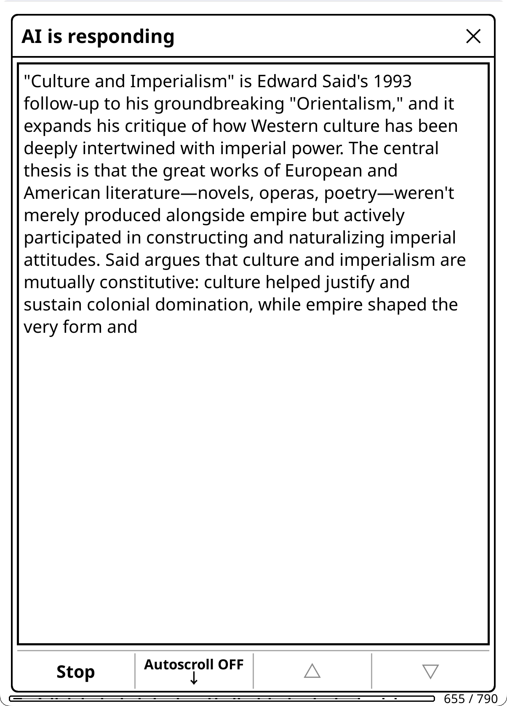</a>

When enabled, responses appear in real-time as the AI generates them.

- **Auto-scroll** (default): Follows new text as it appears. Automatically pauses when you swipe, use page buttons, or tap the scroll controls.
- **Page-based scroll** (default): Text fills the current page top-down, then advances to a blank page when full — minimizing full-screen e-ink refreshes. Disable for continuous bottom-scrolling.
- **Auto-Scroll toggle button**: Tap to stop/start auto-scrolling

Works with all providers that support streaming.

### Prompt Caching

Prompt caching reduces costs and latency by reusing previously processed prompt prefixes. Most major providers support this automatically.

| Provider | Type | Savings | Notes |
|----------|------|---------|-------|
| Anthropic | Explicit | 90% | System prompt marked with `cache_control` |
| OpenAI | Automatic | 90% | Min 1024 tokens |
| Gemini 2.5+ | Automatic | 90% | Min 1024-2048 tokens |
| DeepSeek | Automatic | Up to 90% | Disk-based, min 64 tokens |
| Groq | Automatic | 50% | Select models (Kimi K2, GPT-OSS) |

**What's cached**: The stable prefix of each request — system message (behavior + domain + language instruction), plus conversation history from prior turns. Providers that support automatic prefix caching (OpenAI, Gemini, DeepSeek) also cache the message history, so book text embedded in the first user message is cached on subsequent follow-ups.

**How it helps**: Each follow-up message resends the **entire conversation history** to the AI (system prompt + all prior messages and responses). Without caching, you'd pay full price for the entire payload every turn. With caching, previously seen content is processed at 10-50% of the normal rate.

**Best for**: Multi-turn conversations, especially those that started with large context (book text, summaries). The more stable content at the start of the conversation, the greater the savings.

### Response Caching

X-Ray and Recap responses are automatically cached per book. For **incremental** X-Rays (the default track), this enables **incremental updates** — as you read further, the AI builds on its previous analysis rather than starting from scratch. **Complete** X-Rays (entire document) are cached but always generate fresh when redone.

**How incremental caching works:**
1. Run X-Ray at 30% → Full structured JSON analysis generated and cached
2. Continue reading to 50%
3. Tap X-Ray again → A popup shows: **View X-Ray (30%, today)**, **Update X-Ray (to 50%)**, or **Update X-Ray (to 100%)**
4. Choose Update → Only the new content (30%→50%) is sent along with an index of existing entities. The AI outputs only new or changed entries.
5. Diff-based merge: new entries are name-matched and merged into existing data (entities update in place, timeline events append, state summaries replace). ~200-500 output tokens vs 2000-4000 for full regeneration.
6. Result: Faster responses, lower token costs, continuity of analysis

**"Update to 100%"** extends an incremental X-Ray to the end of the book using the same spoiler-free prompt and Current State/Current Position schema. This is *not* a complete X-Ray — it's the incremental track at full coverage. Only shown when you haven't already read to near 100%.

**Complete X-Ray caching:** Complete (entire document) X-Rays are cached like any other, but they don't support incremental updates. Redoing a complete X-Ray always generates fresh from the full document. The cache is labeled "Complete" instead of a percentage.

**Direct-to-viewer:** When any X-Ray cache covers 100% — whether complete, incremental updated to 100%, or simply read to the end — tapping X-Ray goes directly to the browser viewer with no scope popup. Redo is available in the browser's options menu (☰).

The View/Update popup appears everywhere you can trigger an artifact action (X-Ray, X-Ray (Simple), Recap, Document Summary, Document Analysis): Quick Actions panel, Reading Features menu, gestures, and the book chat input field action picker. For X-Ray specifically, if no cache exists yet, the popup offers "Generate X-Ray (to X%)" and "Generate X-Ray (entire document)". For non-incremental actions (Summarize, Analyze, X-Ray (Simple)), the popup shows "View" and "Redo" (since there's nothing to incrementally update).

**Stale X-Ray notification:** When you open the X-Ray browser and your reading has advanced >5% past the cached progress, a popup shows the gap (e.g., "X-Ray covers to 29% — You're now at 39%") with **Update** and **Don't remind me this session** buttons. This also appears when looking up items via "Look up in X-Ray" from highlight/dictionary. You can also update anytime from the browser's options menu (☰) — it shows **Update X-Ray (to 39%)** when you've read further, or **Redo X-Ray** at the same position. Stale notifications don't appear for 100% caches (reader is always at or behind the cache).

**X-Ray format:** X-Ray results are stored as structured JSON (characters with aliases/connections, locations with references, themes with references, lexicon, timeline, plus Current State/Conclusion). The JSON is rendered to readable markdown for chat display and `{xray_cache_section}` placeholders, while the raw JSON powers the browsable menu UI. Legacy markdown X-Rays from older versions are still viewable but will be replaced with JSON on the next run.

**Requirements:**
- You must be reading (not in file browser)
- Progress must advance by at least 1% to trigger an incremental update (incremental track only)

> **Text extraction required:** X-Ray, Document Analysis, and Document Summary require text extraction to be enabled — they block generation without it. Use X-Ray (Simple) for a prose overview based on AI knowledge when text extraction is not available. Recap still works without text extraction (the AI uses training knowledge), though results are less accurate.

> **X-Ray (Simple) caching:** X-Ray (Simple) results are cached as a separate artifact alongside X-Ray. Unlike X-Ray, it doesn't support incremental updates — every generation is fresh. When your reading position advances, the "View/Update" popup lets you update (regenerate at the new position). Both X-Ray and X-Ray (Simple) can coexist for the same book.

**Cache storage:**
- Stored in the book's sidecar folder (`.sdr/koassistant_cache.lua`)
- Automatically moves with the book if you reorganize your library

**Clearing the cache:**
- **Per-action**: In the artifact viewer, use the delete button (for X-Ray: options menu → "Delete X-Ray"; for X-Ray (Simple)/Recap: delete button in the text viewer; for Summary/Analysis: delete button in the cache viewer). This clears that action's cache for this book. You can then re-run the action — Summary and Analysis also have a regenerate button in the viewer when the book is open.
- **All actions for book**: Settings → Privacy & Data → Text Extraction → Clear Action Cache (requires book to be open)
- Either option forces fresh generation on next run (useful if analysis got off track, or to switch between incremental and complete tracks)

**Limitations:**
- Only X-Ray and Recap support incremental caching currently (other artifact actions — X-Ray (Simple), Document Summary, Document Analysis, Book Info, Analyze My Notes — cache results but always regenerate fresh)
- X-Ray, Document Summary, and Document Analysis require text extraction; X-Ray (Simple), Recap, Book Info, and Analyze My Notes work without it
- Complete X-Rays don't support incremental updates (always fresh generation)
- X-Ray (Simple) doesn't support incremental updates (always fresh generation)
- Going backward in progress doesn't use cache (fresh generation)
- X-Ray cannot be duplicated (its JSON output requires the X-Ray browser). All other actions can be duplicated — they work as one-shot chat actions but don't inherit caching or incremental update behavior
- Legacy markdown X-Ray caches (from before the JSON update) are still viewable but will be fully regenerated (not incrementally updated) on the next run, producing the new JSON format
- To switch between incremental and complete tracks, delete the cache and regenerate

All seven artifact actions (X-Ray, X-Ray (Simple), Recap, Document Summary, Document Analysis, Book Info, Analyze My Notes) produce **Document Artifacts** — reusable results you can view anytime and reference in other actions. See the next section for details.

### Document Artifacts

When certain actions complete, their results are saved as **document artifacts** — persistent, per-book outputs that serve two purposes:

1. **Viewable as standalone reference guides.** Browse a book's Summary, X-Ray, X-Ray (Simple), Recap, Analysis, Book Info, or Analyze My Notes anytime without re-running the action. X-Ray opens as a browsable category menu (characters, locations, themes, lexicon, timeline) with search, chapter/book mention analysis, per-item chapter distribution, linkable cross-references, and your highlight mentions — useful for quickly checking character details, relationships, or where a character appears across chapters mid-read. X-Ray (Simple) shows a prose overview.
2. **Reusable as context in other actions.** Instead of sending full document text (~100K tokens) every time, actions can reference a compact artifact (~2-8K tokens). This is the foundation of **Smart actions** — dramatically cheaper and often better-performing, since models handle focused context more effectively than massive text dumps.

**The seven artifact types:**

| Artifact | Generated by | What it contains | Primary use |
|----------|-------------|------------------|-------------|
| **Summary** | Document Summary | Neutral, comprehensive document representation | **Primary artifact for reuse.** Powers all Smart actions — replaces raw book text with a compact summary. Also useful on its own as a reading reference. |
| **X-Ray** | X-Ray action | Structured JSON: characters (with aliases, connections), locations (with references), themes (with references), lexicon, timeline | **Browsable menu** with categories, search, chapter/book mention analysis, per-item chapter distribution, linkable cross-references, highlight integration. Requires text extraction. Also available as supplementary context in custom actions. |
| **X-Ray (Simple)** | X-Ray (Simple) action | Prose overview: characters, themes, settings, key terms, where things stand | **Text viewer** — prose companion guide from AI knowledge. No text extraction needed. Separate cache from X-Ray; both can coexist. |
| **Recap** | Recap action | "Previously on..." story refresher | **Text viewer** — helps you resume reading where you left off. Supports incremental updates as you read further. |
| **Analysis** | Document Analysis | Opinionated deep analysis of the document | Viewable analytical overview. *Not recommended as input for further analysis* — analyzing an analysis is a decaying game of telephone where each layer loses nuance. |
| **Book Info** | Book Info action | Reader-oriented overview from AI knowledge | **Text viewer** — background, reception, and reading context. No text extraction needed. Uses web search when enabled for current information. |
| **Analyze My Notes** | Analyze My Notes action | Analysis of your highlights and annotations | **Text viewer** — patterns in what you've been noting, reading engagement analysis. Updates as you add more notes. |

**Viewing artifacts:**
- **Reading Features** → Tap any artifact action (X-Ray, X-Ray (Simple), Recap, Document Summary, Document Analysis, Book Info, Analyze My Notes). If a cache exists, a View/Update/Regenerate popup appears; if not, generation starts directly.
- **Quick Actions** → Same artifact action buttons, plus "View Artifacts" appears when any artifacts exist, opening a picker.
- **File Browser** → Long-press a book → "View Artifacts (KOA)" → pick any cached artifact
- **Artifact Browser** → Browse all documents with cached artifacts. Access from Chat History or Notebook browser hamburger menus (☰), or Settings → Quick Actions → Browse Artifacts.
  - **Tap** → Artifact selector popup: "View Summary", "View X-Ray", "View X-Ray (Simple)", etc., plus "Open Book"
  - **Hold** → Options popup: "View", "Delete All", "Cancel"
  - **Hamburger menu** (☰) → Navigate to Chat History or Browse Notebooks
- **Gesture** → Add artifact actions to gesture menu via Action Manager (hold action → "Add to Gesture Menu")
- **Coverage**: The viewer title shows coverage percentage if the document was truncated (e.g., "Summary (78%)")

**Artifact viewer buttons:**
- **Row 1**: Copy, Artifacts (cross-navigate to other cached artifacts for the same book), Export, navigation
- **Row 2**: MD/Text toggle, Info (popup showing model, date, source, progress, reasoning, web search), Update/Regenerate (when book is open) or Open Doc (when viewing from file browser), Delete, Close

The Info popup shows metadata about how the artifact was generated. If reasoning or web search was used, inline indicators appear at the top of the content (matching chat viewer style). X-Ray artifacts open in a **browsable category menu** (see [Reading Analysis Actions](#reading-analysis-actions) for details); all other artifacts open in the text viewer. Legacy markdown X-Rays fall back to the text viewer. Position-relevant artifacts (X-Ray, X-Ray Simple, Recap, Analyze My Notes) show "Update" in the viewer and popup; position-irrelevant artifacts (Summary, Analysis, Book Info) show "Regenerate".

> **Cache source tracking:** Each artifact records metadata about how it was generated: data source (extracted text vs AI training knowledge), model used, generation date, and whether reasoning or web search was used. The Info button in the artifact viewer shows all metadata. Artifacts built without text extraction use the AI's training knowledge — this works well for popular books but may be less accurate for obscure works. You can always regenerate with text extraction enabled for higher quality.

> **Permission requirements for artifact placeholders:** Dynamic based on how the artifact was built:
> - Artifact built **with text extraction**: `{xray_cache_section}` requires **Allow Text Extraction** (plus **Allow Highlights** if built with highlights). `{analyze_cache_section}` and `{summary_cache_section}` require **Allow Text Extraction**.
> - Artifact built **without text extraction**: No text extraction permission needed — the artifact contains only AI training knowledge. X-Ray (Simple) always falls in this category.
>
> Without the required gates enabled, the placeholder renders empty.

**"Generate Once, Use Many Times" — Summary Artifacts and Smart Actions**

The summary artifact is the centerpiece of the reuse system. For medium and long texts, sending full document text (~100K tokens) for each action is both expensive and counterproductive — models often perform worse with massive contexts than with focused summaries. The pattern:

1. **Generate a summary once** → saved as a reusable artifact (~2-8K tokens)
2. **Smart actions reference the cached summary** instead of raw book text
3. **Result**: Massive token savings AND often better responses for repeated queries

**How to generate a summary:**
- **Reading Features → Document Summary** (shows View/Redo popup if exists, generates if not)
- **Quick Actions → Document Summary** (same behavior)
- **Smart actions auto-prompt** — When you use a Smart action without an existing summary, a dialog offers to generate one first. The Document Summary action runs silently in the background and the Smart action continues automatically

**Built-in Smart actions:**
- **Explain in Context (Smart)** — (Highlight) Uses `{summary_cache_section}` for context
- **Analyze in Context (Smart)** — (Highlight) Uses `{summary_cache_section}` + `{annotations_section}`
- **Thematic Connection (Smart)** — (Highlight) Analyze how passage connects to larger themes
- **Key Arguments (Smart)** — (Book) Thesis, evidence, and counterargument analysis using summary
- **Discussion Questions (Smart)** — (Book) Generate discussion prompts grounded in summary
- **Generate Quiz (Smart)** — (Book) Comprehension quiz with answers using summary

Note that even the analysis-flavored Smart actions (Analyze in Context (Smart)) use the *summary* artifact, not the analysis artifact. Using an analysis as input for further analysis would be a decaying game of telephone — each layer loses nuance. The summary provides a neutral foundation for the AI to build its own fresh analysis from.

**How Smart actions work:**
1. User triggers a Smart action (highlight or book context)
2. If summary artifact exists → Uses it immediately
3. If no artifact → Shows confirmation dialog: "Generate summary now?"
4. User confirms → Document Summary action runs silently in the background
5. Original action continues with newly cached summary — no viewer opens

The Document Summary action is the same action available in Reading Features and Quick Actions. When triggered by a Smart action, it generates the summary silently (no viewer) and chains to the original action. When triggered directly by the user, it opens in the summary viewer after generation.

You can customize the Document Summary action independently — edit its provider, model, temperature, or other settings in the Action Manager. This lets you optimize summary generation (e.g., using a cheaper model) while keeping your global settings for everything else. Smart actions themselves use their own settings (global or per-action overrides), separate from the Document Summary action.

**Creating custom Smart actions:**
Add `requires_summary_cache = true` to your action. This triggers the pre-flight check — if no summary exists, the user is prompted to generate one before the action proceeds.

**When to use Smart variants:**
- Longer documents (research papers, textbooks, novels)
- Repeated queries on the same book
- Books the AI isn't trained on (need context for every query)
- When token cost is a concern

**Token savings example:**
- Raw book text: ~100,000 tokens per query
- Cached summary: ~2,000-8,000 tokens per query
- For 10 highlight queries: ~1M tokens saved

**Multi-turn savings:** The difference compounds in conversations. Each follow-up resends the full history, so starting at 100K vs 5K tokens means every subsequent turn is 95K tokens cheaper — even before accounting for provider prompt caching.

**Using artifacts in custom actions:**

Three artifacts can be referenced in custom actions using `{summary_cache_section}`, `{xray_cache_section}`, or `{analyze_cache_section}` placeholders. (X-Ray (Simple) is not available as a placeholder — it's a standalone prose overview, not structured data for reuse.) The **summary** is the recommended choice for most custom actions. The X-Ray and Analyze placeholders are there for advanced users who want to experiment — artifact placeholders disappear when empty, so including them is always safe. See [Tips for Custom Actions](#tips-for-custom-actions) for usage guidance.

**Example: Create a "Questions from X-Ray" action**
1. Enable **Allow Text Extraction** (and optionally **Allow Highlights**) in Settings → Privacy & Data
2. Run **X-Ray** on a book (this populates the artifact)
3. Create a custom action with prompt: `Based on this analysis:\n\n{xray_cache_section}\n\nWhat are the 3 most important questions I should be thinking about?`
4. Check "Allow text extraction" and "Include highlights" in the action's permissions
5. Run your new action — it uses the cached X-Ray without re-analyzing

If you haven't run X-Ray yet, the placeholder renders empty and the action still runs, just without the analysis context. Permission requirements for the placeholder depend on how the X-Ray was built — see [Cache permission inheritance](#text-extraction-and-double-gating) above.

> **Tip**: For documents you'll query multiple times, generate the summary proactively via Document Summary (Reading Features or Quick Actions). The artifacts are also convenient in themselves — browse a book's X-Ray to look up characters (with aliases and connections), tap references to navigate between related items, check who appears in the current chapter, search for any entry, or use "Look up in X-Ray" to instantly search cached data while reading. Review the Analysis for a refresher on key arguments, or skim the Summary before resuming a book you haven't read in a while.

**Text extraction guidelines:**
- ~100 pages ≈ 25,000-40,000 characters (varies by formatting)
- Default limit: 4,000,000 characters (~1M tokens), configurable up to 10,000,000
- Default page limit (PDF, DJVU, CBZ, etc.): 2,000 pages, configurable up to 5,000
- The 4M default handles most books with Gemini's 1M-token context. For smaller models (Claude ~200K tokens, GPT-4o ~128K tokens), you may want to lower it — or rely on the large extraction warning (see below)
- **The extraction limit is not the bottleneck — your model's context window is.** If the extracted text exceeds what your model can handle, the API will reject the request. A **large extraction warning** dialog appears before sending requests over 500K characters (~125K tokens), giving you a chance to cancel. You can dismiss it permanently via the dialog or in Settings → Privacy & Data → Text Extraction → Don't warn about large extractions
- **Truncation warning:** If extracted text exceeds the character limit and gets truncated, a blocking dialog appears before sending — showing the coverage range (e.g., "covers 0%–85% of the document") with Cancel, Continue Anyway, or Don't warn again. The truncation warning fires before the large extraction warning; each is independent and has its own suppress setting. You can also dismiss it permanently in Settings → Privacy & Data → Text Extraction → Don't warn about truncated extractions
- **Use KOReader's Hidden Flows** to exclude front matter, appendices, endnotes, and other irrelevant content. This reduces token usage and improves AI results without lowering extraction limits. See the [Hidden flows support](#x-ray-browser) note above
- **Two extraction types:** `{book_text_section}` extracts from start to current position (spoiler-safe, used by X-Ray/Recap only), `{full_document_section}` extracts the entire document regardless of position (used by all other text extraction actions)

#### Context Windows and Extraction Limits

The max extraction setting is a safety cap, not a target. The default (4M chars) is sized for Gemini's 1M-token context — smaller models will hit their limit well before this. A **large extraction warning** appears at 500K characters (~125K tokens) to alert you before this happens. Here's roughly what each provider supports:

| Provider | Context Window | Max English Text (~4 chars/token) |
|----------|---------------|----------------------------------|
| Gemini 2.5/3 (Pro & Flash) | 1M tokens | ~4M chars — handles any book |
| Claude (all models) | 200k tokens | ~800k chars — most novels |
| OpenAI (GPT-4o, o3) | 128k-200k tokens | ~500k-800k chars |
| DeepSeek (V3, R1) | 128k tokens | ~500k chars |
| Others (Mistral, Qwen, etc.) | 32k-128k tokens | ~130k-500k chars |

> **CJK/non-Latin text** tokenizes less efficiently (~2 chars/token), roughly halving these estimates.

**Cost per request** (input only, English):

| Model | 250k chars (~60k tok) | 500k chars (~125k tok) | 1M chars (~250k tok) |
|-------|----------------------|----------------------|---------------------|
| Gemini 2.5 Flash | $0.02 | $0.04 | $0.08 |
| DeepSeek V3.2 | $0.02 | $0.04 | $0.07 |
| Claude Haiku 4.5 | $0.06 | $0.13 | exceeds context |
| GPT-4o | $0.16 | $0.31 | exceeds context |
| Claude Sonnet 4.5 | $0.19 | $0.38 | exceeds context |
| Gemini 2.5 Pro | $0.08 | $0.16 | $0.38 |
| Claude Opus 4.5 | $0.31 | $0.63 | exceeds context |
| o3 | $0.63 | $1.25 | exceeds context |

> Prompt caching reduces repeated costs by 50-90% on cached portions (see [Prompt Caching](#prompt-caching)). Each follow-up in a conversation resends the full history, but providers cache the stable prefix (system prompt + prior messages), so you pay reduced rates for previously seen content. New content each turn (your latest question + the AI's response from the previous turn) is charged at full rate.

**Tips to avoid exceeding your model's context window:**

- **Use Hidden Flows** — KOReader's Hidden Flows feature lets you exclude front matter, appendices, endnotes, and other irrelevant content from extraction. This saves tokens and improves AI results without lowering extraction limits. Particularly useful for collected works, annotated editions, or books with lengthy apparatus
- **Use response caching** — Run X-Ray/Recap early in your reading. Subsequent runs send only new content since the last cached position, not the entire book again. Starting X-Ray at 80% on a long novel sends the whole 80% at once; starting at 10% and running periodically keeps each request small
- **Use Smart actions for conversations** — They reference the cached summary (~2-8K tokens) instead of raw book text (~100K+ tokens). Since each follow-up resends the full conversation history, a smaller initial context leaves much more room for extended discussions and keeps per-turn costs low
- **Lower the extraction limit** if your model is small — Settings → Privacy & Data → Text Extraction → Max Text Characters. Match it to your model's context window rather than leaving it at the default
- **The max limit (10M chars) exists for future large-context models.** The default (4M chars) is sized for Gemini's 1M-token context. Most other models will never need more than 500k-800k chars. The large extraction warning at 500K chars helps you catch oversized requests before they fail
- **Keep conversations focused** — Each follow-up adds the AI's previous response and your new message to the history, and the entire history is resent every turn. For actions that used large context (full book text), consider starting a new chat rather than extending a very long conversation. The plugin warns you when conversation context exceeds ~50K tokens

### Reasoning/Thinking

For complex questions, supported models can "think" through the problem before responding. Reasoning increases latency and token usage but can significantly improve results for complex tasks like X-Ray generation, deep analysis, and nuanced questions.

> **Note:** Some models always reason at their factory defaults and don't need any settings — the toggles below are only for models where reasoning is *optional*. A first-time info notification appears when you enable reasoning via Quick Settings, explaining which models are affected.

**Anthropic Adaptive Thinking (4.6+)** — Recommended for Claude 4.6 models:
1. Enable the master toggle: Settings → Advanced → Enable Reasoning
2. Enable Anthropic Adaptive Thinking (4.6+)
3. Set effort level (low/medium/high, max for Opus 4.6 only)
4. Temperature is forced to 1.0 (API requirement)
5. Works with: Claude Sonnet 4.6, Opus 4.6
6. Claude decides when and how much to think based on the task — no manual budget needed

**Anthropic Extended Thinking** — Manual budget mode for older Claude models:
1. Enable the master toggle: Settings → Advanced → Enable Reasoning
2. Enable Anthropic Extended Thinking
3. Set token budget (1024-32000)
4. Temperature is forced to 1.0 (API requirement)
5. Works with: Claude Sonnet 4.6, Opus 4.6, Sonnet 4.5, Opus 4.5, Opus 4.1, Sonnet 4, Opus 4, Haiku 4.5, Sonnet 3.7
6. On 4.6 models, Adaptive Thinking takes priority if both are enabled

**Gemini 3 Thinking:**
1. Enable the master toggle: Settings → Advanced → Enable Reasoning
2. Enable Gemini Thinking
3. Set level (minimal/low/medium/high)
4. Works with: gemini-3-*-preview models

**Gemini 2.5 Auto-Thinking:**
Gemini 2.5 Flash and Pro think automatically on every request — no toggle needed. Thinking content is captured when available and viewable via "Show Reasoning". Flash-Lite is excluded (thinking disabled by default).

**OpenAI Reasoning (5.1+):**
GPT-5.1 and GPT-5.2 ship with reasoning off by default (reasoning_effort=none from OpenAI). To enable:
1. Enable the master toggle: Settings → Advanced → Enable Reasoning
2. Enable OpenAI Reasoning (5.1+)
3. Set effort level (low/medium/high/xhigh)
4. Temperature is forced to 1.0 (API requirement)

**OpenAI Always-On Reasoning:**
Other OpenAI reasoning models (o3, o3-mini, o3-pro, o4-mini, GPT-5, GPT-5-mini, GPT-5-nano) always reason at their factory defaults — no toggle needed, no effort parameter sent. These models are not affected by the master toggle.

**DeepSeek:** The `deepseek-reasoner` model automatically uses reasoning (no setting needed).

**Per-action overrides:** Any action can override reasoning settings for specific providers via Action Manager → hold action → Edit Settings → Advanced → Per-Provider Reasoning. This works for all reasoning-capable models, including those not controlled by the master toggle. See [Tuning Built-in Actions](#tuning-built-in-actions).

### Web Search

Supported providers can search the web to include current information in their responses.

| Provider | Feature | Notes |
|----------|---------|-------|
| **Anthropic** | `web_search_20250305` tool | Configurable max searches (1-10) |
| **Gemini** | Google Search grounding | Automatic search count |
| **OpenRouter** | Exa search via `:online` suffix | Works with all models ($0.02/search) |

**How it works:**
1. Enable in Settings → AI Response → Web Search → Enable Web Search
2. When enabled, the AI can search the web during responses
3. During streaming, you'll see "Searching the web..." indicator (with 🔍 prefix when [Emoji Menu Icons](#display-settings) enabled)
4. After completion, "*[Web search was used]*" appears in chat and artifact viewers (if indicator enabled)

**Settings:**
- **Enable Web Search**: Global toggle (default: OFF)
- **Max Searches per Query**: 1-10 (Anthropic only, default: 5)
- **Show Indicator in Chat**: Show "*[Web search was used]*" after responses (default: ON)

**Quick Toggle:**
- **Input dialog**: Web ON/OFF button (top row, 🔍 prefix with [Emoji Menu Icons](#display-settings)) toggles the persistent global web search setting. Action button labels update immediately — forced web search shows 🌐, global-follows shows (🌐) to distinguish per-action overrides from the global toggle.
- **Chat viewer**: Web ON/OFF toggle button (first row) overrides web search for the current session without changing your global setting.

**Per-Action Override:**
Custom actions can override the global setting:
- `enable_web_search = true` → Force web search on (example: **News Update** built-in action)
- `enable_web_search = false` → Force web search off
- `enable_web_search = nil` → Follow global setting (default)

The built-in **News Update** action demonstrates this—it uses `enable_web_search = true` to fetch current news even when web search is globally disabled. See [General Chat](#general-chat) for how to add it to your input dialog.

**Best for:** Questions about current events, recent developments, fact-checking, research topics.

**Note:** Web search increases token usage and may add latency. Unsupported providers silently ignore this setting.

**Troubleshooting OpenRouter:**
- OpenRouter routes requests to many different backend providers, each with their own streaming behavior
- If you experience choppy streaming or unusual behavior with web search enabled, try disabling web search for that session (Web OFF toggle)
- See [Meta-Providers Note](#meta-providers-note) for more details

---

## Supported Providers + Settings

KOAssistant supports **17 AI providers**. Please test and give feedback -- fixes are quickly implemented

| Provider | Description | Get API Key |
|----------|-------------|-------------|
| **Anthropic** | Claude models (primary focus) | [console.anthropic.com](https://console.anthropic.com/) |
| **OpenAI** | GPT models | [platform.openai.com](https://platform.openai.com/) |
| **DeepSeek** | Cost-effective reasoning models | [platform.deepseek.com](https://platform.deepseek.com/) |
| **Gemini** | Google's Gemini models | [aistudio.google.com](https://aistudio.google.com/) |
| **Ollama** | Local models (no API key needed) | [ollama.ai](https://ollama.ai/) |
| **Groq** | Extremely fast inference | [console.groq.com](https://console.groq.com/) |
| **Fireworks** | Fast inference for open models | [fireworks.ai](https://fireworks.ai/) |
| **SambaNova** | Fastest inference, free tier available | [cloud.sambanova.ai](https://cloud.sambanova.ai/) |
| **Together** | 200+ open source models | [api.together.xyz](https://api.together.xyz/) |
| **Mistral** | European provider, coding models | [console.mistral.ai](https://console.mistral.ai/) |
| **xAI** | Grok models, up to 2M context | [console.x.ai](https://console.x.ai/) |
| **OpenRouter** | Meta-provider, 500+ models | [openrouter.ai](https://openrouter.ai/) |
| **Cohere** | Command models | [dashboard.cohere.com](https://dashboard.cohere.com/) |
| **Qwen** | Alibaba's Qwen models | [dashscope.console.aliyun.com](https://dashscope.console.aliyun.com/) |
| **Kimi** | Moonshot, 256K context | [platform.moonshot.cn](https://platform.moonshot.cn/) |
| **Doubao** | ByteDance Volcano Engine | [console.volcengine.com](https://console.volcengine.com/) |
| **Z.AI** | GLM models, free tier available | [z.ai](https://z.ai/) |

> 💡 **Free & Low-Cost Options**
>
> Several providers offer free tiers perfect for testing or budget-conscious use:
> - **Groq**: All models free with generous rate limits (250K tokens/min)
> - **Gemini**: gemini-3-flash-preview and free quota on other models
> - **Ollama**: Completely free (runs locally on your hardware)
> - **SambaNova**: Free tier for open-source models
> - **Z.AI**: GLM-4.7-Flash, GLM-4.5-Flash are free
>
> See details below.

### Free Tier Providers

Several providers offer free tiers for testing or budget-conscious users:

| Provider | Free Tier Details |
|----------|-------------------|
| **Groq** | All models free with rate limits (250K tokens/min, 1K requests/min) |
| **Gemini** | `gemini-3-flash-preview` has free tier; other models have free quota |
| **SambaNova** | Free tier available for open-source models |
| **Ollama** | Completely free (runs locally on your hardware) |
| **Mistral** | Open-weight models free: `open-mistral-nemo`, `magistral-small-latest` (Apache 2.0) |
| **OpenRouter** | Some models have free tiers; check per-model pricing |
| **Z.AI** | GLM-4.7-Flash, GLM-4.5-Flash free (1 concurrent request) |

**Best for testing:** Groq (fastest free inference), Gemini (generous free quota), Ollama (no API key needed).

### Adding Custom Providers

You can add your own OpenAI-compatible providers for local servers or cloud services not in the built-in list.

**Supported endpoints:** LM Studio, vLLM, Text Generation WebUI, Ollama's OpenAI-compatible endpoint, and any API following the OpenAI chat completions format.

**To add a custom provider:**

1. Go to **Settings → Provider**
2. Select **"Add custom provider..."**
3. Fill in the details:
   - **Name**: Display name (e.g., "LM Studio")
   - **Base URL**: Full endpoint URL (e.g., `http://localhost:1234/v1/chat/completions`)
   - **Default Model**: Optional model name to use by default
   - **API Key Required**: Enable for cloud services, disable for local servers

**Managing custom providers:**
- Custom providers appear with ★ prefix in the Provider menu
- Long-press a custom provider to **edit** or **remove** it
- Long-press to toggle **API key requirement** on/off
- Set API keys for custom providers in **Settings → API Keys**

**Tips:**
- For Ollama's OpenAI-compatible mode, use `http://localhost:11434/v1/chat/completions`
- For LM Studio, the default is `http://localhost:1234/v1/chat/completions`
- The first custom model you add becomes the default automatically

### Adding Custom Models

Add models not in the built-in list for any provider (built-in or custom).

**To add a custom model:**

1. Go to **Settings → Model** (or tap Model in any model selection menu)
2. Select **"Add custom model..."**
3. Enter the model ID exactly as your provider expects it

**How custom models work:**
- Custom models are **saved per provider** and persist across sessions
- Custom models appear with ★ prefix in the model menu
- The first custom model added for a provider becomes your default automatically

**To manage custom models:**

1. In the model menu, select **"Manage custom models..."**
2. Tap a model to remove it (with confirmation)

**Tips:**
- Use the exact model ID from your provider's documentation
- Duplicate models are automatically detected and prevented
- Custom models work with all provider features (streaming, reasoning, etc.)

### Setting Default Models

Override the system default model for any provider with your preferred choice.

**To set a custom default:**

1. Open the model selection menu (**Settings → Model**)
2. **Long-press** any model (built-in or custom)
3. Select **"Set as default for [provider]"**

**How defaults work:**
- **System default**: First model in the built-in list (no label or shows "(default)")
- **Your default**: Model you've set via long-press (shows "(your default)")
- When switching providers, your custom default is used instead of the system default

**To clear your custom default:**

1. Long-press your current default model
2. Select **"Clear custom default"**

The provider will revert to using the system default.

### Provider Quirks

- **Anthropic**: Temperature capped at 1.0; Extended thinking forces temp to exactly 1.0
- **OpenAI**: Reasoning models (o3, o3-pro, GPT-5.x) force temp to 1.0; newer models use `max_completion_tokens`
- **Gemini**: Uses "model" role instead of "assistant"; thinking uses camelCase REST API format; 2.5 models auto-think (content captured automatically); streaming may arrive in larger chunks than other providers
- **Ollama**: Local only; configure `base_url` in `configuration.lua` for remote instances
- **OpenRouter**: Requires HTTP-Referer header (handled automatically)
- **Cohere**: Uses v2/chat endpoint with different response format
- **DeepSeek**: `deepseek-reasoner` model always reasons automatically

### Meta-Providers Note

**OpenRouter** is a "meta-provider" that routes requests to 500+ different backend providers (Anthropic, OpenAI, Google, xAI, Perplexity, etc.). This architecture has implications:

**What OpenRouter normalizes (consistent for KOAssistant):**
- **Response format**: Always OpenAI-compatible (`choices[0].message.content`)
- **Web search**: When using `:online` suffix, OpenRouter uses their **own Exa search** integration—not the underlying provider's. Web search detection via `url_citation` annotations works consistently.
- **Error format**: Standardized error responses

**What varies (backend provider differences we can't control):**
- **Streaming behavior**: Different providers send chunks at different rates and sizes. Some stream smoothly, others may appear choppy or "flashing"
- **Response latency**: Backend providers have different speeds
- **Model-specific quirks**: Some models (e.g., Perplexity) return structured data that may need special handling

**Troubleshooting OpenRouter:**
- If streaming appears choppy or unusual, it's likely the backend provider's characteristic, not a KOAssistant bug
- Try a different underlying model (e.g., switch from `x-ai/grok-4` to `anthropic/claude-sonnet-4.5`)
- Disable web search if it causes issues with specific models
- Perplexity models through OpenRouter work but may have different streaming patterns

**Why one handler works:** KOAssistant uses a single OpenRouter handler because the response format is consistent. The streaming variability is cosmetic and doesn't affect the final response.

---

## Tips & Advanced Usage

### Window Resizing & Rotation

KOAssistant automatically resizes windows when you rotate your device, adapting the chat viewer and input dialog to your screen orientation.

### View Modes: Markdown vs Plain Text

KOAssistant offers two view modes for displaying AI responses:

**Markdown View** (default)
- Full formatting: bold, italic, headers, lists, code blocks, tables
- Best for most users with Latin scripts

**Plain Text View**
- Uses KOReader's native text rendering with proper font fallback
- **Recommended for Arabic** and other RTL/non-Latin scripts
- Markdown is intelligently stripped to preserve readability:
  - Headers → hierarchical symbols (`▉ **H1**`, `◤ **H2**`, `◆ **H3**`)
  - **Bold** → renders as actual bold (via PTF)
  - *Italics* (asterisks) → preserved as `*text*` for prose readability
  - _Italics_ (underscores) → bold (for dictionary part of speech)
  - Lists → bullet points (•)
  - Code → `'quoted'`
  - Optimized line spacing for visual density matching Markdown view
- **BiDi support**: Mixed RTL/LTR content (e.g., Arabic headwords with English definitions) displays correctly; RTL-only headers align naturally to the right

**How to switch:**
- **On the fly**: Tap **MD ON / TXT ON** button in chat viewer (bottom row)
- **Permanently**: Settings → Display Settings → Rendering → View Mode

### Reply Draft Saving

Your chat reply drafts are automatically saved as you type. This means you can:
- Close the input dialog and reopen it later — your draft is preserved
- Switch between the chat viewer and input dialog while composing
- Copy text from the AI's response and paste it into your reply
- Structure your reply over multiple sessions

The draft is cleared when you send the message or start a new chat.

### Adding Extra Instructions to Actions

When using actions from gestures or highlight menus, they trigger immediately with their predefined prompts. To add extra context or focus the AI on specific aspects:

1. Don't use the direct action (gesture/highlight menu button)
2. Instead, open the KOAssistant input dialog (tap "KOAssistant" in highlight menu)
3. Select your action
4. Add your extra instructions in the text field (e.g., "esp. focus on X aspect")
5. Send

Your additional input is combined with the action's prompt template.

### Expanding Compact View to Save

Dictionary lookups and popup actions use compact view by default (minimal UI). To save a lookup or continue the conversation:

1. Tap the **Expand** button in compact view
2. The chat opens in full view with all standard features
3. The **Save** button becomes active
4. You can now save to the current document or continue asking follow-up questions

**Use case:** You looked up a word, got interested, and want to ask deeper questions about etymology or usage patterns.

---

## KOReader Tips

> *More tips coming soon. Contributions welcome!*

### Text Selection

**Shorter tap duration** makes text selection easier. Go to **Settings → Taps and Gestures → Long-press interval** and reduce it (default is often 1.0s). This makes highlighting text for KOAssistant much more responsive.

### Text Selection in Chat Viewer

When you select text inside any KOAssistant chat viewer (compact, translate, full chat, or artifact views), the behavior depends on how many words you selected:

| Selection | Behavior |
|-----------|----------|
| **1–3 words** | Dictionary lookup (see below) |
| **4+ words** | Copies to clipboard |

**Dictionary lookup behavior** depends on your [Dictionary Bypass](#dictionary-bypass) setting:

| Bypass Setting | What happens on 1–3 word selection |
|----------------|-------------------------------------|
| **Bypass ON** | Runs your configured bypass action (e.g., Dictionary, Quick Define) as a compact AI lookup |
| **Bypass OFF** | Opens KOReader's built-in dictionary (offline, instant) |
| **No dictionary available** (e.g., general chat from file browser) | Copies to clipboard |

The current chat viewer stays open underneath — the dictionary popup or AI lookup opens on top, and you return to your chat when you close it. This lets you naturally chain lookups: look up a word, see an unfamiliar word in the result, select it to look that up too.

**Why bypass matters:** With bypass off, selecting a word opens KOReader's offline dictionary — useful when reading a saved chat offline, reviewing cache results, or when you simply want a quick definition without an API call. With bypass on, you get the full AI-powered lookup instead.

**Coming soon:** Configurable text selection behavior — choose what action to trigger, adjust the word count threshold, and select what to do with text after highlighting (translate, run any action, etc.).

### Document Metadata

**Good metadata improves AI responses.** Use Calibre, Zotero, or similar tools to ensure correct titles and authors. The AI uses this metadata for context in Book Mode and when "Include book info" is enabled for highlight actions.

---

## Troubleshooting

### Features Not Working / Empty Data

If actions like Analyze My Notes, Connect with Notes, X-Ray, or Recap seem to ignore your reading data:

**Most reading data is opt-in.** Check **Settings → Privacy & Data** and enable the relevant setting:

| Feature not working | Enable this setting |
|---------------------|---------------------|
| Analyze My Notes shows nothing | Allow Annotation Notes |
| Connect with Notes ignores your notes | Allow Annotation Notes + Allow Notebook |
| X-Ray/Recap missing your highlights | Allow Highlights (or Allow Annotation Notes) |
| X-Ray blocked ("requires text extraction") | Allow Text Extraction (in Text Extraction submenu), or use X-Ray (Simple) instead |
| Document Analysis/Summary blocked | Allow Text Extraction (in Text Extraction submenu) |
| Recap uses only book title | Allow Text Extraction (in Text Extraction submenu) |
| Explain/Analyze in Context use only book title | Allow Text Extraction (in Text Extraction submenu) |
| Analyze in Context ignores your highlights | Allow Annotation Notes |
| Custom action with `{highlights}` empty | Allow Highlights (or Allow Annotation Notes) |
| Custom action with `{notebook}` empty | Allow Notebook |
| Custom action with `{book_text}` empty | Allow Text Extraction + action's "Allow text extraction" flag |

**Why this happens:** To protect your privacy, personal data (highlights, annotations, notebook) is not shared with AI providers by default. You must explicitly opt in. See [Privacy & Data](#privacy--data) for the full explanation.

> **Note:** Actions that use document text still work when text extraction is disabled — they don't fail or return errors. Instead, the AI is explicitly guided to use its training knowledge and to be honest about what it doesn't recognize. For well-known books, this often produces reasonable results. For obscure works or research papers, enable text extraction for meaningful output.

**Quick fix:** Use **Preset: Full** to enable all data sharing at once, or enable individual settings as needed.

**See what actions need:** Enable **[Emoji Data Access Indicators](#display-settings)** to see emoji suffixes on action names showing what data each action accesses (📄 🔖 📝 📓 🌐).

### Text Extraction Not Working

If Recap, Explain in Context, Analyze in Context, or custom actions with `{book_text}` / `{full_document}` placeholders return empty or generic responses based only on book title (X-Ray blocks generation entirely without text extraction — use X-Ray (Simple) as an alternative):

**Text extraction is OFF by default.** You must enable it manually:

1. Go to **Settings → Privacy & Data → Text Extraction**
2. Enable **"Allow Text Extraction"** (the master toggle)
3. A notice will appear explaining token costs — this is expected

**For custom actions**, also ensure:
- The action has **"Allow text extraction"** checked (in action settings)
- The action's prompt uses a text placeholder (`{book_text_section}` or `{full_document_section}`)

**Why it's off by default:**
- Text extraction sends actual book content to AI providers
- This significantly increases token usage (and API costs)
- Some users prefer AI to use only its training knowledge
- Content sensitivity — you control what gets shared

**How actions behave without text extraction:** Most actions don't fail — they gracefully degrade. The AI is explicitly told no document text was provided and asked to use its training knowledge of the work (with a guard against fabricating details for unrecognized works). For well-known books, this often produces helpful results. For obscure works or research papers, results will be generic or the AI will honestly say it doesn't recognize the work. **Exception:** X-Ray blocks generation without text extraction — use X-Ray (Simple) for a prose overview from AI knowledge. Document artifacts (Summary, Analysis) are NOT saved from these fallback responses — see [Document Artifacts](#document-artifacts).

**Quick check:** If Recap or context-aware highlight action responses seem to be based only on the book's title/author (generic knowledge), text extraction is not enabled. X-Ray will show a blocking message with instructions.

### Emoji Font Setup

Emoji icons in plugin menus and buttons (Emoji Menu Icons, Emoji Data Access Indicators) require an emoji font installed in KOReader. KOReader does **not** ship with one by default.

> **Note:** Emoji icons only work in **plugin menus and buttons** (settings, action manager, X-Ray browser, chat viewer buttons, etc.). They do **not** render in the Markdown chat viewer, which uses MuPDF's HTML renderer without per-glyph font fallback. This is a KOReader limitation, not a KOAssistant issue.

**Step 1: Install the font**

Download **Noto Emoji** (monochrome, `.ttf`) from [Google Fonts](https://fonts.google.com/noto/specimen/Noto+Emoji). You want `NotoEmoji-Regular.ttf` — **not** Noto Color Emoji, which is incompatible with KOReader's text renderer.

Copy the `.ttf` file to KOReader's fonts directory:

| Platform | Font directory |
|----------|----------------|
| **Kobo** | `/.adds/koreader/fonts/` |
| **Kindle** | `koreader/fonts/` (on USB root) |
| **PocketBook** | `/applications/koreader/fonts/` |
| **Android** | Copy to `/koreader/fonts/` on device storage. Alternatively, you can enable **system fonts** (see below) to use Android's built-in emoji font without copying anything. |

Restart KOReader after installing the font.

**Android shortcut — using system fonts instead:**

Android already has emoji fonts installed. Instead of downloading Noto Emoji, you can tell KOReader to use them: open any book → tap top menu → document icon (📄) → **Font** → **Font Settings** → enable **Enable system fonts** → restart KOReader. This makes all Android system fonts (including emoji) available to KOReader.

**Step 2: Enable as UI fallback font**

Installing the font file alone is not enough — you must add it to KOReader's UI fallback font chain:

1. From any KOReader screen (file browser or reader), tap the top menu → gear icon (⚙) → **Device** → **Additional UI fallback fonts**
2. Check **Noto Emoji** in the list
3. Restart KOReader when prompted

**Step 3: Enable in KOAssistant**

In KOAssistant: Settings → Display Settings → Emoji → enable **Emoji Menu Icons** and/or **Emoji Data Access Indicators**.

**Platform notes:**
- **Android** is the easiest — enable system fonts (see above), then enable Noto Emoji as a UI fallback font
- **Kobo/PocketBook** — download Noto Emoji, copy to fonts directory, then enable as UI fallback
- **Kindle** — limited emoji support. Some glyphs may still render as question marks even with the font installed. If results are poor, disable the emoji options

**Still not working?**
- Verify the font file is `.ttf` format (not `.woff`, `.woff2`, or `.otf`)
- Check that you enabled it in **Additional UI fallback fonts** (Step 2), not just copied the file
- Try restarting KOReader fully (not just closing and reopening a book)
- As a last resort, disable Emoji Menu Icons — the plugin works fine without them

### Font Issues (Arabic/RTL Languages)

If text doesn't render correctly in Markdown view, switch to **Plain Text view**:

- **On the fly**: Tap the **MD ON / TXT ON** button in the chat viewer to toggle
- **Permanently**: Settings → Display Settings → Rendering → View Mode → Plain Text

This is a limitation of KOReader's MuPDF HTML renderer, which lacks per-glyph font fallback. Plain Text mode uses KOReader's native text rendering with proper font support.

**Automatic RTL mode** is enabled by default:
- **Settings → Display Settings → Rendering → Text Mode for RTL Dictionary** / **Text Mode for RTL Translate** / **Auto RTL mode for Chat**
- Dictionary and translate switch to Plain Text when the target language is RTL
- General chat and artifact viewers (X-Ray, X-Ray (Simple), Analyze, Summary) switch to RTL mode (right-aligned + Plain Text) when content is predominantly RTL (more RTL than Latin characters)
- Your global Markdown/Plain Text preference is preserved when content is not predominantly RTL

Plain Text mode includes markdown stripping that preserves readability: headers show with symbols and bold text, **bold** renders as actual bold, lists become bullets (•), and code is quoted. Mixed RTL/LTR content (like Arabic headwords followed by English definitions) displays in the correct order, and RTL-only headers align naturally to the right.

### "API key missing" error
Edit `apikeys.lua` and add your key for the selected provider.

### No response / timeout
1. Check internet connection
2. Enable Debug Mode to see the actual error
3. Try Test Connection in settings

### Streaming not working
1. Ensure "Enable Streaming" is on in Settings → Chat & Export Settings → Streaming
2. Some providers may have different streaming support

### Wrong model showing
1. Check Settings → AI Provider & Model
2. When switching providers, the model resets to that provider's default

### Chats not saving
1. Check Settings → Chat & Export Settings → Auto-save settings
2. Manually save via the Save button in chat

### Bypass or highlight menu actions not working
KOReader has text selection settings that can interfere with KOAssistant features. Check **Settings → Taps and Gestures → Long-press on text** (only visible in reader view):

- **Dictionary on single word selection** must be enabled for dictionary bypass to work. If disabled, single-word selections trigger highlight bypass instead.
- **Highlight action** must be set to "Ask with popup dialog" for highlight menu actions to appear. If set to bypass KOReader's highlight menu, KOAssistant actions won't be accessible.

### Settings Reset

If you're experiencing issues after updating the plugin, or want a fresh start with default settings:

**Access:** Settings → Backup & Reset → Reset Settings

**For targeted fixes:**
- **Settings wrong?** Use "Quick: Settings only" (resets all settings, keeps actions and API keys)
- **Action issues?** Use "Quick: Actions only" (resets all action settings, keeps everything else)
- **Need specific control?** Use "Custom reset..." to choose exactly what to reset

**For broader issues:**
- **Strange behavior after update?** Use "Quick: Settings only" (safest)
- **Many things broken?** Use "Quick: Fresh start" (resets everything except API keys and chats)
- **Want full control?** Use "Custom reset..." and check everything you want to reset

See [Reset Settings](#reset-settings) for detailed descriptions of each option.

**Note:** KOAssistant is under active development. If settings are old, a reset can help ensure compatibility with new features. Long-press any reset option to see exactly what it resets and preserves.

### Debug Mode

Enable in Settings → Advanced → Debug Mode

Shows:
- Full request body sent to API
- Raw API response
- Configuration details (provider, model, temperature, etc.)
- **Token usage** per request in the terminal: input tokens, output tokens, total, and cache hits (cache_read/cache_write) when applicable. Works for all providers (Anthropic, OpenAI, Gemini, Ollama, Cohere, and compatible). Displayed for both streaming and non-streaming responses.

> **Note:** Debug view and export features (particularly the "Everything (debug)" content level) are under review for consistency improvements. Some metadata may not appear as expected in exports. See [Track 0.7](https://github.com/zeeyado/koassistant.koplugin) in the development roadmap.

---

## Requirements

- KOReader
- Internet connection
- At least one API key

---

## Contributing

Contributions welcome! You can:
- Report bugs and issues
- Submit pull requests
- Share feature ideas
- Improve documentation
- [Translate the plugin UI](#contributing-translations) via Weblate

### Community & Feedback

**Discussions** are great for:
- Suggesting prompt improvements or sharing better results
- Reporting findings from custom setups
- Ideas for gestures, quick settings panels, or workflows
- General questions and tips

**Issues** are better for:
- Bug reports with reproducible steps
- Specific feature requests with clear use cases
- Problems that need fixing

[GitHub Discussions](https://github.com/zeeyado/koassistant.koplugin/discussions) | [GitHub Issues](https://github.com/zeeyado/koassistant.koplugin/issues)

### For Developers

A standalone test suite is available in `tests/`. **Note:** Tests are excluded from release zips—clone from GitHub to access them. See `tests/README.md` for setup and usage:

```bash
lua tests/run_tests.lua --unit   # Fast unit tests (no API calls)
lua tests/run_tests.lua --full   # Comprehensive provider tests
lua tests/inspect.lua anthropic  # Inspect request structure
lua tests/inspect.lua --web      # Interactive web UI
```

### Contributing Translations

KOAssistant supports localization with translations managed via Weblate.

[](https://hosted.weblate.org/engage/koassistant/)

**[Contribute translations on Weblate](https://hosted.weblate.org/engage/koassistant/)**

**Current languages (20):**
- **Western European:** French, German, Italian, Spanish, Portuguese, Brazilian Portuguese, Dutch
- **Eastern European:** Russian, Polish, Czech, Ukrainian
- **Asian:** Chinese, Japanese, Korean, Vietnamese, Indonesian, Thai, Hindi
- **Middle Eastern:** Arabic, Turkish

**Important:** Most translations are AI-generated and marked as "needs review" (fuzzy). They may contain inaccuracies or awkward phrasing. Human review and corrections are very welcome!

**If you don't like the translations:** You can change the plugin language in Settings → Display Settings → Plugin UI Language → select "English" to always show the original English UI.

**To contribute:**
1. Visit the [KOAssistant Weblate project](https://hosted.weblate.org/engage/koassistant/)
2. Create an account or log in
3. Select a language and start reviewing/translating
4. Translations sync automatically to this repository

**To add a new language:** Open a GitHub issue or request it on Weblate.

**Note:** The plugin is under active development, so some strings may change between versions. Contributions are still valuable and will be maintained.

---

## Credits

### History

This project was originally forked from [ASKGPT by Drew Baumann](https://github.com/drewbaumann/askgpt), renamed to Assistant, and expanded with multi-provider support, custom actions, chat history, and more. Recently renamed to "KOAssistant" due to a naming conflict with [a fork of this project](https://github.com/omer-faruq/assistant.koplugin). Some internal references may still show the old name.

### Acknowledgments

- Drew Baumann - Original ASKGPT plugin
- KOReader community - Excellent plugin framework
- All contributors and testers

### AI Assistance

This plugin was developed with AI assistance using [Claude Code](https://claude.ai) (Anthropic). The well-documented KOReader plugin framework and codebase made it possible for AI tools to understand the existing patterns and contribute meaningfully to development and documentation.

### License

GNU General Public License v3.0 - See [LICENSE](LICENSE)

---

**Questions or Issues?**
- [GitHub Issues](https://github.com/zeeyado/koassistant.koplugin/issues)
- [KOReader Docs](https://koreader.rocks/doc/)
